# Kabegame 二次元クローラークライアント

> *Translated by AI. [English](README.md) | [中文](README.zh-CN.md) | 日本語 | [한국어](README.ko.md)*

Tauri ベースの二次元クローラークライアント！画像をクロール、壁紙をクロール・管理・設定・ローテーション。推しの画像たちで毎日癒やされよう～ プラグインで拡張可能、様々な二次元系サイトから簡単に画像を取得できます。

> 🌐 **デモページ**：[https://kabegame.com/](https://kabegame.com/)

<div align="center">
  
</div>

## ギャラリースクリーンショット

<table>
  <tr>
    <td align="center" style="width: 300px;">
      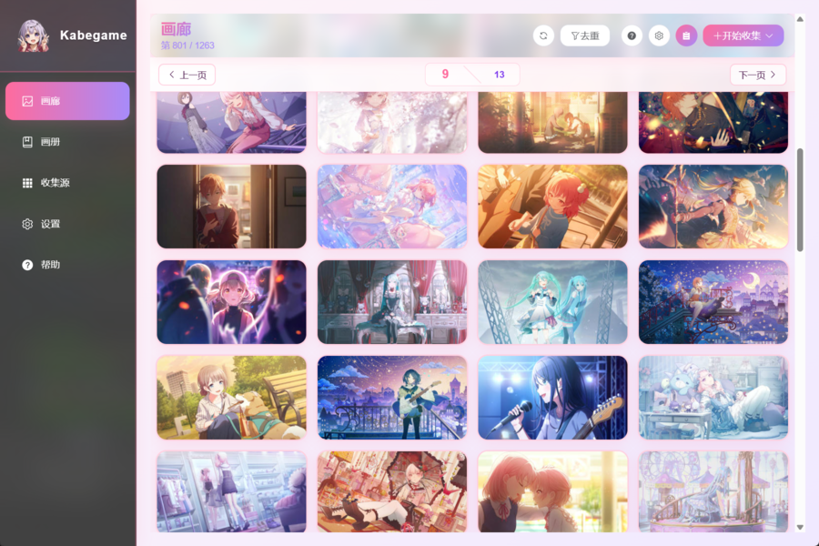<br/>
      <small>Windows</small>
    </td>
    <td align="center" style="width: 300px;">
      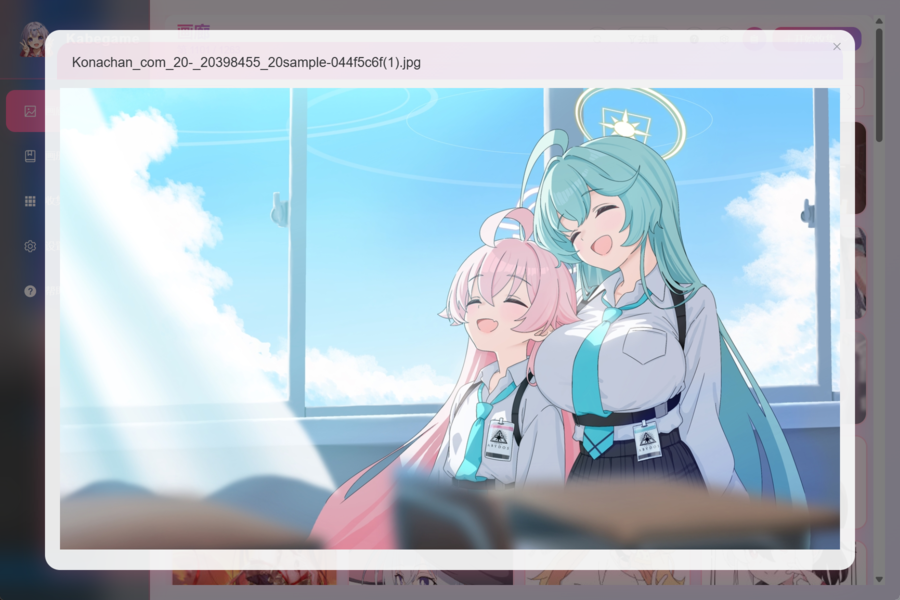<br/>
      <small>Windows</small>
    </td>
    <td align="center" rowspan="2" style="vertical-align: top; text-align: right; width: 200px;">
      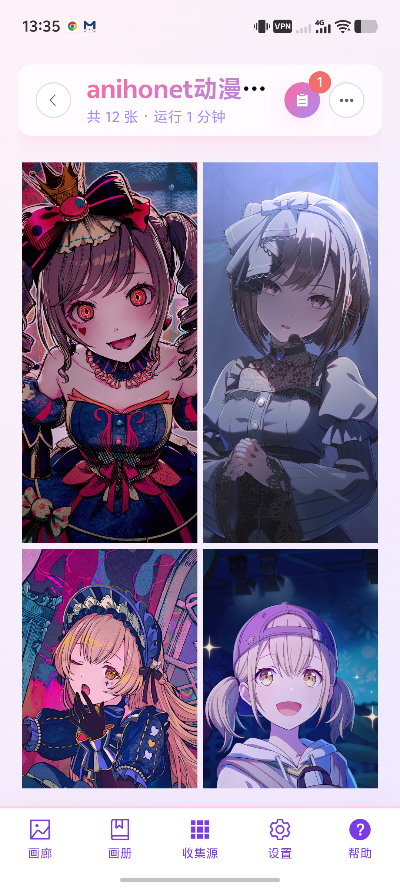<br/>
      <small>Android</small>
    </td>
  </tr>
  <tr>
    <td align="center" style="width: 300px;">
      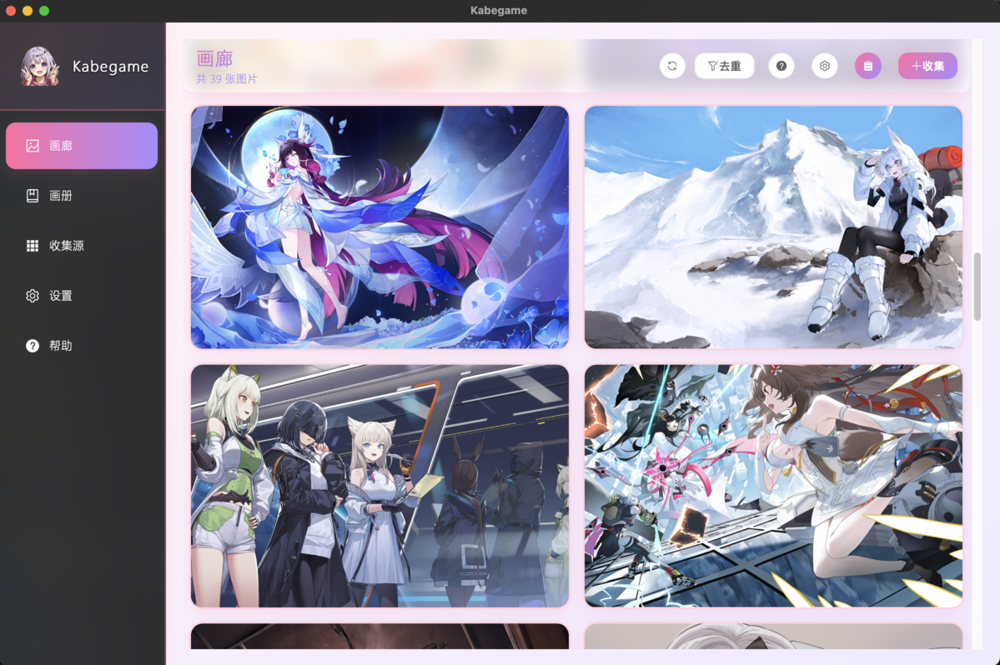<br/>
      <small>macOS</small>
    </td>
    <td align="center" style="width: 300px;">
      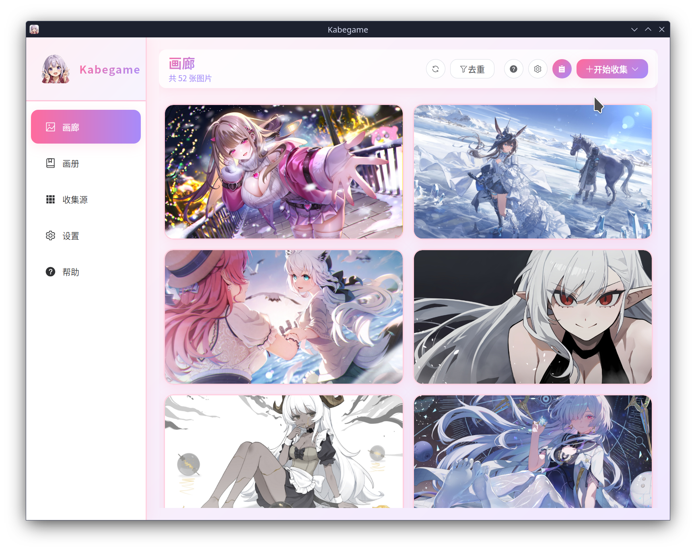<br/>
      <small>Linux</small>
    </td>
  </tr>
</table>

## クローラースクリーンショット

|  |  |
| --- | --- |
| <div align="center">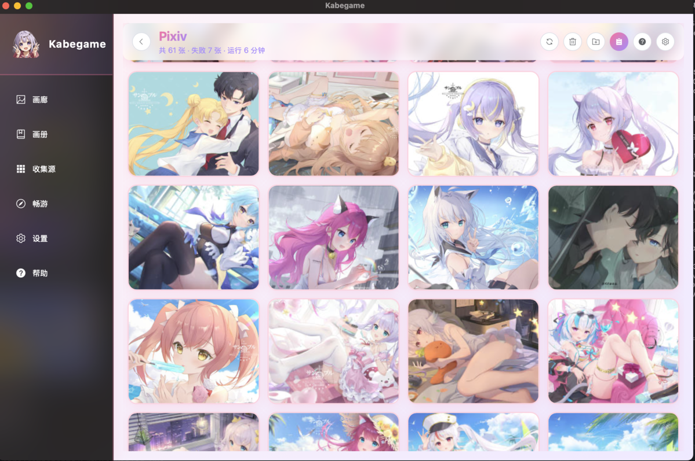<br/><small><a href="https://pixiv.net">Pixiv</a>（絵師：<a href="https://www.pixiv.net/users/16365055">somna</a>）</small></div> | <div align="center">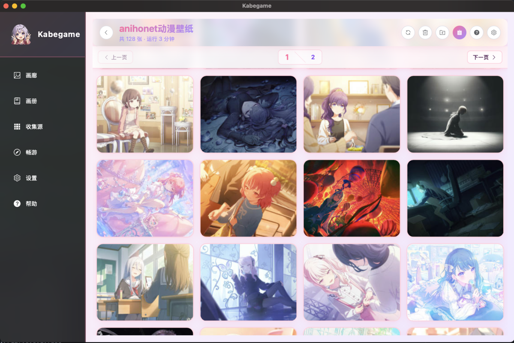<br/><small><a href="https://anihonetwallpaper.com">anihonet</a>（年間ランキング）</small></div> |
| <div align="center">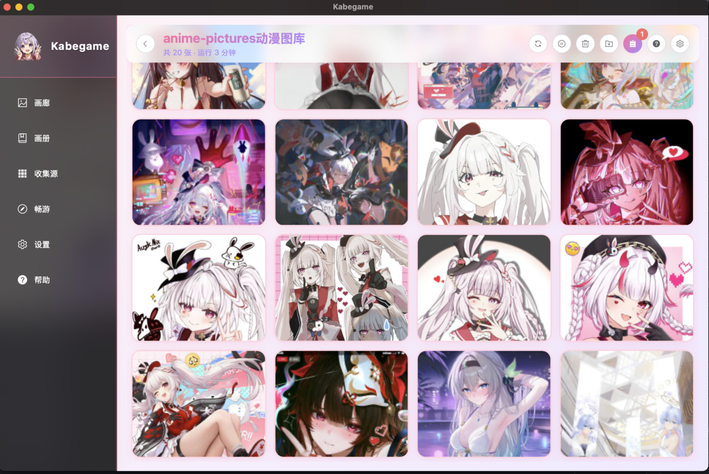<br/><small><a href="https://anime-pictures.net">anime-pictures</a>（キーワード：崩壊:スターレイル）</small></div> | <div align="center">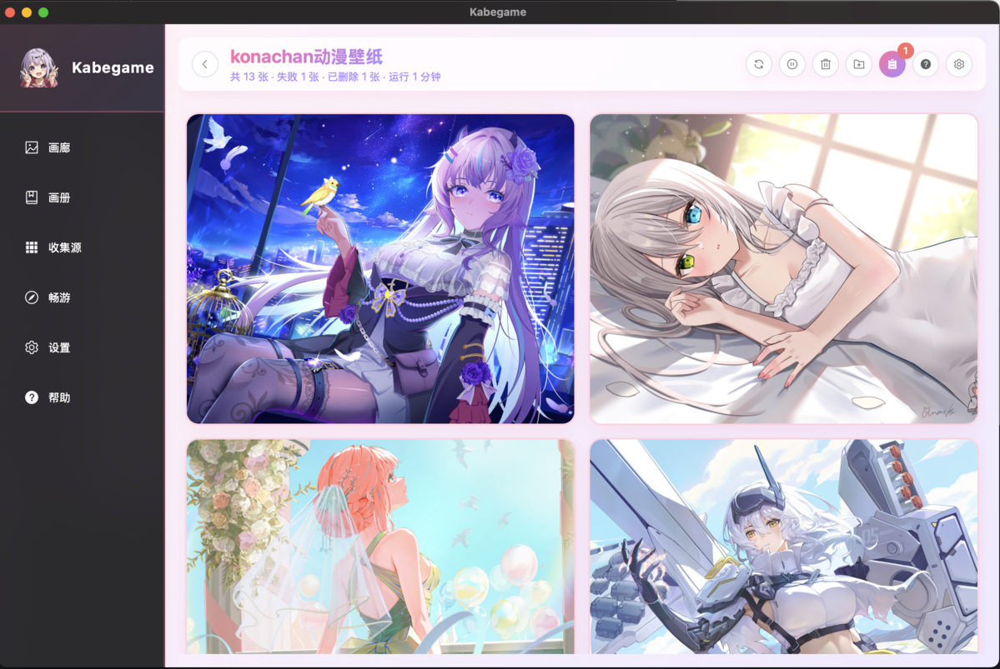<br/><small><a href="https://konachan.net">konachan</a>壁紙</small></div> |
| <div align="center">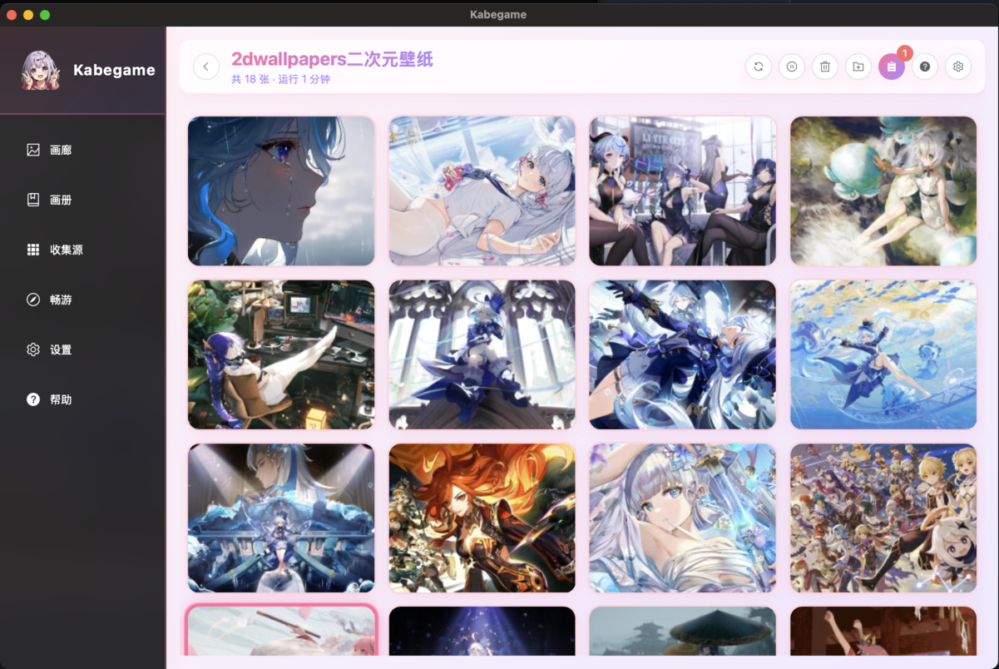<br/><small><a href="https://2dwallpapers.com">2dwallpaper</a>（ゲーム→原神→最多閲覧）</small></div> | <div align="center">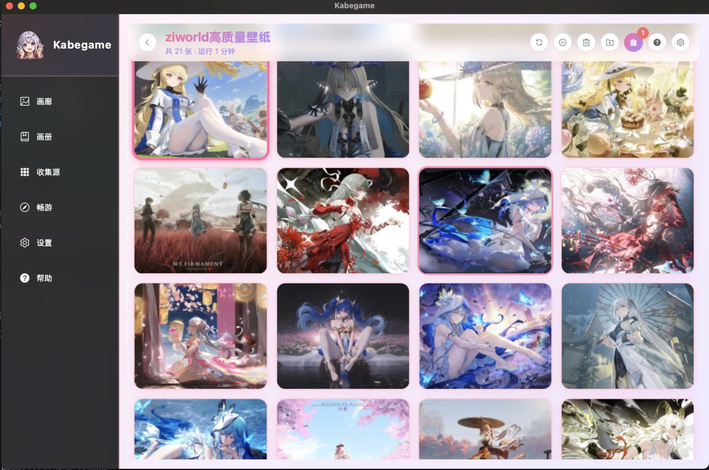<br/><small><a href="https://t.ziworld.top">ziworld</a>壁紙</small></div> |

<p align="center"><sub>多数サイト対応、プラグインで拡張可能。貢献大歓迎！</sub></p>

[→ クローラープラグインリポジトリ](https://github.com/kabegame/crawler-plugins/tree/main)

## 名前の由来 🐢

**Kabegame** は日本語の「壁亀」（かべがめ）のローマ字。壁紙（かべがみ）と発音が似ている～ 静かな亀がデスクトップで見守ってくれるように、あなたのアニメ壁紙コレクションをそっと守ってくれます。これで毎日癒やされるね。やったぁ～ ✨

> 私のこだわり：オープンソースに取り入れ、オタクだけのためのソフトウェアを作り上げる。

## 機能

- 🔌 **クローラークライアント**：`.kgpg` プラグインで各サイトから壁紙を取得；内蔵プラグインストアで閲覧・インストール・管理；タスク進捗・停止・削除；CLI でプラグイン実行・画像インポートなど
- 🎨 **壁紙設定（画像/動画）**：アニメ壁紙の収集・管理・ローテーション；指定アルバムから自動でデスクトップ壁紙を切り替え（ランダム/順番）
- 🖼️ **画像管理（画像/動画）**：ギャラリーブラウズ、アルバム整理、仮想ディスク（Windows はドライブ、macOS/Linux は仮想フォルダ）、ローカル画像・動画・フォルダ・アーカイブや kgpg のドラッグ＆ドロップ

（動画は v3.2.2 時点で mp4 と mov のみ対応）

## インストール

**デスクトップ版 Kabegame** は 2 種類のビルドがあります：

| 機能 | Standard | Light |
|------|----------|-------|
| **仮想ディスク** | ✅ | ❌ |
| **CLI** | ✅ | ❌ |
| **用途** | 日常使用、CLI/仮想ディスク必要 | 軽量、基本機能のみ |
| **サイズ** | 大き | 小さい |
| **トレードオフ** | 全機能、OS 依存あり（[インストール](#インストール-1)参照） | インストール即実行、仮想ディスク・CLI なし |

**OS と用途に合わせてパッケージを選んでください。**

**[GitHub Releases（最新版）でダウンロード](https://github.com/kabegame/kabegame/releases/latest)**

| OS | Standard | Light |
|----|----------|-------|
| Windows | [setup.exe](https://github.com/kabegame/kabegame/releases/download/v4.0.1/Kabegame-standard_4.0.1_x64-setup.exe) | [setup.exe](https://github.com/kabegame/kabegame/releases/download/v4.0.1/Kabegame-light_4.0.1_x64-setup.exe) |
| macOS | [dmg](https://github.com/kabegame/kabegame/releases/download/v4.0.1/Kabegame-standard_4.0.1_aarch64.dmg) | [dmg](https://github.com/kabegame/kabegame/releases/download/v4.0.1/Kabegame-light_4.0.1_aarch64.dmg) |
| Linux | [deb](https://github.com/kabegame/kabegame/releases/download/v4.0.1/Kabegame-standard_4.0.1_amd64.deb) | [deb](https://github.com/kabegame/kabegame/releases/download/v4.0.1/Kabegame-light_4.0.1_amd64.deb) |

- **Android プレビュー**：[apk](https://github.com/kabegame/kabegame/releases/download/v4.0.1/Kabegame_4.0.1_android-preview.apk)（同一リリースページ）。

## インストール

### Windows

1. **ダウンロード**：Standard または Light の `setup.exe` を選択
2. **インストーラー実行**：ダブルクリックしてウィザードに従う
3. **仮想ディスクドライバ（Standard のみ）**：
   - Dokan 未インストール時、管理者権限の要求が表示されます
   - 「はい」をクリックして Dokan をインストール（仮想ディスクに必要）
   - Light ビルドには仮想ディスクなし、Dokan 不要
4. **CLI（Standard のみ）**：
   - `kabegame-cli.exe` はアプリディレクトリにインストール
   - PATH に追加するか、フルパスで使用

> **ヒント**：インストーラーは自動更新対応。再実行でアップグレード可能。

### macOS

> **最低**：macOS **10.13 (High Sierra)** 以降。

1. **DMG ダウンロード**：Standard または Light の `.dmg` を選択
2. **インストール**：
   - `.dmg` を開く
   - `Kabegame.app` をアプリフォルダにドラッグ
> [!IMPORTANT]
> ## 修正：「Kabegame.app」が破損しているため開けません
> アプリフォルダにインストール後、Gatekeeper をバイパスする必要があります（オープンソースで開発者料金を払っていないため）。
>
> `xattr -d com.apple.quarantine /Applications/Kabegame.app`
3. **仮想ディスク / FUSE（Standard のみ）**：
   - macFUSE が必要：`brew install macfuse`
   - 初回マウントで権限要求
4. **CLI（Standard のみ）**：
   - 場所：`/Applications/Kabegame.app/Contents/Resources/resources/bin/kabegame-cli`
   - グローバル使用：`sudo ln -s ".../kabegame-cli" /usr/local/bin/kabegame-cli`
   - Light ビルドには CLI なし

### Linux（Debian 系、Ubuntu 等）

> **最低**：**Ubuntu 24.04** 以降。

1. **依存関係（Standard のみ）**：`fuse3` が必要
2. **インストール**：`sudo dpkg -i Kabegame-<mode>_<version>_<arch>.deb`
3. **CLI（Standard のみ）**：`/usr/bin/kabegame-cli` にインストール

## 主な機能

### 🖼️ ギャラリー＆画像管理

ギャラリーは Kabegame の中心。収集した壁紙がここに表示されます。ページネーション、プレビュー、複数選択、重複除去など。ローカルファイルをドラッグでインポート。ダブルクリックでアプリ内プレビュー（ズーム・パン・ナビゲーション）。

### 📸 アルバム

壁紙をカスタムアルバムで整理。お気に入りを追加、ドラッグで並び替え。アルバムは壁紙ローテーションと仮想ディスクのレイアウトに使えます。

### 🔌 プラグインシステム

Kabegame の強みはプラグインベースのクローラー。`.kgpg` プラグインでアニメ壁紙サイトから画像を取得。Rhai で記述。内蔵プラグインストアでワンクリックインストール、または他開発者のプラグインをインポート、自分で作成も可能。分かるな。

### 🎨 壁紙＆ローテーション

ワンクリックでデスクトップ壁紙を設定。ネイティブモード（パフォーマンス）とウィンドウモード（機能追加）。ローテーションでアルバムから自動切り替え（ランダム/順番）、間隔も設定可能。

### 📋 クローラータスク管理

全タスクを一括管理。進捗・状態・画像数。詳細表示、実行中停止、完了削除。

### 💾 仮想ディスク

**<del>Light ビルドでは非対応</del>**

Windows・macOS・Linux でアルバムを仮想ディスク（仮想フォルダ）としてマウント。ファイルマネージャで通常フォルダのように閲覧。

### ⌨️ CLI

Headless CLI でプラグイン実行・画像インポート・アルバム管理。自動化・バッチ処理に最適。`.kgpg` をダブルクリックで CLI で詳細表示。

### その他

内蔵ヘルプページで Kabegame をもっと知れます。

これからもっと機能や改良を行っていく予定です。ぜひご期待を。

## 注意事項

- クロール時は対象サイトの robots.txt と利用規約を遵守してください。
- 壁紙はデフォルトで `Pictures/Kabegame`、またはアプリデータの `images` フォルダに保存（アプリ内で設定可能）。
- アンインストール時に「データ削除」を選択するとアプリデータは削除されますが、画像は残ります。
- 壁紙ローテーションはアプリをバックグラウンド（トレイ）で実行する必要があります。

## アンインストール

### Windows
設定 → アプリ → インストール済み → Kabegame 検索 → ⋮ → アンインストール

### Linux
`sudo dpkg -r kabegame`

---

## 技術スタック

- **フロント**：Vue 3 + TypeScript + Element Plus + UnoCSS
- **バック**：Rust (Tauri) + Kotlin (Jetpack)
- **状態**：Pinia
- **ルーター**：Vue Router
- **ビルド**：Vite 5 + Nx
- **プラグイン**：Rhai

## 開発

### 前提

- Bun 1.3+
- Rust 1.70+ (Rust 2021 Edition)
- [Tauri CLI](https://tauri.app/v2/guides/getting-started/prerequisites)

### 依存関係

```bash
bun install
```

FFmpeg は `third/FFmpeg` の Git サブモジュール。`bun run build:ffmpeg` の前に `git submodule update --init --recursive`。

### 開発・ビルド

```bash
bun dev -c main              # メインアプリ
bun dev -c main --mode local # ローカルモード
bun start -c cli             # CLI
bun b                        # 全ビルド
bun check -c main            # チェック
```

### Android

- Android Studio、JAVA_HOME、ANDROID_HOME、NDK_HOME 必須
- `bun dev -c main --mode android`（`--android` から変更）
- デバッグは Chrome DevTools で `chrome://inspect/#devices`

## プロジェクト構造

```
.
├── apps/main/
├── packages/core/
├── src-tauri/
│   ├── core/
│   ├── app-main/
│   └── app-cli/
├── src-crawler-plugins/
├── docs/
└── ...
```


## プラグイン開発

- [プラグイン開発ガイド](docs/README_PLUGIN_DEV.md)
- [プラグイン形式](docs/PLUGIN_FORMAT.md)
- [Rhai API](docs/RHAI_API.md)

## ライセンス

GPL v3. [LICENSE](./LICENSE) を参照。

## 謝辞

本プロジェクトは以下のオープンソースプロジェクトに基づいています：Tauri、Vue、Vite、TypeScript、Element Plus、Pinia、Rhai、FFmpeg 等。感謝！
