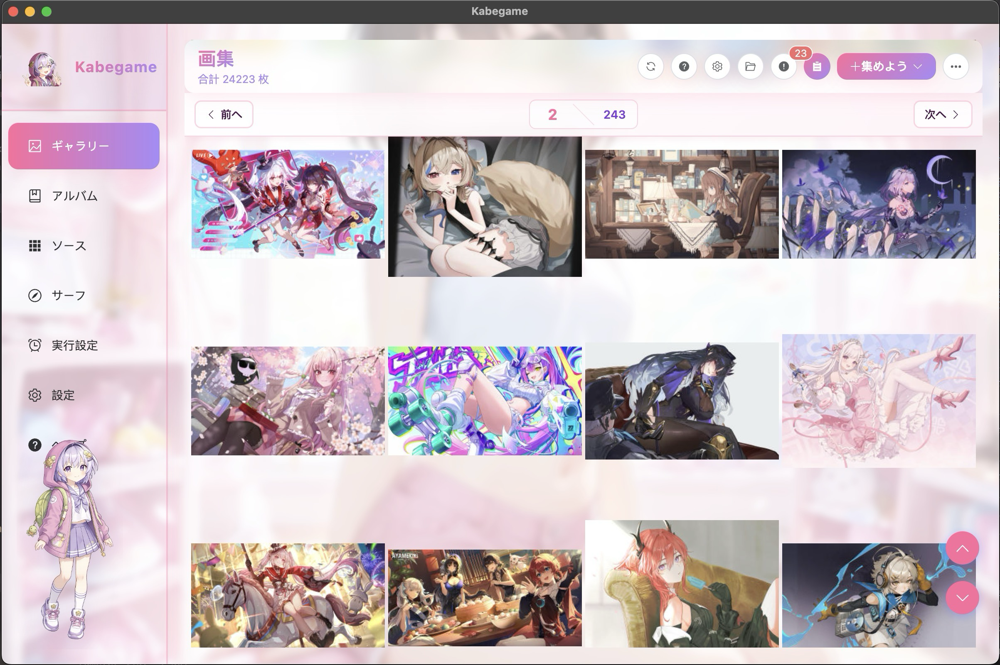
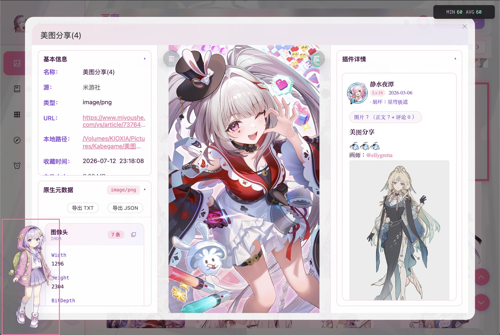
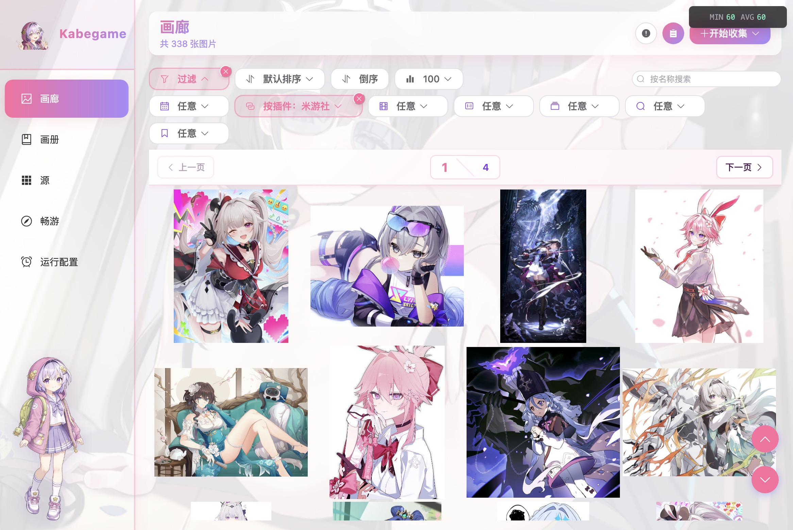
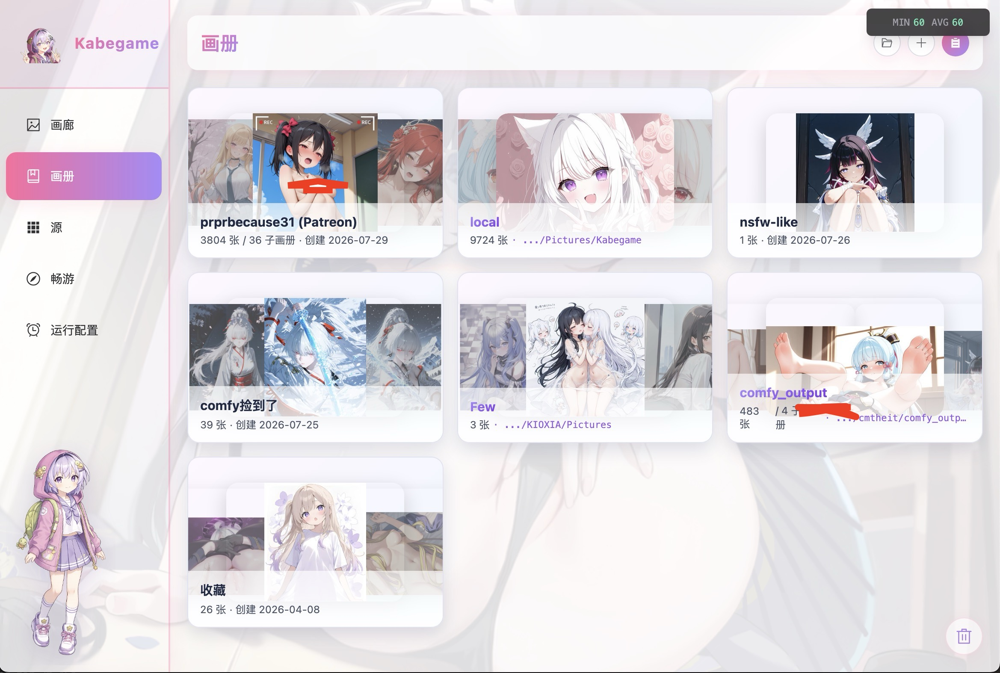
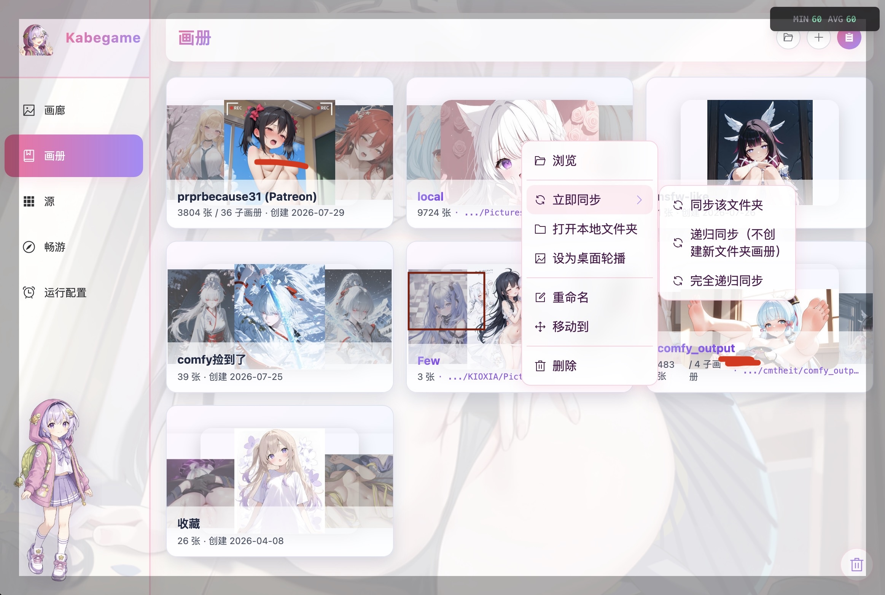
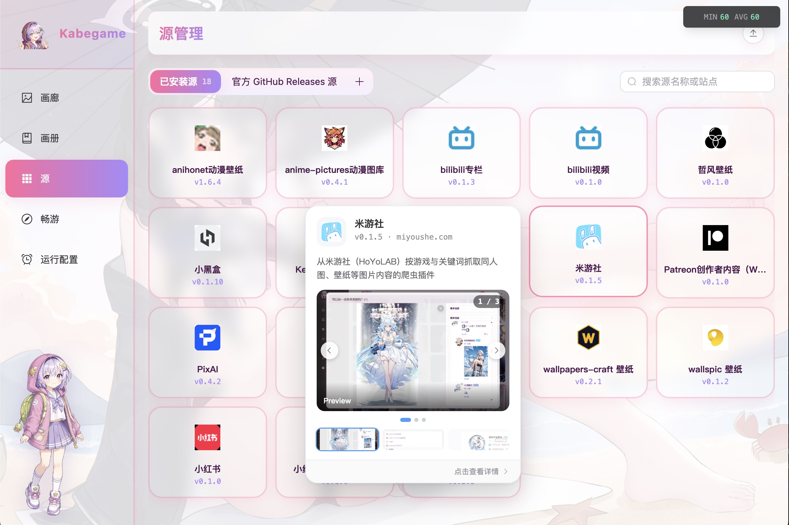
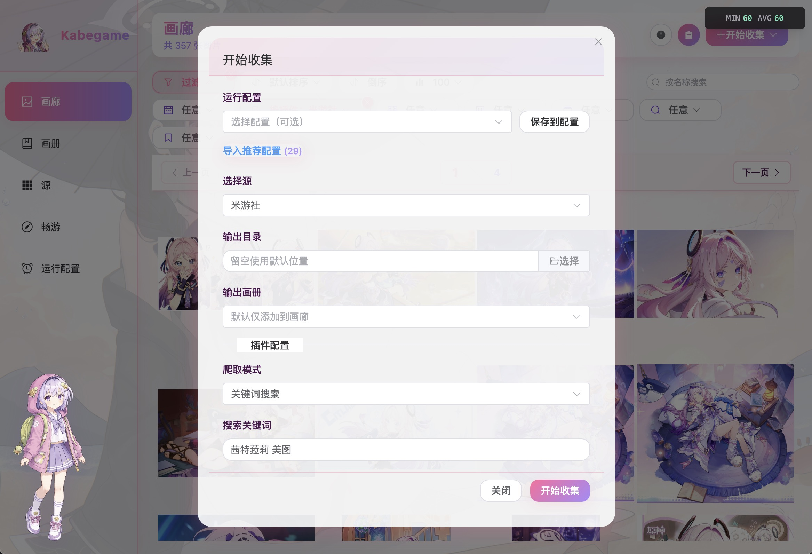
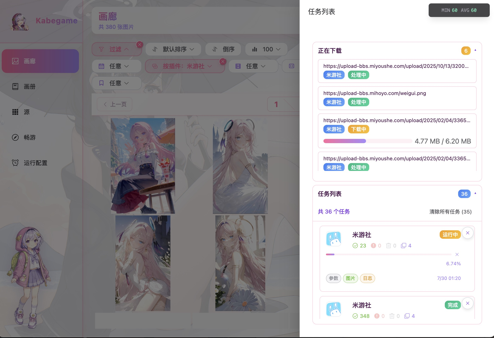
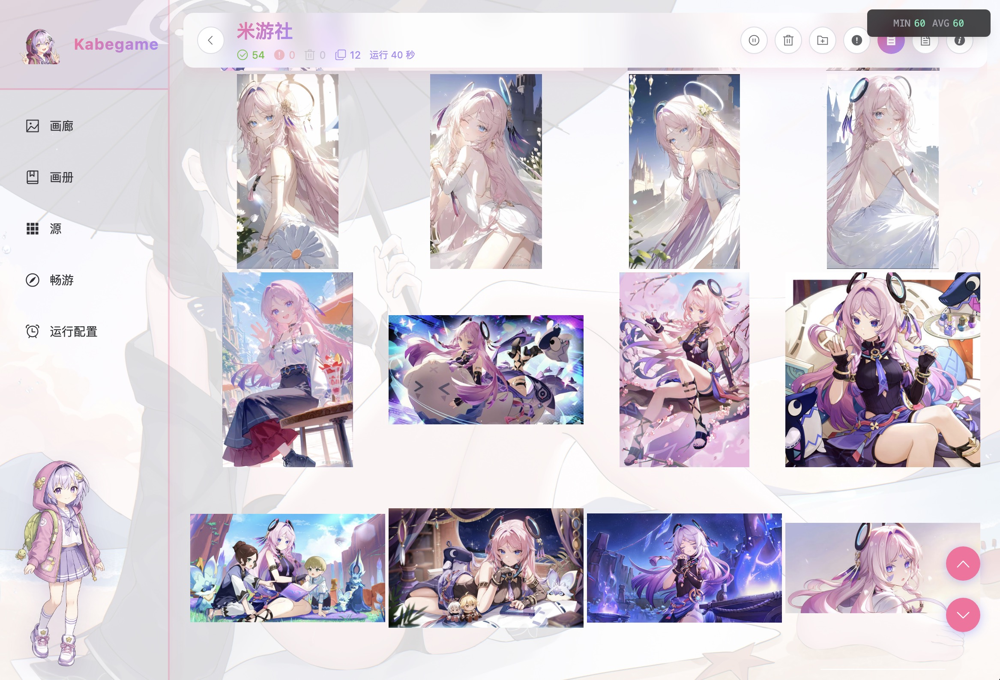
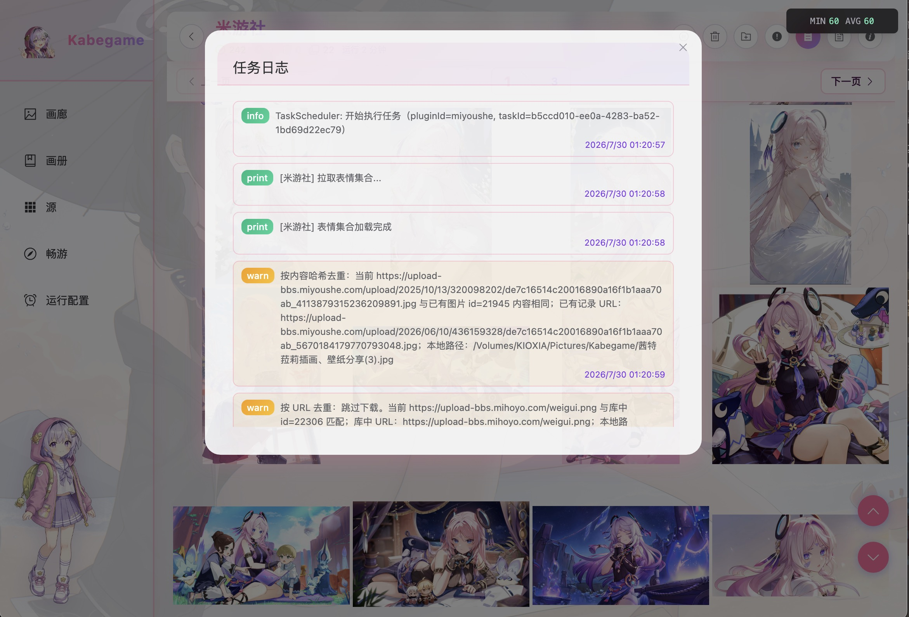

# Kabegame 二次元クローラークライアント

> *Translated by AI. [中文](README.md) | [English](README.en-US.md) | 日本語 | [한국어](README.ko.md)*

Tauri ベースの二次元クローラークライアント！壁紙をクロール・管理・設定/ローテーションして、推しの嫁（や旦那）たちに毎日そばにいてもらおう～ プラグインで拡張でき、様々な二次元サイトのリソースを簡単にクロールできます。

> 📖 **完全なドキュメント**：[https://kabegame.com](https://kabegame.com/)

> 🌐 **オンラインで体験（Demo）**：[https://demo.kabegame.com](https://demo.kabegame.com/)

<div align="center">
  
</div>

<table width="100%">
  <tr>
    <td align="center" width="50%">
      <br/>
      <small>ギャラリー</small>
    </td>
    <td align="center" width="50%">
      <br/>
      <small>プレビュー</small>
    </td>
  </tr>
  <tr>
    <td align="center" width="50%">
      <br/>
      <small>詳細メタデータ</small>
    </td>
    <td align="center" width="50%">
      <br/>
      <small>自由なフィルタリング</small>
    </td>
  </tr>
  <tr>
    <td align="center" width="50%">
      <br/>
      <small>画集の整理</small>
    </td>
    <td align="center" width="50%">
      <br/>
      <small>フォルダ同期</small>
    </td>
  </tr>
  <tr>
    <td align="center" width="50%">
      <br/>
      <small>ソースプラグイン一覧</small>
    </td>
    <td align="center" width="50%">
      <br/>
      <small>ソースプラグインドキュメント</small>
    </td>
  </tr>
  <tr>
    <td align="center" width="50%">
      <br/>
      <small>タスクパラメータ設定</small>
    </td>
    <td align="center" width="50%">
      <br/>
      <small>タスクを実行</small>
    </td>
  </tr>
  <tr>
    <td align="center" width="50%">
      <br/>
      <small>タスク画像</small>
    </td>
    <td align="center" width="50%">
      <br/>
      <small>タスクログ（問題を素早く特定）</small>
    </td>
  </tr>
</table>

## 主な機能

- 🔌 **クローラークライアント**：`.kgpg` プラグインで各サイトから壁紙をクロール。内蔵のプラグインストアで閲覧/インストール/管理が可能。4.3.0 以降、リリース時点の最新プラグインをすべて同梱しています。プラグインは JS/TS で書かれ、V8（deno_core）または WebView バックエンドで動作します。
- 🎨 **壁紙セッター（画像/動画）**：二次元壁紙を収集・管理・ローテーションし、指定した画集からデスクトップ壁紙を自動で切り替えます。
- 🖼️ **画像マネージャー**：ギャラリー閲覧、画集の整理、仮想ディスク、ドラッグ＆ドロップでのインポート、フォルダと画集の同期。
- 🧩 **MCP 整理**：MCP サーバーを開き、外部の AI エージェントにきめ細かな権限のもとで壁紙の整理を任せられます。

Windows、macOS、Linux、Android に対応（iOS は非対応）。

## 興味があるかもしれません
二次元壁紙やクローラーには興味がないかもしれませんが、本アプリのいくつかの技術的な工夫にはもしかしたら興味を持ってもらえるかもしれません
- Tauri ベースの Webview クローラー [WebviewHandler](./src-tauri/kabegame-core/src/crawler/webview.rs)
- 自作の Tauri runtime [tauri-runtime-cef](./src-tauri/tauri-runtime-cef/)
  Kabegame 向けに深くカスタマイズしているため crate としては公開していませんが、AI に頼んで自分のプロジェクトへ移植できます。
- 自作のパス折りたたみ式クエリエンジン [PathQL](./src-tauri/pathql-rs/)
  簡単に紹介すると、Provider DSL と呼ばれるパーサーと、URL パスベースのクエリ構文を開発しました。アプリ内のほとんどの画像クエリはすでに [Provider DSL JSON5 形式](./src-tauri/kabegame-core/src/providers/dsl/) に置き換えられており、これらの JSON が PathQL エンジンのクエリ折りたたみ方法を決定します。たとえば 2026 年 6 月のすべての動画を取得したい場合、クエリはこう書きます:
    ```url
    images://hide/media-type/video/filter_comb/date/2026y/06m/filter_comb/sort/by-id/1
    ```
  このクエリエンジンに興味があれば issue を立ててください。ドキュメントを充実させます。
  理論上は crate として公開できますが、まだ探り切れていないエッジケースのバグがおそらく残っているので、AI に頼んで自分のプロジェクトへコピーしてもらうのもありです（GPL-3.0 にはご注意を）。

## ダウンロードとインストール

**[GitHub Releases](https://github.com/kabegame/kabegame/releases/latest)** から各プラットフォーム向けのインストーラーをダウンロードしてください。

各プラットフォームのインストール手順、仮想ディスクの依存関係、データディレクトリの説明はドキュメントを参照：**[インストールと初回起動](https://kabegame.com/guide/installation/)**。

## ドキュメント

完全なドキュメントはすべて **[kabegame.com](https://kabegame.com/)** にあります：

- [ユーザーガイド](https://kabegame.com/guide/installation/) —— インストール、ギャラリー、画集、壁紙、仮想ディスク、MCP など。
- [プラグイン開発](https://kabegame.com/dev/overview/) —— V8 / WebView クローラープラグインの作成、`.kgpg` 形式、パッケージングと公開。
- [開発に参加](https://kabegame.com/dev-contrib/building/) —— ソースからのビルド、Android 開発、アーキテクチャと技術スタック、謝辞と組み込み依存関係。
- [コマンドラインツール](https://kabegame.com/reference/cli/) と [API リファレンス](https://kabegame.com/reference/kabegame-api/)。

クローラープラグインリポジトリ：**[kabegame/crawler-plugins](https://github.com/kabegame/crawler-plugins)**（プラグインの貢献を歓迎します！）

## ライセンス

ソースコードは [GPL v3](./LICENSE) ライセンスの下で提供されています。

## 名前の由来 🐢

**Kabegame** は日本語の「壁亀」（かべがめ）のローマ字表記で、「壁紙」（かべがみ）と発音が近いんです～ まるで静かな亀さんがあなたのデスクトップに乗って、二次元壁紙コレクションをそっと見守っているかのよう。オープンソースを大切に、二次元好きのための、二次元好き自身のソフトウェアを作ろう。
