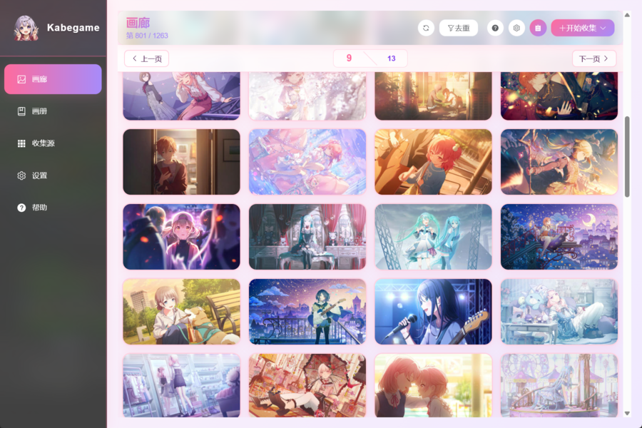
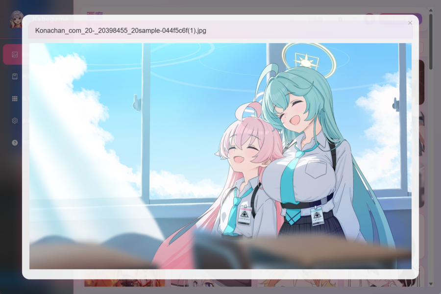
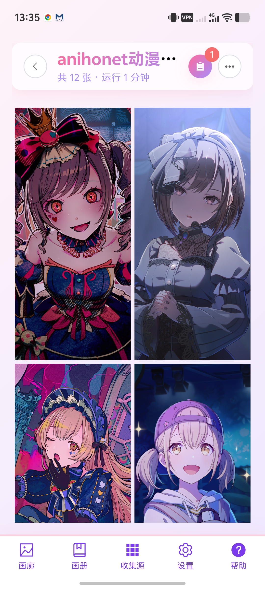
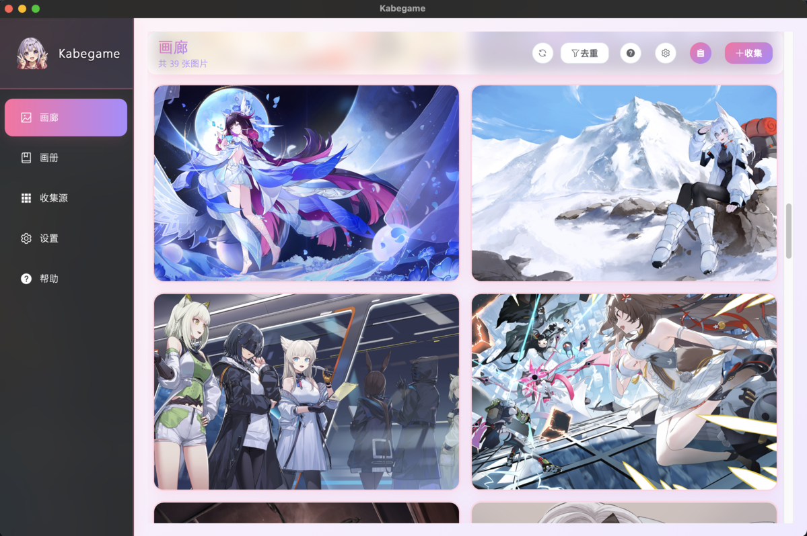
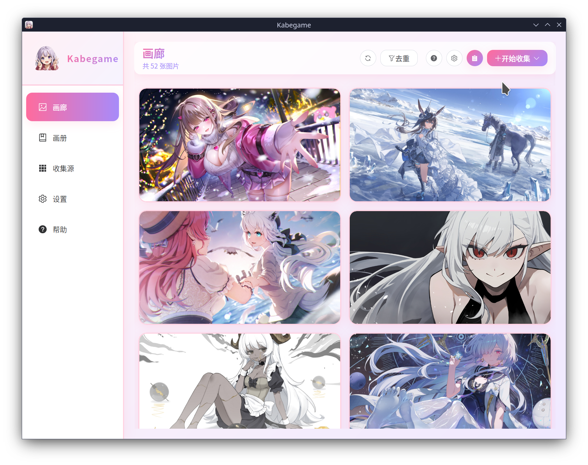

# Kabegame 이차원 크롤러 클라이언트

> *Translated by AI. [中文](README.md) | [English](README.en-US.md) | [日本語](README.ja.md) | 한국어*

Tauri 기반 이차원 크롤러 클라이언트! 벽지를 크롤링·관리·설정/로테이션하여, 아내(또는 남편)들이 매일 당신 곁을 지켜주게 하세요~ 플러그인 확장을 지원해 다양한 이차원 사이트의 리소스를 손쉽게 크롤링할 수 있습니다.

> 📖 **전체 문서**：[https://kabegame.com](https://kabegame.com/)
> 🌐 **온라인 체험（Demo）**：[https://demo.kabegame.com](https://demo.kabegame.com/)

<div align="center">
  
</div>

<table>
  <tr>
    <td align="center" style="width: 300px;">
      <br/>
      <small>Windows</small>
    </td>
    <td align="center" style="width: 300px;">
      <br/>
      <small>Windows</small>
    </td>
    <td align="center" rowspan="2" style="vertical-align: top; text-align: right; width: 200px;">
      <br/>
      <small>Android</small>
    </td>
  </tr>
  <tr>
    <td align="center" style="width: 300px;">
      <br/>
      <small>macOS</small>
    </td>
    <td align="center" style="width: 300px;">
      <br/>
      <small>Linux</small>
    </td>
  </tr>
</table>

## 주요 기능

- 🔌 **크롤러 클라이언트**：`.kgpg` 플러그인으로 여러 사이트에서 벽지를 크롤링하고, 내장 플러그인 스토어에서 탐색/설치/관리할 수 있습니다. 플러그인은 JS/TS로 작성되며 V8(deno_core) 또는 WebView 백엔드에서 실행됩니다.
- 🎨 **벽지 설정기(이미지/동영상)**：이차원 벽지를 수집·관리·로테이션하고, 지정한 화집에서 바탕화면 벽지를 자동으로 교체합니다.
- 🖼️ **이미지 관리자**：갤러리 탐색, 화집 정리, 가상 디스크, 드래그 앤 드롭 가져오기, 폴더-화집 동기화.
- 🧩 **MCP 정리**：MCP 서버를 열어 외부 AI 에이전트가 세밀한 권한 아래 벽지 정리를 돕게 할 수 있습니다.

Windows, macOS, Linux, Android를 지원합니다(iOS는 미지원).

## 관심 있을지도 모릅니다
이차원 벽지나 크롤러에는 관심이 없을 수도 있지만, 이 앱에 담긴 몇 가지 기술적 혁신에는 흥미가 생길지도 모릅니다
- Tauri 기반 Webview 크롤러 [WebviewHandler](./src-tauri/kabegame-core/src/crawler/webview.rs)
- 자체 개발 Tauri runtime [tauri-runtime-cef](./src-tauri/tauri-runtime-cef/)
  Kabegame에 맞춰 깊이 커스터마이즈되어 있어 crate로 배포하지는 않았습니다. AI를 이용해 여러분의 프로젝트로 옮겨올 수 있습니다.
- 자체 개발 경로 폴딩 방식 쿼리 엔진 [PathQL](./src-tauri/pathql-rs/)
  간단히 소개하자면, Provider DSL이라 부르는 파서와 URL 경로 기반 쿼리 문법을 개발했습니다. 앱 내 대부분의 이미지 쿼리는 이미 [Provider DSL JSON5 형식](./src-tauri/kabegame-core/src/providers/dsl/)으로 바뀌었으며, 이 JSON들이 PathQL 엔진이 쿼리를 폴딩하는 방식을 결정합니다. 예를 들어 2026년 6월의 모든 동영상을 조회한다면 쿼리는 이렇게 씁니다:
    ```url
    images://hide/media-type/video/filter_comb/date/2026y/06m/filter_comb/sort/by-id/1
    ```
  이 쿼리 엔진에 관심이 있다면 issue를 남겨주세요. 문서를 보완하겠습니다.
  이론상 crate로 배포할 수 있지만, 아직 찾아내지 못한 엣지 케이스 버그가 남아 있을 것이므로, AI를 시켜 여러분의 프로젝트로 베껴 오게 해도 됩니다(GPL-3.0에 유의하세요).

## 다운로드 및 설치

**[GitHub Releases](https://github.com/kabegame/kabegame/releases/latest)** 에서 각 플랫폼용 설치 파일을 내려받으세요.

플랫폼별 설치 절차, 가상 디스크 의존성, 데이터 디렉터리 설명은 문서를 참고하세요：**[설치 및 첫 실행](https://kabegame.com/guide/installation/)**.

## 문서

전체 문서는 모두 **[kabegame.com](https://kabegame.com/)** 에 있습니다：

- [사용자 가이드](https://kabegame.com/guide/installation/) —— 설치, 갤러리, 화집, 벽지, 가상 디스크, MCP 등.
- [플러그인 개발](https://kabegame.com/dev/overview/) —— V8 / WebView 크롤러 플러그인 작성, `.kgpg` 형식, 패키징 및 배포.
- [개발 참여](https://kabegame.com/dev-contrib/building/) —— 소스에서 빌드, Android 개발, 아키텍처와 기술 스택, 감사의 말과 내장 의존성.
- [명령줄 도구](https://kabegame.com/reference/cli/) 와 [API 레퍼런스](https://kabegame.com/reference/kabegame-api/).

크롤러 플러그인 저장소：**[kabegame/crawler-plugins](https://github.com/kabegame/crawler-plugins)**（플러그인 기여를 환영합니다!）

## 라이선스

소스 코드는 [GPL v3](./LICENSE) 라이선스로 제공됩니다.

## 이름의 유래 🐢

**Kabegame** 는 일본어「壁亀」(かべがめ)의 로마자 표기로,「壁紙」(かべがみ, "벽지")와 발음이 비슷합니다~ 마치 조용한 거북이 한 마리가 당신의 바탕화면 위에 엎드려, 이차원 벽지 컬렉션을 묵묵히 지켜주는 것처럼요. 오픈 소스를 품고, 이차원 팬을 위한 이차원 팬 자신의 소프트웨어를 만듭니다.
