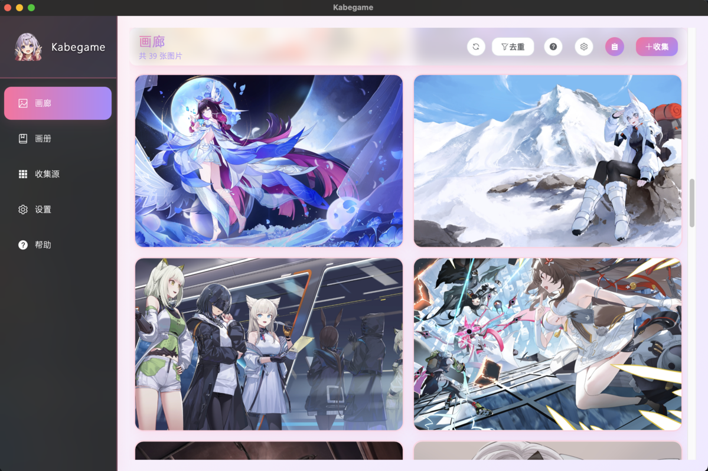

# Kabegame 壁纸管理器

一个基于 Tauri 的二次元壁纸管理器！收集、管理、轮播，让老婆们（或老公们）每天陪伴你~ 支持插件扩展，轻松爬取各种二次元壁纸资源~

<div align="center">
  
  
</div>

<div align="center">
  
  
  
</div>

## 名称由来 🐢

**Kabegame** 是日语「壁亀」（かべがめ）的罗马音，与「壁纸」（かべがみ）发音相近~ 就像一只安静的龟龟趴在你的桌面上，默默守护着你的二次元壁纸收藏，不吵不闹，只负责治愈你~ これで毎日癒やされるね。やったぁ～ ✨

> 我的观念：拥抱开源，做二次元人自己的软件

> 私のこだわり：オープンソースに取り入れ、オタクだけのためのソフトウェアを作り上げる。


## 功能特性

- 🖼️ **壁纸管理**: 收集、管理、轮播二次元壁纸，让桌面充满二次元气息
- 🔌 **插件系统**: 支持通过 `.kgpg` 插件文件从不同网站爬取壁纸资源
- 📸 **画册浏览**: 查看已爬取的壁纸，支持按插件和画册筛选
- 🎨 **壁纸轮播**: 自动从指定画册中轮播更换桌面壁纸，支持随机和顺序模式
- 📦 **本地存储**: 壁纸和元数据存储在本地应用数据目录
- 💾 **虚拟磁盘**: 在 Windows 上将画册挂载为虚拟磁盘，在资源管理器中像文件夹一样浏览图片
- 🌐 **源管理**: 浏览、安装、收藏和管理壁纸源插件
- 📋 **任务管理**: 实时查看收集任务进度、状态和已收集图片，支持停止、删除等操作
- ⌨️ **命令行工具**: 提供完整的 CLI 工具，支持通过命令行运行插件、导入图片等操作
- 🖱️ **拖拽导入**: 支持拖入本地图片、文件夹或压缩包（zip、rar）快速导入到画廊，也可以拖入kgpg插件文件导入插件

## 安装方法


**桌面端 Kabegame** 提供三种模式供下载，满足不同使用场景：

| 功能 | Normal 模式 | Local 模式 | Light 模式 |
|------|------------|-----------|-----------|
| **插件商店** | ✅ 支持 | 🟡 预置插件 | 🟡 预置插件 |
| **虚拟磁盘** | ✅ 支持 | ✅ 支持 | ❌ 不支持 |
| **cli** | ✅ 支持 | ✅ 支持 | ❌ 不支持|
| **内置插件** | 本地导入插件(`local-import`) | 发布时的全部插件 | 发布时的全部插件 |
| **适用场景** | 日常使用，需要从商店安装插件 | 离线使用，需要所有插件内置 | 轻量使用，仅需基本功能 |
| **文件大小** | ⭐⭐⭐⭐ | ⭐⭐⭐⭐⭐ | ⭐ |

**根据你的操作系统和需求，选择合适的安装包**

| 操作系统 | Normal 模式 | Local 模式 | Light 模式 |
|---------|------------|-----------|-----------|
| Windows | [setup.exe](release/Kabegame-normal_3.0.3_x64-setup.exe) | [setup.exe](release/Kabegame-local_3.0.3_x64-setup.exe) | [setup.exe](release/Kabegame-light_3.0.3_x64-setup.exe) |
| MacOS | [dmg映像](release/Kabegame-normal_3.0.4_aarch64.dmg) | [dmg映像](release/Kabegame-local_3.0.4_aarch64.dmg) | [dmg映像](release/Kabegame-light_3.0.4_aarch64.dmg) |
| Linux (Plasma) | [deb包](release/Kabegame-normal_plasma_3.0.3_amd64.deb)  | [deb包](release/Kabegame-local_plasma_3.0.3_amd64.deb)  | [deb包](release/Kabegame-light_plasma_3.0.3_amd64.deb) |
| Linux (GNOME) | [deb包](release/Kabegame-normal_gnome_3.0.3_amd64.deb) | [deb包](release/Kabegame-local_gnome_3.0.3_amd64.deb) | [deb包](release/Kabegame-light_gnome_3.0.3_amd64.deb) |

**Android 版 Kabegame** (开发中) 将不分模式，只有light模式+商店（内置全量插件+商店源） 

## 安装方法

### Windows

1. **下载安装包**：根据你的需求选择 Normal、Local 或 Light 模式的 `setup.exe` 文件
2. **运行安装程序**：双击 `setup.exe` 文件，按照向导完成安装
3. **虚拟磁盘驱动（仅 Normal / Local 模式）**：
   - 安装过程中，如果检测到未安装 Dokan 虚拟磁盘驱动，安装程序会**自动弹出管理员权限请求**
   - 点击「是」允许安装 Dokan 驱动（虚拟磁盘功能需要）
   - Light 模式不包含虚拟磁盘功能，因此不会安装 Dokan 驱动
4. **CLI 工具（仅 Normal / Local 模式）**：
   - CLI 可执行文件 `kabegame-cli.exe` 会被安装到应用安装目录
   - 如需在命令行中使用，请将安装目录添加到系统 PATH 环境变量，或直接使用完整路径

> **提示**：安装程序支持自动更新，再次运行安装程序即可更新到新版本。

### MacOS

1. **下载 DMG 文件**：根据你的需求选择 Normal、Local 或 Light 模式的 `.dmg` 文件
2. **安装应用**：
   - 打开下载的 `.dmg` 文件
   - 将 `Kabegame.app` 拖拽到「应用程序」文件夹
3. **虚拟磁盘fuse依赖（仅 Normal / Local 模式）**：
   - MacOS的虚拟磁盘功能依赖macfuse，通过 `brew install macfuse`安装
   - 首次挂载会弹窗请求权限
4. **CLI 工具（仅 Normal / Local 模式）**：
   - CLI 可执行文件已随应用一起打包，位于：`/Applications/Kabegame.app/Contents/Resources/resources/bin/kabegame-cli`
   - 如需在终端中全局使用，可以手动创建软链接（需要管理员权限）：
   ```bash
   sudo ln -s "/Applications/Kabegame.app/Contents/Resources/resources/bin/kabegame-cli" /usr/local/bin/kabegame-cli
   ```
   - 之后即可在终端中使用：`kabegame-cli --help`
   - Light 模式不提供 CLI 工具

### Linux（Debian 分发，如 Ubuntu）

1. **确认桌面环境**：
   ```bash
   systemctl --user list-units --type=service | grep -E "plasma|gnome|xfce|cinnamon|mate|sway|hyprland"
   ```
   根据输出选择对应的安装包（Plasma 或 GNOME）

   <b style="color: red; background-color: #fdd;">
   安装错误 desktop 版本可能导致无法正常设置壁纸！
   </b>

2. **安装依赖（仅 Normal / Local 模式）**：
   - 虚拟磁盘功能需要 `fuse3` 依赖，如果系统未安装，请先安装：
   ```bash
   sudo apt update
   sudo apt install fuse3
   ```
   - Light 模式不需要 `fuse3` 依赖

3. **安装应用**：
   ```bash
   sudo dpkg -i Kabegame-<mode>_<desktop>_<version>_<arch>.deb
   ```
   - 如果遇到依赖问题，可以运行：`sudo apt-get install -f` 自动修复

4. **CLI 工具（仅 Normal / Local 模式）**：
   - CLI 会自动安装到 `/usr/bin/kabegame-cli`，可直接在终端使用：`kabegame-cli --help`
   - Light 模式不提供 CLI 工具


## 主要功能

### 🖼️ 画廊浏览与图片管理

画廊是 Kabegame 的核心，所有收集到的壁纸都会在这里展示。支持分页浏览、快速预览、多选操作、去重清理等功能。你可以直接拖入本地文件快速导入。双击图片即可在应用内预览大图，支持缩放、拖拽、切换等操作，也可以设置系统看图软件打开。

<div align="center">
  
  <br/>
  
</div>

### 📸 画册管理

画册功能让你可以自由整理和分类收集到的壁纸。创建自定义画册，将喜欢的图片加入其中，支持拖拽调整顺序。画册可以用于壁纸轮播，也可以作为虚拟磁盘的目录结构。每个画册都有独立的封面和描述，让你的收藏更有条理。

<div align="center">
  
  
</div>


### 🔌 强大的插件系统

Kabegame 的核心竞争力在于其插件化的爬虫系统（本地导入文件功能本质上是一个爬虫插件）。通过 `.kgpg` 插件文件，你可以轻松从各种二次元壁纸网站收集资源。插件使用 Rhai 脚本语言编写，支持复杂的爬取逻辑。应用内置插件商店（[插件仓库](./src-crawler-plugins)），可以一键安装热门插件，也可以导入别人开发的插件，甚至可以编写你自己的插件。每个插件都可以配置参数，在运行脚本的时候由用户输入。你也可以在运行的时候配置http头，分かるな。

<div align="center">
  
  
  
</div>

### 🎨 壁纸设置与轮播

一键设置桌面壁纸（图片右键抱到桌面上），支持原生模式和窗口模式。原生模式性能优秀，窗口模式功能更丰富。开启壁纸轮播后，可以自动从指定画册中更换壁纸，支持随机和顺序两种模式，可自定义轮播间隔。让桌面每天都有新惊喜！


### 📋 任务管理

所有收集任务都在这里统一管理。实时查看任务进度、状态、已收集图片数量等信息。支持查看任务详情、停止运行中的任务、删除已完成的任务。任务详情页以网格形式展示已收集的图片，可以预览、选择、添加到画册或删除。

<div align="center">
  
  
  <br/>
  
  
</div>

### 💾 虚拟磁盘

**<del>Light 模式不支持</del>**

在 Windows、MacOS和Linux系统上，Kabegame 可以将画册挂载为虚拟磁盘（虚拟目录），让你在资源管理器中像浏览普通文件夹一样浏览画册和图片。支持按插件、按时间、按任务、按画册等多种目录结构，带来更加灵活和原生的浏览体验。

<div align="center">
  
  
</div>

### ⌨️ 命令行工具

提供精巧的 CLI 工具（无界面，纯命令行），支持通过命令行运行插件、导入图片、管理画册等操作。适合自动化脚本、批量处理等场景。可以轻松集成到你的工作流中，让壁纸收集更加自动化。当你双击一个`kgpg`文件的时候，默认通过命令行工具打开查看详情。


### 更多用法
应用内置一个帮助页面，能够帮助你更好了解龟龟！


これからもっと機能や改良を行っていく予定です。ぜひご期待を。

## 注意事项

- 请遵守目标网站的 robots.txt 和使用条款，合理使用爬虫功能
- 壁纸默认存储在用户的图片（Pictures）文件夹下，否则位于应用数据目录的 images 中（具体位置应用中可以确认并且设置）
- 插件配置保存在应用数据目录中
- 壁纸轮播功能需要应用在后台运行，关闭应用后轮播会自动停止
- 插件文件格式为 `.kgpg`（ZIP 压缩包），包含 `manifest.json`、`crawl.rhai` 等文件

## 卸载方法

### Windows
#### 方法一
打开设置 -> 应用 -> 已安装应用 -> 搜索 Kabegame -> 点击右边三个点 -> 卸载
#### 方法二
右键点击应用快捷方式 -> 打开文件所在位置 -> 找到 uninstall.exe -> 双击运行即可删除

### Linux（Debian分发）
运行以下命令：
```sh
sudo dpkg -r kabegame
```

---

## 技术栈

- **前端**: Vue 3 + TypeScript + Element Plus
- **后端**: Rust (Tauri)
- **状态管理**: Pinia
- **路由**: Vue Router
- **构建工具**: Vite + Nx
- **插件脚本**: Rhai

## 开发

### 前置要求

- Bun 1.3+ (推荐使用官方安装脚本: `curl -fsSL https://bun.sh/install | bash` 或 Windows: `powershell -c "irm bun.sh/install.ps1 | iex"`)
- Rust 1.70+ (Rust 2021 Edition)
- [Tauri CLI](https://tauri.app/v2/guides/getting-started/prerequisites)

### 安装依赖

```bash
bun install
```

### Git 钩子：push 前自动尝试打 tag（可选）

本仓库使用 Husky 提供 git hooks：在 `git push` 之前会读取 `src-crawler-plugins/package.json` 的 `version`，
并尝试创建 `v{version}` 的 tag（例如 `1.0.0` → `v1.0.0`）。如果 tag 已存在或创建失败会**跳过且不阻断 push**。

- 启用方式：执行 `bun install`（会自动运行 `prepare` 安装 hooks）
- 手动重装 hooks：执行 `bun run prepare`

### 开发/构建命令（统一入口）

项目采用 **Cargo Workspace** 架构，包含三个独立应用：
- **main**：主应用（Tauri GUI，前端端口 1420）
- **cli**：命令行工具（无界面）

所有应用共享 `kabegame-core` 核心库。

```bash
# 开发模式（带 watch，热重载）
bun dev -c main              # 启动主应用（端口 1420）
bun dev -c main --mode local # 使用 local 模式（无商店版本，预打包全部插件）
bun dev -c main --desktop plasma  # 指定桌面环境为 Plasma（在设置中显示插件模式选项）
bun dev -c main --desktop gnome   # 指定桌面环境为 GNOME

# 启动模式（无 watch，直接运行）
bun start -c cli            # 启动 CLI 工具

# 构建生产版本
bun b                    # 构建全部组件（main + cli）
bun b -c main            # 构建主应用
bun b -c cli             # 构建 CLI 工具

# 检查（不产出构建产物）
bun check -c main                # 依次检查 vue 与 cargo
bun check -c main --skip cargo   # 仅检查 vue
```

说明：
- `-c, --component`：指定要开发/启动/构建的组件（`main` | `cli`）
- `bun check` 必须用 `-c, --component` 指定组件
- `--mode`：构建模式
  - `normal`（默认）：一般版本，带商店源，仅打包本地插件到 resources
  - `local`：无商店，预打包全部插件到 resources
  - `light`：轻量模式，无商店，没有虚拟盘功能、没有cli工具
- `--desktop <desktop>`：指定桌面环境（`plasma` | `gnome`），用于后端按桌面环境选择实现
  - `plasma`：适用于 KDE Plasma 环境（在设置中显示 Plasma 插件模式选项）
  - `gnome`：适用于 GNOME 环境
- `--skip <skip>`：跳过某个流程（只能一个值：`vue` | `cargo`）
  - 在 `check` 中始终生效：`--skip vue` 跳过 `vue-tsc`，`--skip cargo` 跳过 `cargo check`
  - 在 `build` 中：
    - `cli`：`--skip vue` 跳过前端构建，`--skip cargo` 跳过后端构建
    - `main`：仅支持 `--skip vue` 跳过前端构建（仍会执行 `cargo tauri build`）
- 主应用的开发会自动先打包插件到 `src-tauri/app-main/resources/plugins`，确保资源存在，而这个操作依赖cli的存在，因此需要先运行 `bun b -c cli` 来构建cli，否则无法开发主应用
- `dev` 的前端由各自的 `tauri.conf.json` 的 `beforeDevCommand` 启动；`build` 时前端由构建脚本显式构建（`nx run .:build-*`）

### Android 开发

#### 前置要求

Android 开发需要额外的环境配置，详见 [Android 迁移指南](docs/TAURI_ANDROID_MIGRATION.md)。主要要求包括：

> **壁纸功能实现**：Android 平台壁纸设置（填充模式、过渡效果、视差滚动）的完整实现方案，详见 [Android 壁纸实现方案](docs/ANDROID_WALLPAPER_IMPLEMENTATION.md)。

- Android Studio（需安装）
- `JAVA_HOME` 环境变量（指向 Android Studio 的 JBR）
- `ANDROID_HOME` 环境变量（指向 Android SDK 目录）
- `NDK_HOME` 环境变量（**必须配置**，否则编译会失败）
- Rust Android 目标：`rustup target add aarch64-linux-android armv7-linux-androideabi i686-linux-android x86_64-linux-android`

#### 打开开发者工具

在 Android 平台上，Tauri 不支持像桌面端那样直接调用 `open_devtools()` API。需要使用 **Chrome DevTools** 进行远程调试：

**方法一：使用 Chrome DevTools（推荐）**

1. **确保设备已连接并开启 USB 调试**
   ```bash
   # 检查设备是否连接
   adb devices
   ```

2. **在 Chrome 浏览器中打开开发者工具**
   - 在桌面 Chrome 中访问：`chrome://inspect/#devices`
   - 确保 "Discover USB devices" 已勾选
   - 在设备列表中会显示你的 Android 设备
   - 找到你的应用（Kabegame），点击 "inspect" 打开开发者工具

**方法二：通过 ADB 命令**

```bash
# 1. 确保设备已连接
adb devices

# 2. 转发端口（如果需要）
adb forward tcp:9222 localabstract:chrome_devtools_remote

# 3. 在 Chrome 中访问
# chrome://inspect/#devices
```

**注意事项：**

- 确保应用以 **Debug 模式**运行（开发模式会自动启用）
- Android WebView 在 Debug 构建中默认启用调试，无需额外配置
- 如果看不到设备：
  - 检查 USB 调试是否开启
  - 检查 ADB 驱动是否安装
  - 尝试重新连接设备：`adb kill-server && adb start-server`

## 项目结构

```
.
├── apps/                  # 前端应用（Nx Monorepo）
│   └── main/             # 主应用前端（Vue 3 + TypeScript，端口 1420）
├── packages/             # 共享包（Nx Monorepo）
│   └── core/             # 共享前端组件和工具
├── src-tauri/            # Rust 后端代码（Cargo Workspace）
│   ├── core/             # 共享核心库（kabegame-core）
│   ├── app-main/         # 主应用（Tauri GUI）
│   ├── app-cli/          # CLI 工具（纯 Rust 命令行，无界面）
│   └── icons/            # 应用图标资源
├── src-crawler-plugins/  # 插件相关（Nx 项目）
├── scripts/              # 构建脚本
├── docs/                 # 文档
├── static/               # 静态资源
├── nx.json               # Nx 工作区配置
├── project.json          # 根项目配置
├── package.json          # Node.js 依赖（包含 Bun workspace 配置）
└── Cargo.toml            # Rust Cargo Workspace 配置
```

## 插件开发

插件开发相关文档请参考：
- [插件开发指南](docs/README_PLUGIN_DEV.md)
- [插件文件格式](docs/PLUGIN_FORMAT.md)
- [Rhai API 文档](docs/RHAI_API.md)
- [爬虫 WebView 架构设计](docs/CRAWLER_WEBVIEW_DESIGN.md)（规划中）

## License

The source code is licensed under GPL v3. License is available [here](./LICENSE).

## 致谢

本项目基于以下优秀的开源项目构建，感谢这些项目的开发者和社区：

### 核心框架
- [**Tauri**](https://github.com/tauri-apps/tauri) - 构建跨平台桌面应用的框架（本项目的框架，以及部分代码参考）
- [**Vue**](https://github.com/vuejs/core) - 渐进式 JavaScript 框架（本项目的前端核心）
- [**Vite**](https://github.com/vitejs/vite) - 下一代前端构建工具
- [**TypeScript**](https://github.com/microsoft/TypeScript) - JavaScript 的超集，提供类型安全

### UI 与工具库
- [**Element Plus**](https://github.com/element-plus/element-plus) - 基于 Vue 3 的组件库
- [**Pinia**](https://github.com/vuejs/pinia) - Vue 的状态管理库
- [**Vue Router**](https://github.com/vuejs/router) - Vue.js 官方路由管理器
- [**Axios**](https://github.com/axios/axios) - 基于 Promise 的 HTTP 客户端
- [**UnoCSS**](https://github.com/unocss/unocss) - 原子动态CSS框架

### 后端与工具
- [**Rhai**](https://github.com/rhaiscript/rhai) - 嵌入式脚本语言引擎（本项目插件脚本的核心支持）
- [**Serde**](https://github.com/serde-rs/serde) - Rust 序列化框架
- [**Tokio**](https://github.com/tokio-rs/tokio) - Rust 异步运行时
- [**Reqwest**](https://github.com/seanmonstar/reqwest) - Rust HTTP 客户端
- [**Scraper**](https://github.com/causal-agent/scraper) - Rust HTML 解析和选择器库
- [**Rusqlite**](https://github.com/rusqlite/rusqlite) - SQLite 的 Rust 绑定
- [**Image**](https://github.com/image-rs/image) - Rust 图像处理库
- [**Prisma**](https://github.com/prisma/prisma) - 下一代 ORM（用来文档数据库结构）

### 构建与开发工具
- [**Nx**](https://github.com/nrwl/nx) - 智能、快速和可扩展的构建系统（用来缓存构建步骤）
- [**Bun**](https://github.com/oven-sh/bun) - 快速的全能 JavaScript 运行时、包管理器和构建工具
- [**Tapable**](https://github.com/webpack/tapable) - 用于创建钩子系统的库（本项目开发构建系统的核心）
- [**Handlebars**](https://github.com/handlebars-lang/handlebars.js) - 模板工具，本项目用来生成 tauri.config.json

### 参考项目
- [**Lively**](https://github.com/rocksdanister/lively) - 动态壁纸应用（本项目参考了其桌面挂载实现）
- [**Clash Verge**](https://github.com/clash-verge-rev/clash-verge-rev) - Clash 代理客户端（本项目参考了其托盘代码、tauri config写法以及linux workaround 写法）

如果这些项目对你有帮助，请考虑给它们一个 ⭐ Star，这是对开源社区最好的支持！
