# Kabegame 壁纸管理器

一个基于 Tauri 的二次元壁纸管理器！收集、管理、轮播，让老婆们（或老公们）每天陪伴你~ 支持插件扩展，轻松爬取各种二次元壁纸资源~

<div align="center">
  
  
</div>

## 名称由来 🐢

**Kabegame** 是日语「壁亀」（かべがめ）的罗马音，与「壁纸」（かべがみ）发音相近~ 就像一只安静的龟龟趴在你的桌面上，默默守护着你的二次元壁纸收藏，不吵不闹，只负责治愈你~ これで毎日癒やされるね。やったぁ～ ✨

## 功能特性

- 🖼️ **壁纸管理**: 收集、管理、轮播二次元壁纸，让桌面充满二次元气息
- 🔌 **插件系统**: 支持通过 `.kgpg` 插件文件从不同网站爬取壁纸资源
- 📸 **画册浏览**: 查看已爬取的壁纸，支持按插件和画册筛选
- 🎨 **壁纸轮播**: 自动从指定画册中轮播更换桌面壁纸，支持随机和顺序模式
- 📦 **本地存储**: 壁纸和元数据存储在本地应用数据目录
- 💾 **虚拟磁盘**: 在 Windows 上将画册挂载为虚拟磁盘，在资源管理器中像文件夹一样浏览图片
- 🌐 **源管理**: 浏览、安装、收藏和管理壁纸源插件
- 📋 **任务管理**: 实时查看收集任务进度、状态和已收集图片，支持停止、删除等操作
- 🛠️ **插件编辑器**: 内置强大的插件编辑器，支持创建、编辑和调试 Rhai 爬虫脚本
- ⌨️ **命令行工具**: 提供完整的 CLI 工具，支持通过命令行运行插件、导入图片等操作
- 🖱️ **拖拽导入**: 支持拖入本地图片、文件夹或压缩包快速导入到画廊

## 主要功能

### 🖼️ 画廊浏览与图片管理

画廊是 Kabegame 的核心，所有收集到的壁纸都会在这里展示。支持分页浏览、快速预览、多选操作、去重清理等功能。你可以直接拖入本地文件快速导入。双击图片即可在应用内预览大图，支持缩放、拖拽、切换等操作，也可以设置系统看图软件打开。

<div align="center">
  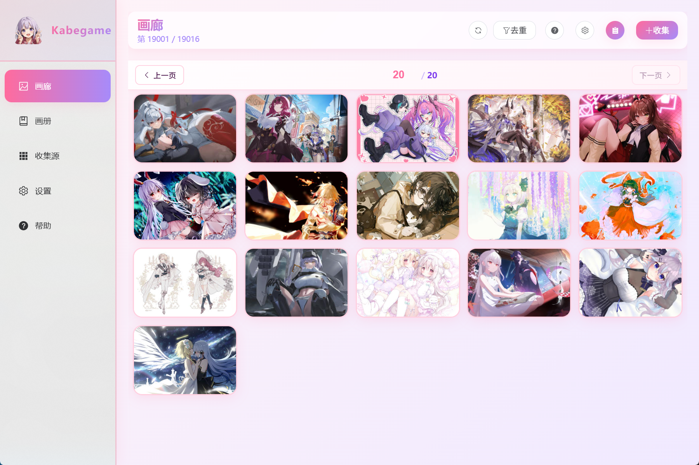
  <br/>
  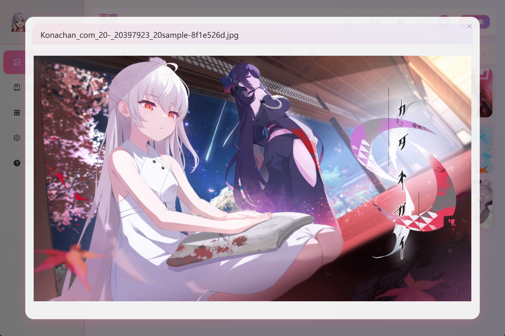
</div>

### 📸 画册管理

画册功能让你可以自由整理和分类收集到的壁纸。创建自定义画册，将喜欢的图片加入其中，支持拖拽调整顺序。画册可以用于壁纸轮播，也可以作为虚拟磁盘的目录结构。每个画册都有独立的封面和描述，让你的收藏更有条理。

<div align="center">
  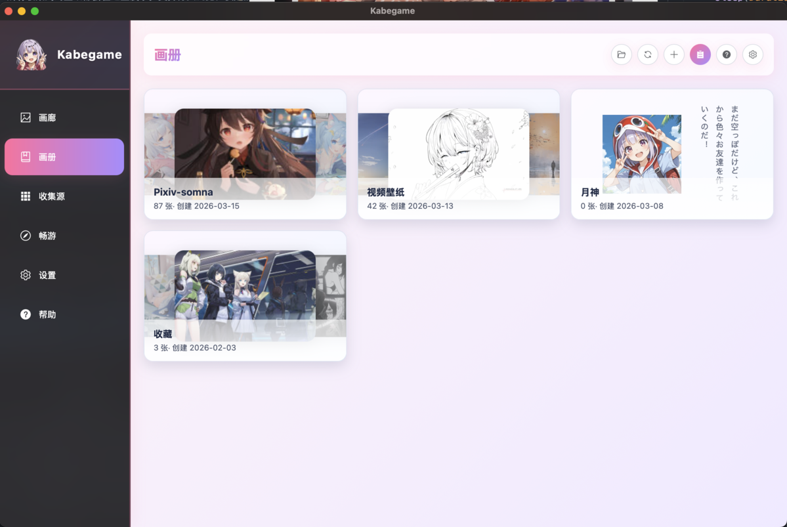
  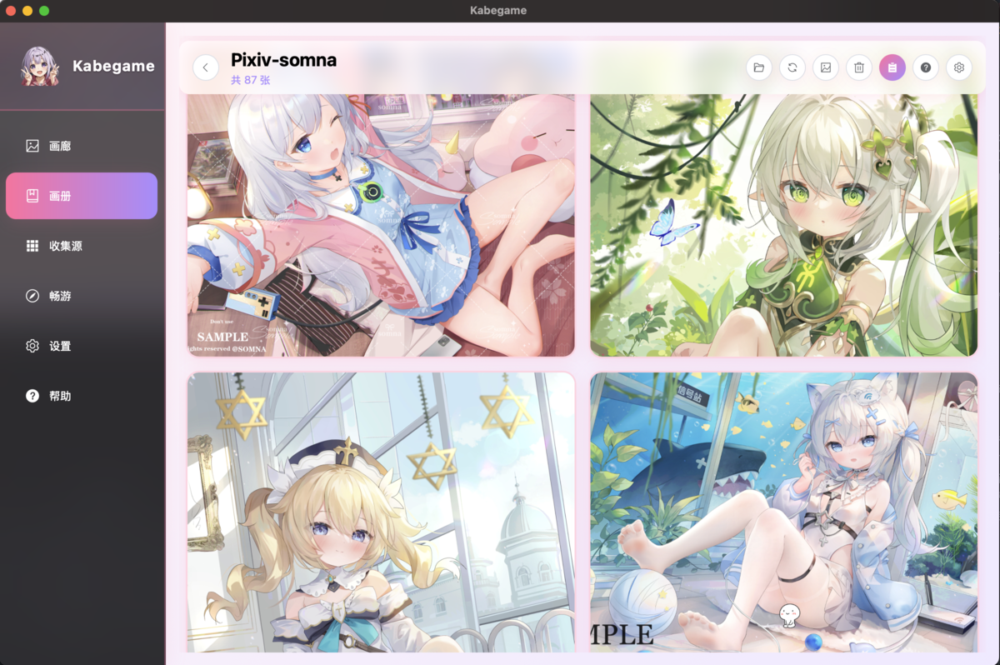
</div>


### 🔌 强大的插件系统

Kabegame 的核心竞争力在于其插件化的爬虫系统（本地导入文件功能本质上是一个爬虫插件）。通过 `.kgpg` 插件文件，你可以轻松从各种二次元壁纸网站收集资源。插件使用 Rhai 脚本语言编写，支持复杂的爬取逻辑。应用内置插件商店（[插件仓库](./src-crawler-plugins)），可以一键安装热门插件，也可以导入别人开发的插件，甚至可以编写你自己的插件。每个插件都可以配置参数，在运行脚本的时候由用户输入。你也可以在运行的时候配置http头，分かるな。

<div align="center">
  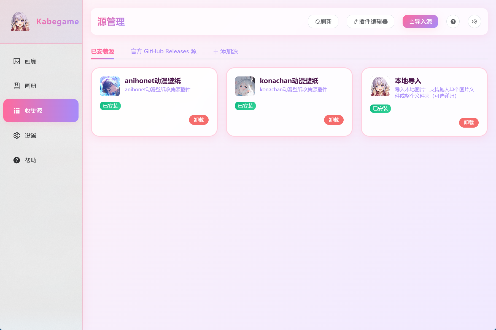
  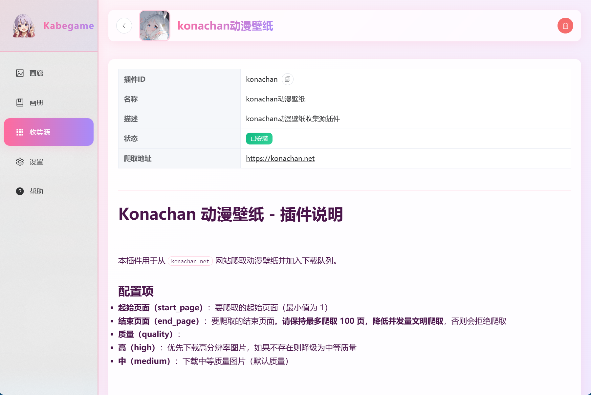
  
</div>

### 🎨 壁纸设置与轮播

一键设置桌面壁纸（图片右键抱到桌面上），支持原生模式和窗口模式。原生模式性能优秀，窗口模式功能更丰富。开启壁纸轮播后，可以自动从指定画册中更换壁纸，支持随机和顺序两种模式，可自定义轮播间隔。让桌面每天都有新惊喜！


### 📋 任务管理

所有收集任务都在这里统一管理。实时查看任务进度、状态、已收集图片数量等信息。支持查看任务详情、停止运行中的任务、删除已完成的任务。任务详情页以网格形式展示已收集的图片，可以预览、选择、添加到画册或删除。

<div align="center">
  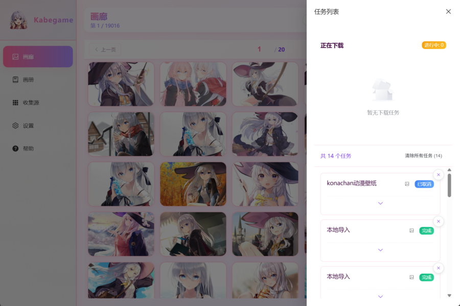
  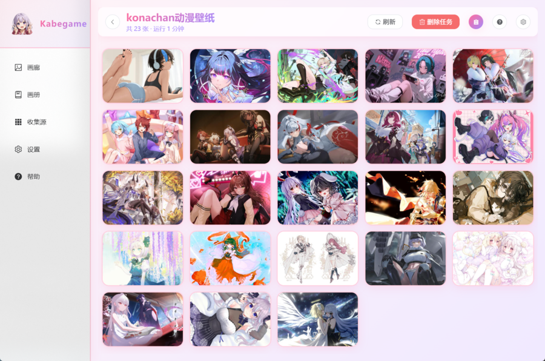
  <br/>
  
  
</div>

### 💾 虚拟磁盘

在 Windows 系统上（目前），Kabegame 可以将画册挂载为虚拟磁盘，让你在资源管理器中像浏览普通文件夹一样浏览画册和图片。支持按插件、按时间、按任务、按画册等多种目录结构，带来更加灵活和原生的浏览体验。

<div align="center">
  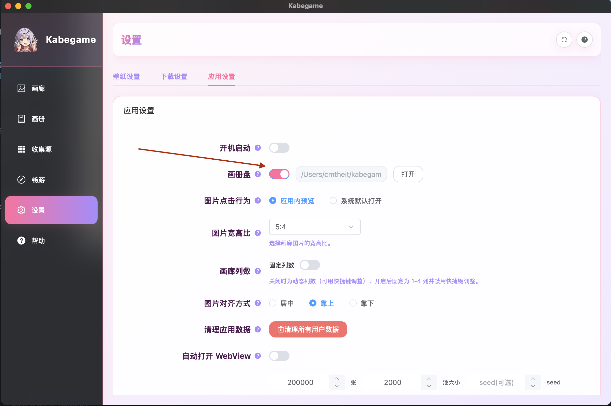
  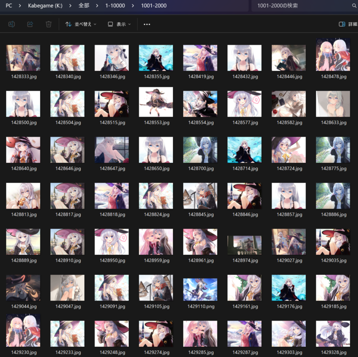
</div>

### 🛠️ 插件编辑器

内置强大的插件编辑器，支持创建、编辑和调试 Rhai 爬虫脚本。提供语法高亮、代码补全、实时预览等功能。可以配置插件的 manifest.json 和 config.json，添加图标和文档，一键打包为 `.kgpg` 文件并导入。让插件开发变得简单高效！

<div align="center">
  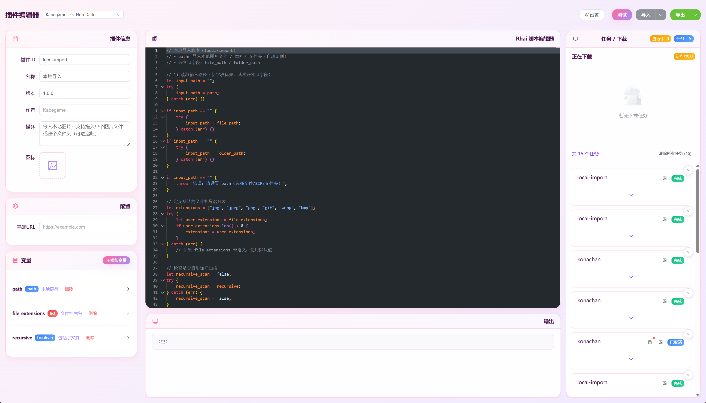
</div>

### ⌨️ 命令行工具

提供精巧的 CLI 工具，支持通过命令行运行插件、导入图片、管理画册等操作。适合自动化脚本、批量处理等场景。可以轻松集成到你的工作流中，让壁纸收集更加自动化。当你双击一个`kgpg`文件的时候，默认通过命令行工具打开查看详情。

<div align="center">
  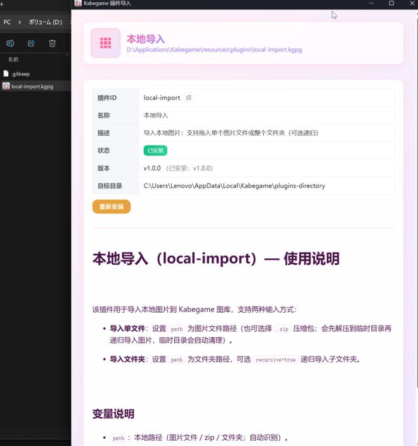
</div>

### 更多用法
应用内置一个帮助页面，能够帮助你更好了解龟龟！
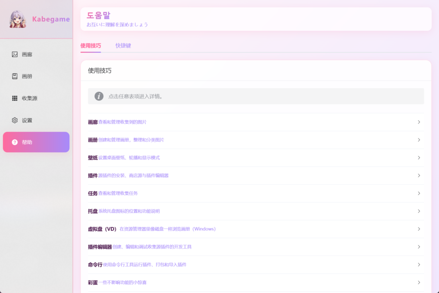

これからもっと機能や改良を行っていく予定です。ぜひご期待を。

## 注意事项

- 请遵守目标网站的 robots.txt 和使用条款，合理使用爬虫功能
- 壁纸默认存储在用户的图片（Pictures）文件夹下，否则位于应用数据目录的 images 中（具体位置应用中可以确认并且设置）
- 插件配置保存在应用数据目录中
- 壁纸轮播功能需要应用在后台运行，关闭应用后轮播会自动停止
- 插件文件格式为 `.kgpg`（ZIP 压缩包），包含 `manifest.json`、`crawl.rhai` 等文件

---

## 技术栈

- **前端**: Vue 3 + TypeScript + Element Plus
- **后端**: Rust (Tauri)
- **状态管理**: Pinia
- **路由**: Vue Router
- **构建工具**: Vite + Nx
- **插件脚本**: Rhai

## 开发

### 前置要求

- Node.js 16+ 
- Bun 1.3+ (推荐使用官方安装脚本: `curl -fsSL https://bun.sh/install | bash` 或 Windows: `powershell -c "irm bun.sh/install.ps1 | iex"`)
- Rust 1.70+ (Rust 2021 Edition)
- [Tauri CLI](https://tauri.app/v2/guides/getting-started/prerequisites)

### 安装依赖

```bash
bun install
```

### Git 钩子：push 前自动尝试打 tag（可选）

本仓库使用 Husky 提供 git hooks：在 `git push` 之前会读取 `src-crawler-plugins/package.json` 的 `version`，
并尝试创建 `v{version}` 的 tag（例如 `1.0.0` → `v1.0.0`）。如果 tag 已存在或创建失败会**跳过且不阻断 push**。

- 启用方式：执行 `bun install`（会自动运行 `prepare` 安装 hooks）
- 手动重装 hooks：执行 `bun run prepare`

### 开发/构建命令（统一入口）

项目采用 **Cargo Workspace** 架构，包含三个独立应用：
- **main**：主应用（Tauri GUI，前端端口 1420）
- **plugin-editor**：插件编辑器（Tauri GUI，前端端口 1421）
- **cli**：命令行工具（无界面）

所有应用共享 `kabegame-core` 核心库。

```bash
# 开发模式（带 watch，热重载）
bun dev -c main              # 启动主应用（端口 1420）
bun dev -c plugin-editor     # 启动插件编辑器（端口 1421）
bun dev -c main --mode local # 使用 local 模式（无商店版本，预打包全部插件）
bun dev -c main --desktop plasma  # 指定桌面环境为 Plasma（在设置中显示插件模式选项）
bun dev -c main --desktop gnome   # 指定桌面环境为 GNOME

# 启动模式（无 watch，直接运行）
bun start -c cli            # 启动 CLI 工具

# 构建生产版本
bun b                    # 构建全部组件（main + plugin-editor + cli）
bun b -c main            # 构建主应用
bun b -c plugin-editor   # 构建插件编辑器
bun b -c cli             # 构建 CLI 工具

# 检查（不产出构建产物）
bun check -c main                # 依次检查 vue 与 cargo
bun check -c main --skip cargo   # 仅检查 vue
bun check -c plugin-editor --skip vue  # 仅检查 cargo
```

说明：
- `-c, --component`：指定要开发/启动/构建的组件（`main` | `plugin-editor` | `cli`）
- `bun check` 必须用 `-c, --component` 指定组件
- `--mode`：构建模式
  - `normal`（默认）：一般版本，带商店源，仅打包本地插件到 resources
  - `local`：无商店，预打包全部插件到 resources
  - `light`：轻量模式，无商店，没有插件编辑器，没有虚拟盘功能
- `--desktop <desktop>`：指定桌面环境（`plasma` | `gnome`），用于后端按桌面环境选择实现
  - `plasma`：适用于 KDE Plasma 环境（在设置中显示 Plasma 插件模式选项）
  - `gnome`：适用于 GNOME 环境
- `--skip <skip>`：跳过某个流程（只能一个值：`vue` | `cargo`）
  - 在 `check` 中始终生效：`--skip vue` 跳过 `vue-tsc`，`--skip cargo` 跳过 `cargo check`
  - 在 `build` 中：
    - `cli/plugin-editor`：`--skip vue` 跳过前端构建，`--skip cargo` 跳过后端构建
    - `main`：仅支持 `--skip vue` 跳过前端构建（仍会执行 `cargo tauri build`）
- `dev` 和 `start` 会自动先打包插件到 `src-tauri/app-main/resources/plugins`，确保资源存在
- `dev` 的前端由各自的 `tauri.conf.json` 的 `beforeDevCommand` 启动；`build` 时前端由构建脚本显式构建（`nx run .:build-*`）

## 项目结构

```
.
├── apps/                  # 前端应用（Nx Monorepo）
│   ├── main/             # 主应用前端（Vue 3 + TypeScript，端口 1420）
│   │   ├── src/
│   │   │   ├── components/# Vue 组件
│   │   │   ├── stores/   # Pinia 状态管理
│   │   │   ├── views/   # 页面视图
│   │   │   ├── router/  # 路由配置
│   │   │   ├── help/    # 帮助系统
│   │   │   └── main.ts  # 入口文件
│   │   ├── html/        # HTML 模板
│   │   ├── vite.config.ts
│   │   └── package.json
│   ├── plugin-editor/    # 插件编辑器前端（Vue 3 + TypeScript，端口 1421）
│   │   ├── src/
│   │   │   └── plugin-editor/
│   │   ├── html/
│   │   ├── vite.config.ts
│   │   └── package.json
│   └── cli/              # CLI 工具前端（Vue 3 + TypeScript）
│       ├── src/
│       ├── html/
│       ├── vite.config.ts
│       └── package.json
├── packages/             # 共享包（Nx Monorepo）
│   └── core/             # 共享前端组件和工具
│       ├── src/         # Vue 组件、工具函数等
│       └── package.json
├── src-tauri/            # Rust 后端代码（Cargo Workspace）
│   ├── core/             # 共享核心库（kabegame-core）
│   │   ├── src/
│   │   │   ├── lib.rs    # 核心库入口
│   │   │   ├── plugin/   # 插件管理
│   │   │   ├── crawler/  # 爬虫逻辑
│   │   │   ├── providers/# 数据提供者（画册、任务等）
│   │   │   ├── storage/  # 存储层
│   │   │   ├── ipc/      # IPC 通信（事件、客户端等）
│   │   │   ├── runtime/  # 运行时适配器（Tauri、IPC 等）
│   │   │   ├── gallery/  # 画廊浏览
│   │   │   ├── virtual_driver/# 虚拟磁盘实现
│   │   │   └── ...       # 其他共享模块（设置、路径、去重等）
│   │   ├── build.rs
│   │   └── Cargo.toml
│   ├── app-main/         # 主应用（Tauri GUI）
│   │   ├── src/
│   │   │   ├── main.rs   # 主应用入口，包装 core 的 Tauri commands
│   │   │   ├── tray.rs   # 系统托盘
│   │   │   ├── storage.rs# 存储相关命令
│   │   │   ├── daemon_client.rs # Daemon 客户端
│   │   │   ├── event_listeners.rs # 事件监听器
│   │   │   ├── virtual_driver.rs # 虚拟磁盘命令
│   │   │   ├── wallpaper/# 壁纸相关（管理器、轮播、窗口等）
│   │   │   └── ...
│   │   ├── resources/    # 资源文件
│   │   │   ├── plugins/  # 打包后的插件文件（.kgpg）
│   │   │   └── bin/      # Sidecar 二进制文件
│   │   ├── capabilities/ # Tauri 权限配置
│   │   ├── nsis/         # NSIS 安装脚本
│   │   ├── tauri.conf.json
│   │   └── Cargo.toml
│   ├── app-plugin-editor/# 插件编辑器（Tauri GUI）
│   │   ├── src/
│   │   │   ├── main.rs   # 插件编辑器入口
│   │   │   └── plugin_editor.rs
│   │   ├── capabilities/
│   │   ├── tauri.conf.json
│   │   └── Cargo.toml
│   ├── app-cli/          # CLI 工具（命令行）
│   │   ├── src/
│   │   │   ├── main.rs
│   │   │   └── bin/
│   │   │       └── kabegame-cliw.rs # Windows CLI 入口
│   │   ├── tauri.conf.json
│   │   └── Cargo.toml
│   └── icons/            # 应用图标资源
├── src-crawler-plugins/      # 插件相关（Nx 项目）
│   ├── plugins/          # 本地插件源码
│   │   ├── anihonet-wallpaper/
│   │   ├── konachan/
│   │   └── local-import/
│   ├── packed/           # 打包后的插件文件（.kgpg）
│   ├── scripts/          # 插件构建脚本
│   ├── generate-index.js # 生成插件索引
│   ├── package-plugin.js # 插件打包脚本
│   ├── project.json      # Nx 项目配置
│   └── package.json
├── scripts/              # 构建脚本
│   ├── run.js            # 统一开发/构建入口
│   └── git/              # Git 相关脚本
├── docs/                 # 文档
│   ├── images/           # 文档图片
│   ├── README_PLUGIN_DEV.md
│   ├── PLUGIN_FORMAT.md
│   └── RHAI_API.md
├── static/               # 静态资源
├── nx.json               # Nx 工作区配置
├── project.json          # 根项目配置
├── package.json          # Node.js 依赖（包含 Bun workspace 配置）
└── Cargo.toml            # Rust Cargo Workspace 配置
```

## 插件开发

插件开发相关文档请参考：
- [插件开发指南](docs/README_PLUGIN_DEV.md)
- [插件文件格式](docs/PLUGIN_FORMAT.md)
- [Rhai API 文档](docs/RHAI_API.md)

## 许可证

The source code is licensed under GPL v3. License is available [here](./LICENSE).

## 致谢

本项目基于以下优秀的开源项目构建，感谢这些项目的开发者和社区：

### 核心框架
- [**Tauri**](https://github.com/tauri-apps/tauri) - 构建跨平台桌面应用的框架（本项目的框架，以及部分代码参考）
- [**Vue**](https://github.com/vuejs/core) - 渐进式 JavaScript 框架（本项目的前端核心）
- [**Vite**](https://github.com/vitejs/vite) - 下一代前端构建工具
- [**TypeScript**](https://github.com/microsoft/TypeScript) - JavaScript 的超集，提供类型安全

### UI 与工具库
- [**Element Plus**](https://github.com/element-plus/element-plus) - 基于 Vue 3 的组件库
- [**Pinia**](https://github.com/vuejs/pinia) - Vue 的状态管理库
- [**Vue Router**](https://github.com/vuejs/router) - Vue.js 官方路由管理器
- [**Axios**](https://github.com/axios/axios) - 基于 Promise 的 HTTP 客户端

### 后端与工具
- [**Rhai**](https://github.com/rhaiscript/rhai) - 嵌入式脚本语言引擎（本项目插件脚本的核心支持）
- [**Serde**](https://github.com/serde-rs/serde) - Rust 序列化框架
- [**Tokio**](https://github.com/tokio-rs/tokio) - Rust 异步运行时
- [**Reqwest**](https://github.com/seanmonstar/reqwest) - Rust HTTP 客户端
- [**Scraper**](https://github.com/causal-agent/scraper) - Rust HTML 解析和选择器库
- [**Rusqlite**](https://github.com/rusqlite/rusqlite) - SQLite 的 Rust 绑定
- [**Image**](https://github.com/image-rs/image) - Rust 图像处理库
- [**Prisma**](https://github.com/prisma/prisma) - 下一代 ORM，用于数据库访问和类型安全

### 构建与开发工具
- [**Nx**](https://github.com/nrwl/nx) - 智能、快速和可扩展的构建系统
- [**Bun**](https://github.com/oven-sh/bun) - 快速的全能 JavaScript 运行时、包管理器和构建工具
- [**Tapable**](https://github.com/webpack/tapable) - 用于创建钩子系统的库（本项目开发构建系统的核心）

### 参考项目
- [**Lively**](https://github.com/rocksdanister/lively) - 动态壁纸应用（本项目参考了其桌面挂载实现）
- [**Clash Verge**](https://github.com/clash-verge-rev/clash-verge-rev) - Clash 代理客户端（本项目参考了其托盘代码）

如果这些项目对你有帮助，请考虑给它们一个 ⭐ Star，这是对开源社区最好的支持！
