# Kabegame — Anime Crawler Client

> *Translated by AI. [中文](README.zh-CN.md) | [日本語](README.ja.md) | [한국어](README.ko.md)*

A Tauri-based anime crawler client! Crawl, organize, and set/rotate wallpapers—let your waifus (or husbandos) keep you company every day~ Plugin-extensible, so you can easily grab images from all kinds of anime wallpaper sites.

> 🌐 **Demo Page**: [https://kabegame.com/](https://kabegame.com/)

<div align="center">
  
</div>


## Gallery Screenshots

<table>
  <tr>
    <td align="center" style="width: 300px;">
      <br/>
      <small>Windows</small>
    </td>
    <td align="center" style="width: 300px;">
      <br/>
      <small>Windows</small>
    </td>
    <td align="center" rowspan="2" style="vertical-align: top; text-align: right; width: 200px;">
      <br/>
      <small>Android</small>
    </td>
  </tr>
  <tr>
    <td align="center" style="width: 300px;">
      <br/>
      <small>macOS</small>
    </td>
    <td align="center" style="width: 300px;">
      <br/>
      <small>Linux</small>
    </td>
  </tr>
</table>

## Crawler Screenshots

|  |  |
| --- | --- |
| <div align="center"><br/><small><a href="https://pixiv.net">Pixiv</a> (artist: <a href="https://www.pixiv.net/users/16365055">somna</a>)</small></div> | <div align="center"><br/><small><a href="https://anihonetwallpaper.com">anihonet</a> (yearly ranking)</small></div> |
| <div align="center"><br/><small><a href="https://anime-pictures.net">anime-pictures</a> (keyword: Honkai: Star Rail)</small></div> | <div align="center"><br/><small><a href="https://konachan.net">konachan</a> wallpapers</small></div> |
| <div align="center"><br/><small><a href="https://2dwallpapers.com">2dwallpaper</a> (Games → Genshin → Most viewed)</small></div> | <div align="center"><br/><small><a href="https://t.ziworld.top">ziworld</a> wallpapers</small></div> |

<p align="center"><sub>Supports many sites; plugins are extensible. Contributions welcome!</sub></p>

[→ Crawler plugins repo](https://github.com/kabegame/crawler-plugins/tree/main)

## Name Origin 🐢

**Kabegame** is the romanization of the Japanese word 壁亀 (かべがめ), which sounds similar to 壁紙 (かべがみ, wallpaper). Like a quiet turtle resting on your desktop, it quietly guards your anime wallpaper collection—no fuss, just comfort. So you get a little comfort every day. Yay~ ✨

> My philosophy: Embrace open source, build software by and for weebs.

## Features

- 🔌 **Crawler client**: Use `.kgpg` plugins to crawl wallpapers from various sites; built-in plugin store for browse/install/manage; task progress with stop/delete; CLI to run plugins, import images, etc.
- 🎨 **Wallpaper setter (image/video)**: Collect, manage, and rotate anime wallpapers; auto-switch desktop wallpaper from albums (random or sequential)
- 🖼️ **Image manager (image/video)**: Gallery browsing, album organization, virtual disk (drive letter on Windows, virtual folder on macOS/Linux), drag-and-drop import for local images/videos/folders/archives or kgpg plugins

(Video support: mp4 and mov only as of v3.2.2)

## Installation

**Desktop Kabegame** comes in two builds:

| Feature | Standard | Light |
|---------|----------|-------|
| **Virtual disk** | ✅ | ❌ |
| **CLI** | ✅ | ❌ |
| **Use case** | Daily use, CLI/virtual disk needed | Lightweight, basic features only |
| **Size** | Larger | Smaller |
| **Trade-off** | Full features, but OS-specific deps (see [Installation](#installation-1)) | Install and go, no virtual disk or CLI |

**Pick the right package for your OS and needs.**

**[View the latest GitHub Releases](https://github.com/kabegame/kabegame/releases/latest)**

| OS | Standard | Light |
|----|----------|-------|
| Windows | [setup.exe](https://github.com/kabegame/kabegame/releases/download/v4.1.1/Kabegame-standard_4.1.1_x64-setup.exe) | [setup.exe](https://github.com/kabegame/kabegame/releases/download/v4.1.1/Kabegame-light_4.1.1_x64-setup.exe) |
| macOS | [dmg](https://github.com/kabegame/kabegame/releases/download/v4.1.1/Kabegame-standard_4.1.1_aarch64.dmg) | [dmg](https://github.com/kabegame/kabegame/releases/download/v4.1.1/Kabegame-light_4.1.1_aarch64.dmg) |
| Linux | [deb](https://github.com/kabegame/kabegame/releases/download/v4.1.1/Kabegame-standard_4.1.1_amd64.deb) | [deb](https://github.com/kabegame/kabegame/releases/download/v4.1.1/Kabegame-light_4.1.1_amd64.deb) |

- **Android preview** : [apk](https://github.com/kabegame/kabegame/releases/download/v4.1.1/Kabegame_4.1.1_android-preview.apk) on the same releases page.

## Installation

### Windows

1. **Download**: Choose Standard or Light `setup.exe`.
2. **Run installer**: Double-click and follow the wizard.
3. **Virtual disk driver (Standard only)**:
   - If Dokan is not installed, the installer will prompt for admin rights.
   - Click "Yes" to install Dokan (required for virtual disk).
   - Light build does not include virtual disk, so no Dokan.
4. **CLI (Standard only)**:
   - `kabegame-cli.exe` is installed in the app directory.
   - Add that directory to PATH, or use the full path.

> **Tip**: The installer supports auto-update; run it again to upgrade.

### macOS

> **Minimum**: macOS **10.13 (High Sierra)** or later.

1. **Download DMG**: Choose Standard or Light `.dmg`.
2. **Install**:
   - Open the `.dmg`.
   - Drag `Kabegame.app` to Applications.
> [!IMPORTANT]
> ## Fix: "Kabegame.app" is damaged and can't be opened
> After installing to Applications, you need to bypass Gatekeeper (this is an open-source app and the author can't afford Apple's developer fee).
>
> `xattr -d com.apple.quarantine /Applications/Kabegame.app`
3. **Virtual disk / FUSE (Standard only)**:
   - Requires macFUSE: `brew install macfuse`
   - First mount will prompt for permission.
4. **CLI (Standard only)**:
   - Located at: `/Applications/Kabegame.app/Contents/Resources/resources/bin/kabegame-cli`
   - To use globally:
   ```bash
   sudo ln -s "/Applications/Kabegame.app/Contents/Resources/resources/bin/kabegame-cli" /usr/local/bin/kabegame-cli
   ```
   - Then: `kabegame-cli --help`
   - Light build has no CLI.

### Linux (Debian-based, e.g. Ubuntu)

> **Minimum**: **Ubuntu 24.04** or later.

1. **Dependencies (Standard only)**:
   - Virtual disk needs `fuse3`:
   ```bash
   sudo apt update
   sudo apt install fuse3
   ```
   - Light build does not need fuse3.

2. **Install**:
   ```bash
   sudo dpkg -i Kabegame-<mode>_<version>_<arch>.deb
   ```
   - If dependencies fail: `sudo apt-get install -f`

3. **CLI (Standard only)**:
   - Installed to `/usr/bin/kabegame-cli`: `kabegame-cli --help`
   - Light build has no CLI.

4. **KDE Plasma Wallpaper Plugin (optional)**:
   - **Requires**: KDE Plasma 6; Kabegame must be installed first (hard dependency). See [Kabegame installation](https://github.com/kabegame/kabegame#installation).
   - Use Kabegame as the system wallpaper in Plasma 6. After installing the plugin deb, go to System Settings → Appearance → Wallpaper and select "Kabegame Wallpaper".
   - **Install**: Download the `.deb` from [Releases](https://github.com/kabegame/plasma-wallpaper-plugin2/releases) (choose a release with `plasma-v*` tag), then:
     ```bash
     sudo dpkg -i kabegame-plasma-wallpaper_*_amd64.deb
     ```
     If dependencies fail: `sudo apt-get install -f`
   - **Restart Plasma Shell** (required after install or update):
     ```bash
     kquitapp6 plasmashell 2>/dev/null; kstart6 plasmashell &
     ```
     Or log out and log back in.
   - **Source**: [Plasma Wallpaper Plugin](https://github.com/kabegame/plasma-wallpaper-plugin2)

5. **Workarounds** (Linux):
   - **Wayland**: WebKit2GTK can feel laggy on Wayland. The app automatically forces `GDK_BACKEND=x11` when running under Wayland (so the UI uses X11 and is smoother).

## Main Features

### 🖼️ Gallery & Image Management

The gallery is the heart of Kabegame—all collected wallpapers show up here. Pagination, quick preview, multi-select, deduplication, and more. Drag in local files to import. Double-click for in-app preview with zoom, pan, and navigation, or open with your system viewer.

<div align="center">
  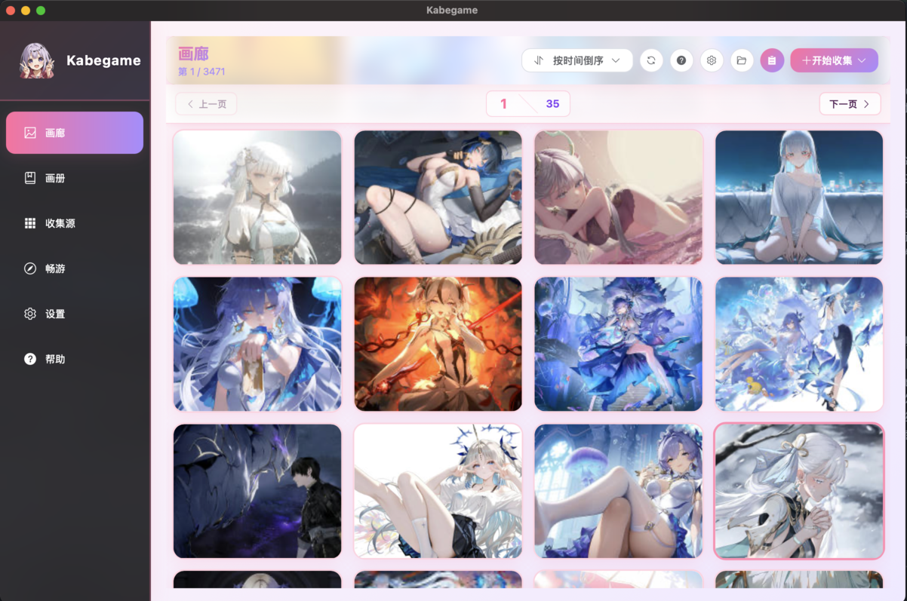
  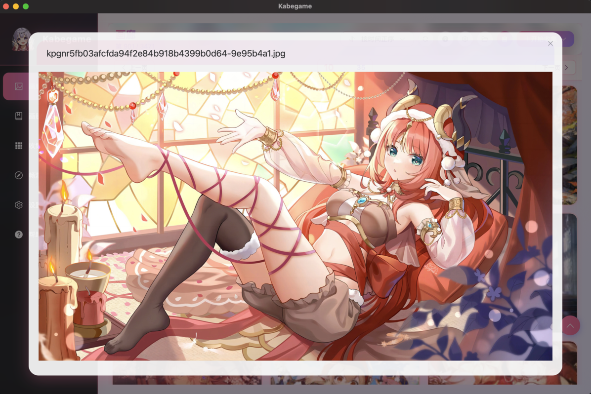
</div>

### 📸 Albums

Organize wallpapers into custom albums. Add favorites, drag to reorder. Albums power wallpaper rotation and virtual disk layout. Each album has its own cover and description.

<div align="center">
  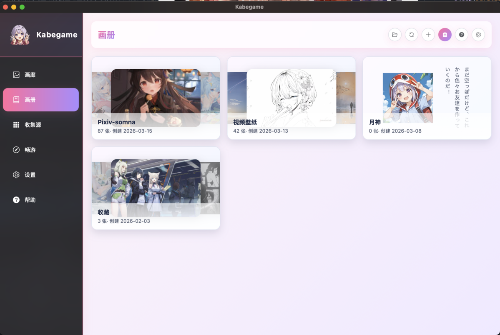
  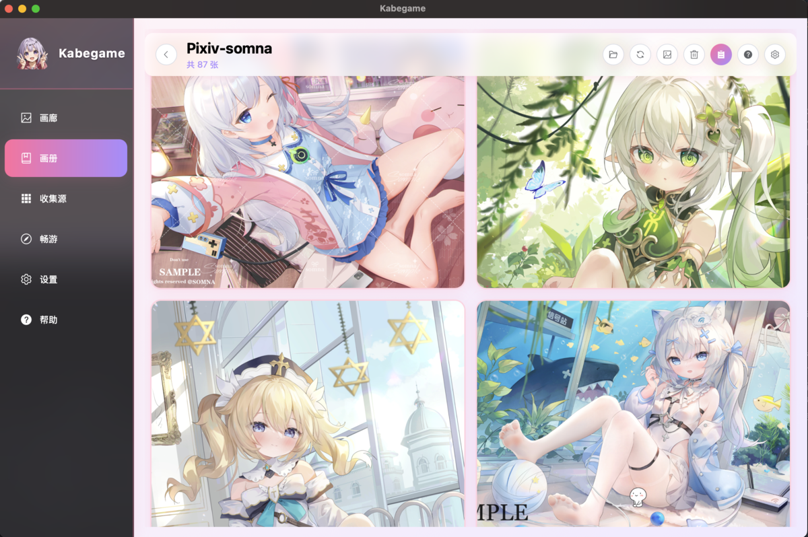
</div>

### 🔌 Plugin System

Kabegame’s strength is its plugin-based crawler (local file import is a crawler plugin too). `.kgpg` plugins let you pull images from anime wallpaper sites. Plugins are written in Rhai. Built-in plugin store ([plugin repo](./src-crawler-plugins)) for one-click install, or import third-party plugins, or write your own. Each plugin has configurable parameters and optional HTTP headers. You get it.

<div align="center">
  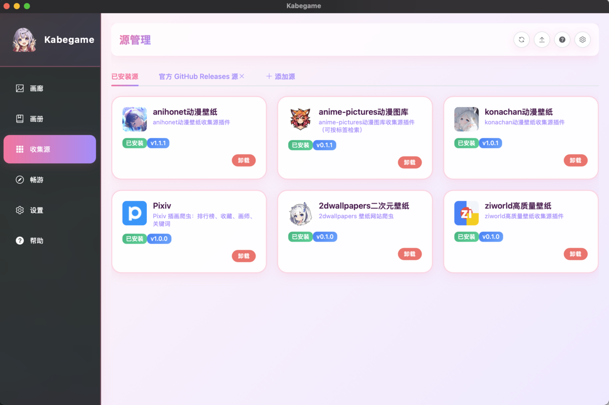
  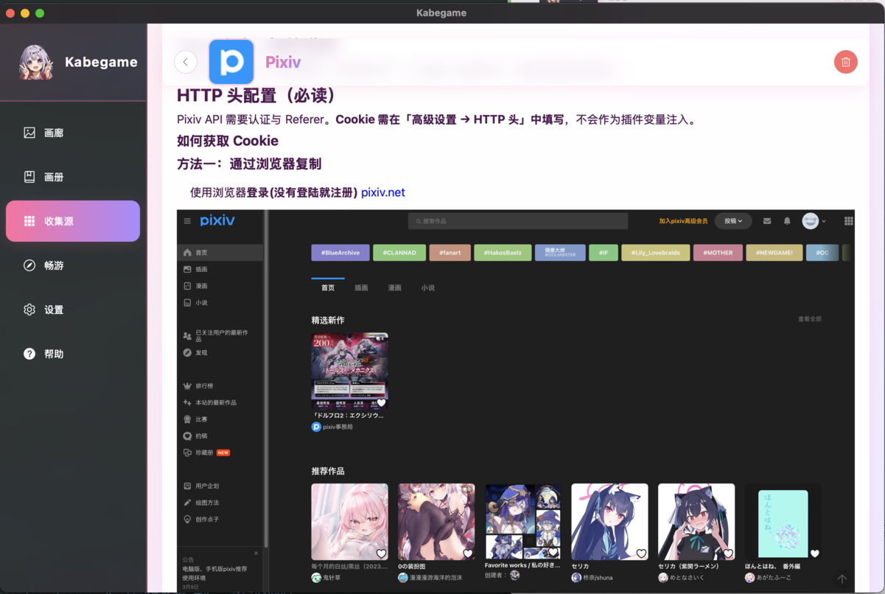
</div>

### 🎨 Wallpaper & Rotation

Set desktop wallpaper with one click (right-click image → set as wallpaper). Native mode for performance, window mode for extra features. Enable rotation to auto-switch from an album (random or sequential), with configurable interval.

<div align="center"><small>Set image wallpaper</small></div>


<div align="center"><small>Set video wallpaper (Windows, macOS)</small></div>


### 📋 Crawler Task Management

All crawl tasks in one place. Live progress, status, image count. View details, stop running tasks, delete finished ones. Task detail view shows collected images in a grid—preview, select, add to album, or delete.

| 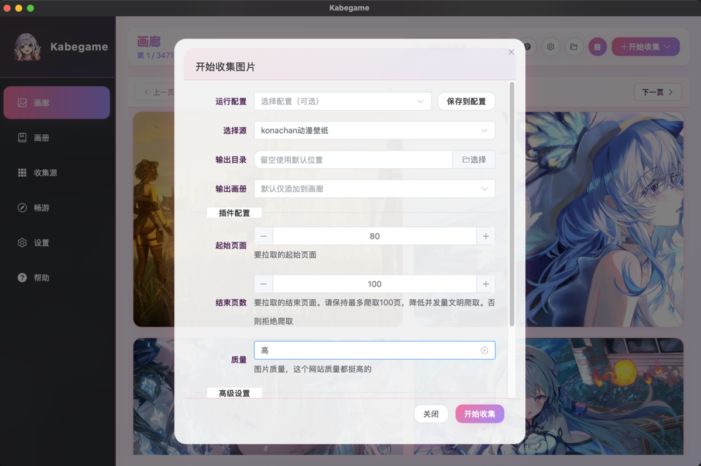<br/><sub>Start task</sub> | 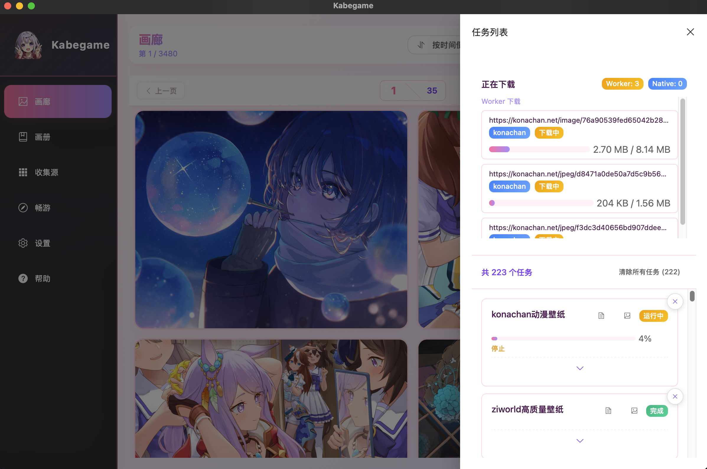<br/><sub>Crawling</sub> |
|:-----------------------------------------------------------:|:----------------------------------------------------------:|
| 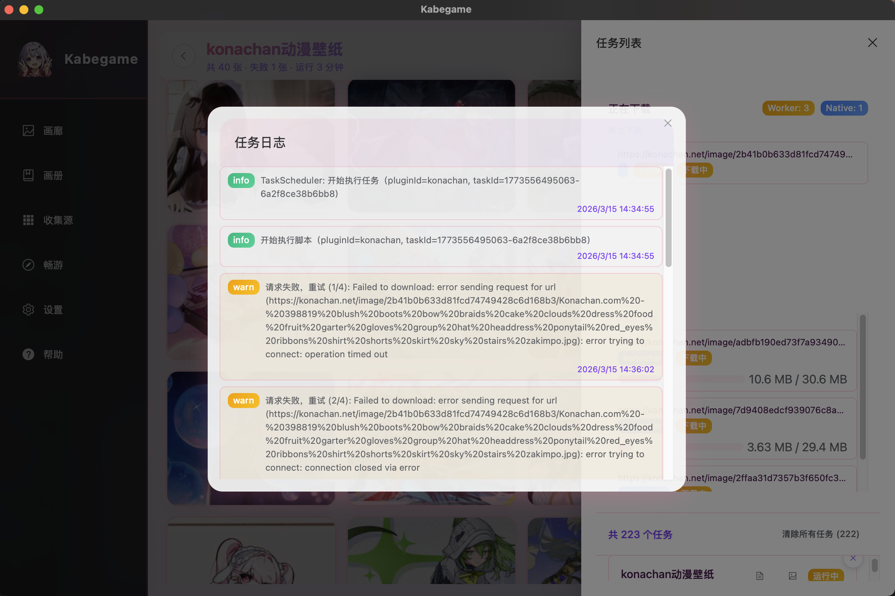<br/><sub>Task log</sub>    | 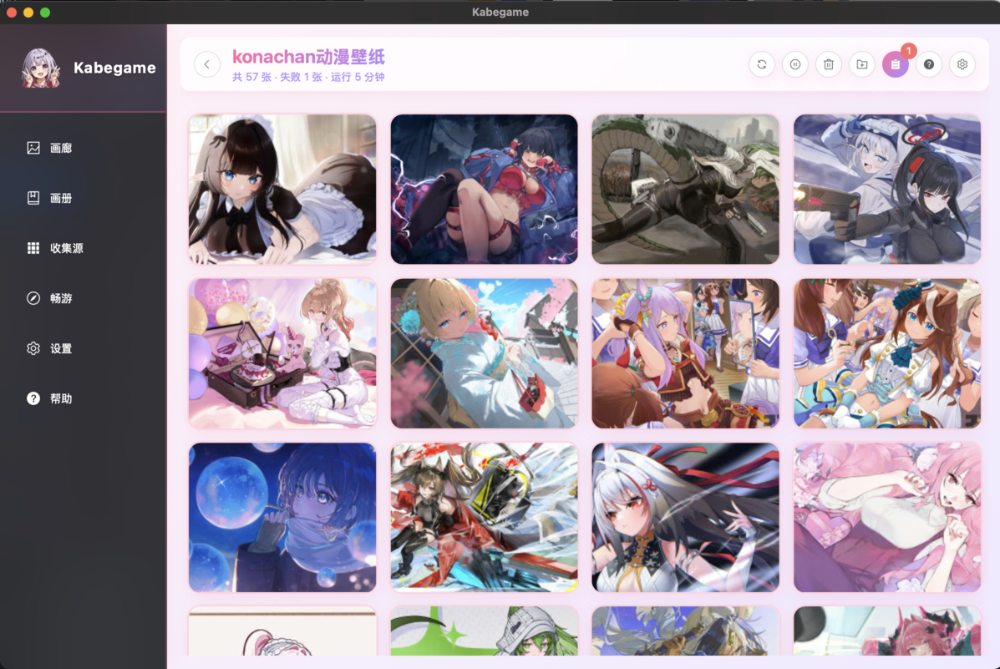<br/><sub>Task images</sub>  |

### 💾 Virtual Disk

**<del>Not available in Light build</del>**

On Windows, macOS, and Linux, Kabegame can mount albums as a virtual disk (or virtual folder). Browse albums and images in your file manager like normal folders. Supports layouts by plugin, time, task, or album.

<div align="center">
  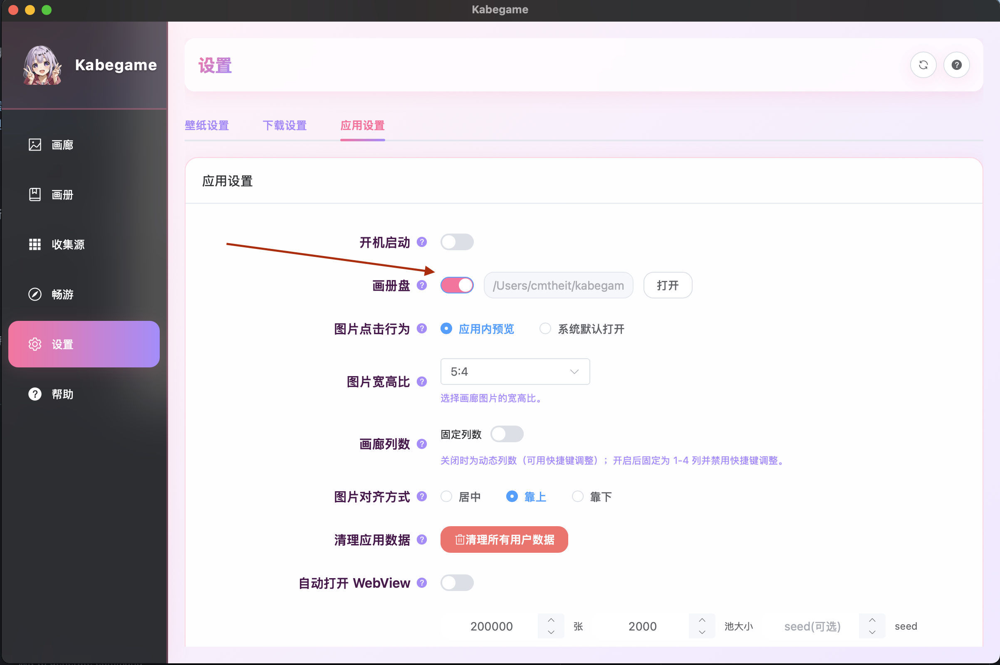
  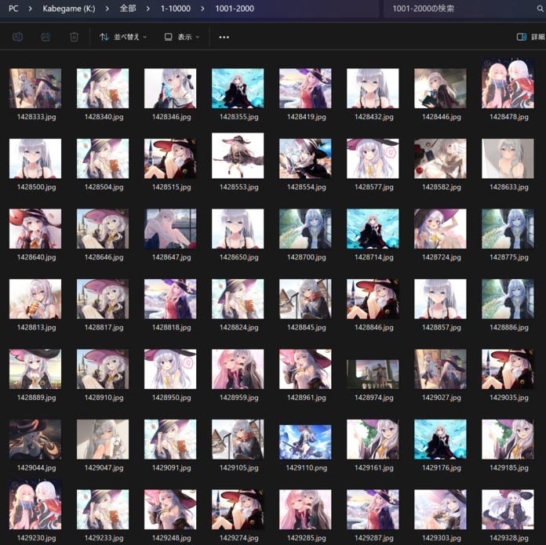
  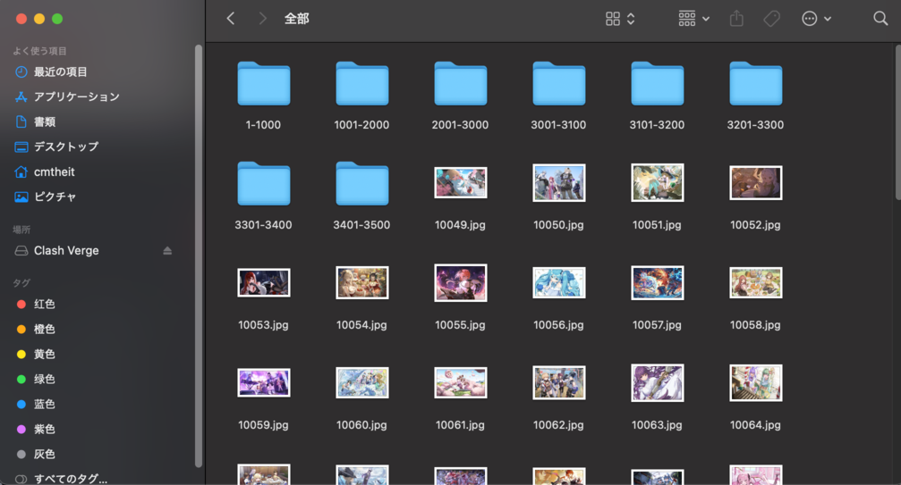
</div>

### ⌨️ CLI

Headless CLI for running plugins, importing images, managing albums. Great for automation and batch jobs. Double-clicking a `.kgpg` file opens it with the CLI to view details.

### More

Built-in help page to get to know Kabegame better.
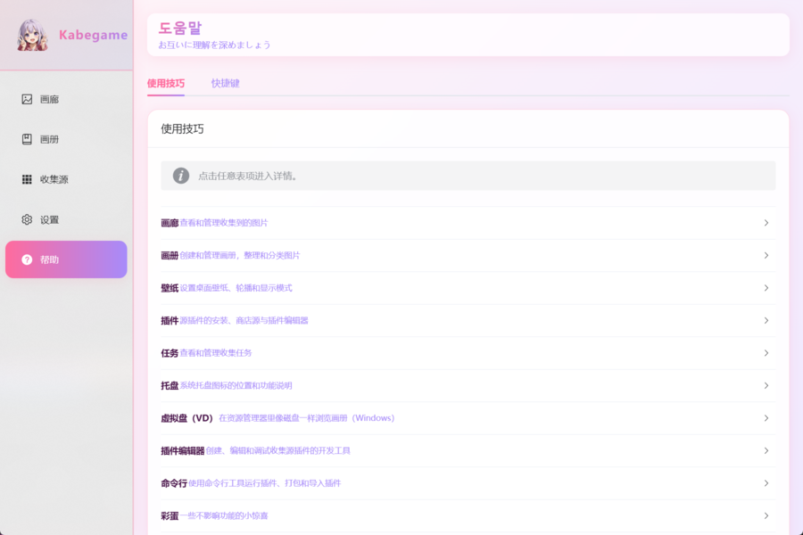

More features and improvements are planned. Stay tuned.

## Notes

- Respect target sites’ robots.txt and terms of use when crawling.
- Wallpapers are stored in `Pictures/Kabegame` by default, or in the app data `images` folder (configurable in-app).
- All data lives in app data; cache in cache dir. Uninstalling with “delete data” removes app data but not images.
- Wallpaper rotation requires the app to run in the background (tray icon). Closing the app stops rotation.

## Uninstall

### Windows
**Option 1**: Settings → Apps → Installed apps → search Kabegame → ⋮ → Uninstall  
**Option 2**: Right-click shortcut → Open file location → run `uninstall.exe`

### Linux (Debian-based)
```sh
sudo dpkg -r kabegame
```

---

## Tech Stack

- **Frontend**: Vue 3 + TypeScript + Element Plus + UnoCSS
- **Backend**: Rust (Tauri) + Kotlin (Jetpack)
- **State**: Pinia
- **Router**: Vue Router
- **Build**: Vite 5 + Nx
- **Plugin scripts**: Rhai

## Development

### Prerequisites

- Bun 1.3+ (install: `curl -fsSL https://bun.sh/install | bash` or Windows: `powershell -c "irm bun.sh/install.ps1 | iex"`)
- Rust 1.70+ (Rust 2021 Edition)
- [Tauri CLI](https://tauri.app/v2/guides/getting-started/prerequisites)

### Install dependencies

```bash
bun install
```

FFmpeg is a **Git submodule** in `third/FFmpeg` (for desktop video preview/compression). For `bun run build:ffmpeg`:

- **After clone**: `git submodule update --init --recursive`, or `git clone --recurse-submodules <repo-url>`
- **First-time submodule add** (one-time, large): `git submodule add https://github.com/FFmpeg/FFmpeg.git third/FFmpeg`

### Git hooks: auto-tag on push (optional)

Husky runs before `git push`, reads `src-crawler-plugins/package.json` version, and tries to create tag `v{version}`. If the tag exists or creation fails, it **skips without blocking push**.

- Enable: `bun install` (runs `prepare` and installs hooks)
- Reinstall: `bun run prepare`

### Dev / build commands

Cargo workspace with three apps:
- **kabegame**: Tauri GUI (frontend on port 1420)
- **kabegame-cli**: Headless CLI

Both share `kabegame-core`.

```bash
# Dev (watch, hot reload)
bun dev -c kabegame              # Main app (port 1420)
bun dev -c kabegame --mode local  # Local mode (no store, all plugins bundled)

# Run (no watch)
bun start -c kabegame-cli             # CLI

# Build
bun b                    # All (kabegame + kabegame-cli)
bun b -c kabegame            # Main app
bun b -c kabegame-cli             # CLI

# Check (no build output)
bun check -c kabegame                # Vue + cargo
bun check -c kabegame --skip cargo   # Vue only

# Build FFmpeg sidecar (desktop video preview compression, compile on target)
bun run build:ffmpeg             # Needs libx264 (macOS: brew install x264, Ubuntu: libx264-dev)
```

- `-c, --component`: `kabegame` | `kabegame-cli`
- `bun check` requires `-c`
- `--mode`: `standard` (default, store + virtual disk + CLI) | `light` (store only) | `android` (Android target)
- `--data`: `dev` (default for `bun dev` — uses repo-local `data/` and `cache/` dirs) | `prod` (default for all other commands — uses system data dirs). Use `--data prod` during `bun dev` to test against your installed Kabegame data.
- `--skip`: `vue` | `cargo`
- Kabegame app `bun dev -c kabegame` runs `crawler-plugins:package-to-dev-data` (NX) so packed `.kgpg` files land in `data/plugins-directory` for local testing; release builds do not bundle store plugins (users install from the GitHub store).

### Android development

#### Prerequisites

See [Android migration guide](docs/TAURI_ANDROID_MIGRATION.md). Main requirements:

> **Wallpaper**: See [Android wallpaper implementation](docs/ANDROID_WALLPAPER_IMPLEMENTATION.md).

- Android Studio
- `JAVA_HOME` (Android Studio JBR)
- `ANDROID_HOME` (SDK)
- `NDK_HOME` (**required**, or build fails)
- Rust targets: `rustup target add aarch64-linux-android armv7-linux-androideabi i686-linux-android x86_64-linux-android`

**Minimum Android 8.0 (API 26+)**.

#### Run on device/emulator

Use **`bun dev -c kabegame --mode android`** (omit `--mode android` and it runs desktop). With multiple devices:

```bash
adb devices

# Specify device (replace <device-id> with first column from adb devices)
bun dev -c kabegame --mode android -- <device-id>
```

#### DevTools

Tauri doesn’t support `open_devtools()` on Android. Use **Chrome DevTools**:

**Option 1: Chrome DevTools**

1. Connect device, enable USB debugging.
2. In Chrome: `chrome://inspect/#devices`
3. Enable "Discover USB devices"
4. Find Kabegame, click "inspect"

**Option 2: ADB**

```bash
adb devices
adb forward tcp:9222 localabstract:chrome_devtools_remote
# Then chrome://inspect/#devices
```

- App must run in Debug (dev mode does this).
- If device not visible: check USB debugging, ADB drivers, try `adb kill-server && adb start-server`.

## Project structure

```
.
├── apps/                  # Frontend (Nx)
│   └── kabegame/             # Main app (Vue 3 + TS, port 1420)
├── packages/
│   └── core/             # Shared frontend
├── src-tauri/            # Rust (Cargo workspace)
│   ├── kabegame-core/             # kabegame-core
│   ├── kabegame/         # Tauri GUI
│   ├── kabegame-cli/          # CLI
│   └── icons/
├── src-crawler-plugins/  # Plugins
├── scripts/
├── docs/
├── static/
├── nx.json
├── project.json
├── package.json
└── Cargo.toml
```

## Plugin development

- [Plugin dev guide](docs/README_PLUGIN_DEV.md)
- [Plugin format](docs/PLUGIN_FORMAT.md)
- [Rhai API](docs/RHAI_API.md)
- [Crawler WebView design](docs/CRAWLER_WEBVIEW_DESIGN.md) (planned)
- **Heybox (`xhh`) plugin** ([`src-crawler-plugins/plugins/xhh/`](src-crawler-plugins/plugins/xhh/)): Web API signing and list endpoints are documented in [`items-api.md`](src-crawler-plugins/plugins/xhh/items-api.md). The **`GET /bbs/app/link/tree`** endpoint returns the comment tree for a post; set query **`link_id`** to the post’s **`linkid`** from list APIs (e.g. `feeds` → `result.links[].linkid`, search → `result.items[].info.linkid`). Anonymous requests with a valid signature may still get **`status: "show_captcha"`** (empty `result`); behavior depends on Heybox server policy.

## License

GPL v3. See [LICENSE](./LICENSE).

## Acknowledgments

Built on these open-source projects:

### Core
- [**Tauri**](https://github.com/tauri-apps/tauri) - Cross-platform desktop framework
- [**Vue**](https://github.com/vuejs/core) - Progressive JS framework
- [**Vite**](https://github.com/vitejs/vite) - Build tool
- [**TypeScript**](https://github.com/microsoft/TypeScript) - Typed JS

### UI & tools
- [**Element Plus**](https://github.com/element-plus/element-plus) - Vue 3 component library
- [**Pinia**](https://github.com/vuejs/pinia) - State management
- [**Vue Router**](https://github.com/vuejs/router) - Routing
- [**Axios**](https://github.com/axios/axios) - HTTP client
- [**UnoCSS**](https://github.com/unocss/unocss) - Atomic CSS
- [**panzoom**](https://github.com/timmywil/panzoom) - Pan/zoom
- [**PhotoSwipe**](https://github.com/dimsemenov/PhotoSwipe) - Image viewer (Vue rewrite in this project)

### Backend
- [**Rhai**](https://github.com/rhaiscript/rhai) - Script engine for plugins
- [**Serde**](https://github.com/serde-rs/serde) - Serialization
- [**Tokio**](https://github.com/tokio-rs/tokio) - Async runtime
- [**Reqwest**](https://github.com/seanmonstar/reqwest) - HTTP client
- [**Scraper**](https://github.com/causal-agent/scraper) - HTML parsing
- [**Rusqlite**](https://github.com/rusqlite/rusqlite) - SQLite
- [**Image**](https://github.com/image-rs/image) - Image processing
- [**FFmpeg**](https://ffmpeg.org/) - Video (sidecar for desktop preview compression)
- [**Prisma**](https://github.com/prisma/prisma) - DB schema docs

### Build
- [**Nx**](https://github.com/nrwl/nx) - Build system
- [**Bun**](https://github.com/oven-sh/bun) - Runtime & package manager
- [**Tapable**](https://github.com/webpack/tapable) - Hooks
- [**Handlebars**](https://github.com/handlebars-lang/handlebars.js) - Templates

### References
- [**Lively**](https://github.com/rocksdanister/lively) - Desktop mount
- [**Clash Verge**](https://github.com/clash-verge-rev/clash-verge-rev) - Tray, config, Linux workarounds
- [**Pake**](https://github.com/tw93/pake) - Web-to-app
- [**LiveWallpaperMacOS**](https://github.com/thusvill/LiveWallpaperMacOS.git) - macOS wallpaper
- [**PixivCrawler**](https://github.com/CWHer/PixivCrawler) - Pixiv crawler (Rhai port)

If these help you, consider giving them a ⭐—it means a lot to open source!
