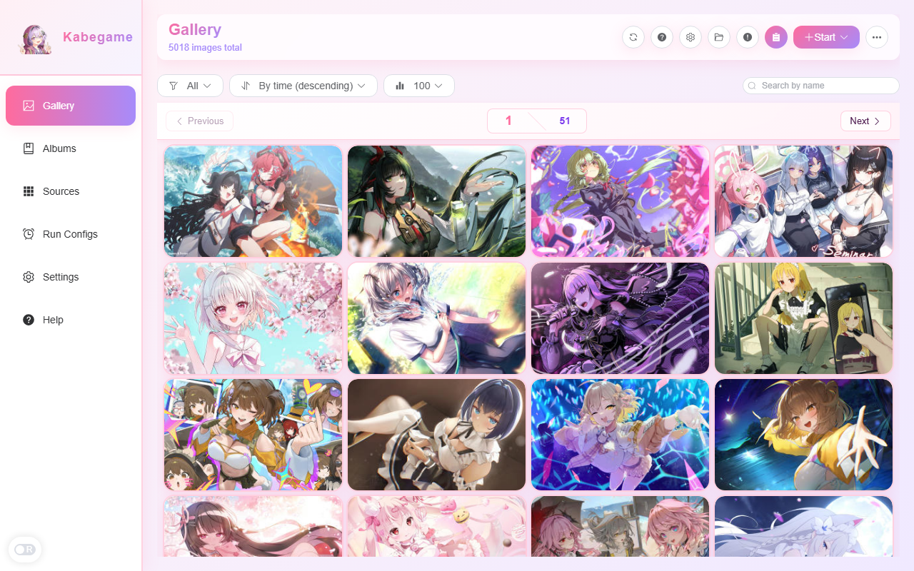

## 导入本地文件

本地导入功能已内置，无需单独安装「本地导入」插件。你可以通过以下方式将本地图片加入画廊：

- **桌面**：将图片/文件夹/压缩包拖入窗口，或在画廊右上角点击「开始收集」→ 选择「本地」打开导入对话框。
- **安卓**：在画廊右上角点击「开始收集」→ 选择「本地」，通过系统媒体选择器勾选要导入的图片。

### 桌面：拖入导入

把本地图片文件、包含图片的文件夹，或图片压缩包（zip）直接拖到主窗口中。可以同时拖入多种类型（多个图片文件、多个文件夹、多个压缩包，或任意组合），应用会统一处理并显示在导入确认窗口中。

应用会弹出导入确认窗口，你可以选择是否为每个来源创建画册（推荐：导入大批量素材时更好管理）。

### 桌面：右上角「开始收集」→ 本地

在画廊页面点击右上角「开始收集」按钮，在下拉菜单中选择「本地」，会打开本地导入对话框。你可以通过「添加文件」「添加文件夹」选择要导入的内容，同样支持为每个来源创建画册。

### Android：开始收集 → 本地

在 Android 上，点击「开始收集」会先弹出来源选择（本地 / 远程）。选择「本地」后进入 MediaPicker，可在「图片 / 视频 / 文件夹 / 压缩包」四个入口中选择要导入的内容。

### 文件夹导入

拖入文件夹时，会递归扫描子目录并导入其中的图片。如果开启了「为每个来源创建画册」，会为该文件夹创建一个同名画册，并把导入结果放入该画册。

### 压缩包导入（zip）

拖入 zip 时，后端会智能导入其中的图片，无需手动解压。导入时如果勾选了「为每个来源创建画册」，会为该 zip 创建一个同名画册，并把导入结果放入该画册。

### macOS：若导入「图片」「桌面」等文件夹失败

在 macOS 上，「图片」「桌面」「文稿」「下载」等为系统受保护文件夹，拖拽导入可能无法访问这些目录（会提示「权限不足」）。

**解决办法：**

1. 优先使用「添加文件夹」按钮，在系统选择器中选中该文件夹，再开始导入。
2. 若仍无法访问，请打开「系统设置」→「隐私与安全性」→「文件与文件夹」，为 Kabegame 开启对应目录（如「图片」）的访问权限。

:::note
本地导入能力已内置在应用中，不再依赖单独的「本地导入（local-import）」源插件。若你曾单独安装过该插件，建议在源管理中删除，避免重复或混淆。
:::

---

## 浏览画廊

### 图片总数

画廊顶部工具栏的副标题始终显示当前浏览集合的图片总数：「共 X 张图片」。当图片数超过当前每页条数时，图片网格上方会额外出现分页器用于跳页。

这个提示会实时更新：删除图片、导入新图片、或执行去重 / 整理操作后，总数会相应变化。

### 分页与每页条数

当画廊中的图片总数超过「每页条数」时，会自动启用分页。分页器会显示在图片网格上方，包含：

- **上一页 / 下一页**：快速切换相邻页面。
- **页码输入框**：直接输入页码跳转。
- **总页数显示**：显示当前为第几页、共多少页。

每页条数可选 **100 / 500 / 1000**，默认 100。切换方式：

- **桌面**：工具栏「每页数量」下拉。
- **Android**：Header 下拉条中的「每页数量」picker。
- **设置**：「应用设置 → 画廊每页显示数量」。

切换每页条数会立即重载当前过滤的首页；新值会自动持久化，下次启动保持。

:::note
工具栏上只暴露 100 / 500 / 1000 三档。其它自定义值会被修正回 100。
:::

### 列数与布局（仅桌面）

桌面下可以通过快捷设置或系统设置调整画廊网格的显示密度：

| 设置项 | 说明 |
|---|---|
| 固定列数 | 关闭时走动态列数（跟随窗口宽度）；开启后可在 1–6 列中选择。 |
| 图片宽高比 | 在「画廊布局 = 格子」下生效，决定每格的宽高比。 |
| 图片对齐方式 | 图片溢出格子时的对齐：居中 / 顶部 / 底部。 |
| 画廊布局 | `格子`（固定宽高比）/ `画廊`（纵向堆叠，masonry 无空白）。 |

除了在设置里改，桌面还有两种即时调整列数的方式：

- `Ctrl` / `⌘` + 鼠标滚轮
- `Ctrl` / `⌘` + `+` / `-`

:::note
当「固定列数」开启时，快捷键和滚轮调整会被禁用——此时请直接在设置中改列数。
:::

### 过滤与排序

工具栏（桌面）或 Header 下拉条（Android）提供三组下拉：

**过滤**：

- 「全部」：不过滤。
- 「设置过壁纸的」：只看曾经设为壁纸的图片。
- 「按时间」：按年 → 月 → 日三级下钻；没有图片的时间段不显示。
- 「按插件」：按图片来源插件过滤，每项显示当前匹配计数；计数为 0 的插件不列出。
- 「按种类」：「仅图片」或「仅视频」，各自显示计数。

**排序**：

- 「按时间正序」 / 「按时间倒序」。
- 当过滤为「设置过壁纸的」时，排序选项会切换为「按设置时间正序 / 倒序」。

**搜索**：工具栏右侧有一个按名称搜索的输入框，占位文字「按名称搜索」。搜索会同时影响过滤菜单里各选项的预览计数，让你看到「在当前搜索下，各插件/种类还剩几张」。搜索关键字不会持久化，刷新或重进会清空。

### 显示隐藏图片 / 失败图片入口

画廊 Header 还有两个与浏览状态相关的入口：

- **显示隐藏图片**：切换 Header 下拉里的「显示隐藏图片 / 隐藏隐藏图片」开关，可临时把加入了「隐藏」画册的图片显示回来。
- **失败图片**：按钮角标显示当前失败图片数（如「99+」），点击跳转到[失败图片](/guide/failed-images/)页面。

### 空状态

- 普通空：显示「暂无图片」和「开始收集」大按钮。
- 过滤为「设置过壁纸的」且为空：显示「还没有任何图片被抱到桌面上呢」和「查看全部图片」按钮。

---

## 选择与批量操作

### 桌面：鼠标与键盘

画廊网格支持多选，配合右键菜单可以一次性对一批图片执行操作。

| 操作 | 效果 |
|---|---|
| 单击一张 | 仅选中该图；若当前已多选且点的是已选中项，保持原选中集。 |
| `Ctrl` / `⌘` + 单击 | 切换该图的选中状态。 |
| `Shift` + 单击 | 以上次点击为锚，做范围选择。 |
| 右键 | 若右键对象不在当前选中集，会先单选它，再弹出菜单。 |
| `Ctrl` / `⌘` + `A` | 全选当前页。 |
| `Ctrl` / `⌘` + `C` | 复制图片（仅单选时有效）。 |
| `Delete` / `Backspace` | 对选中项触发永久删除确认。 |

:::note
键盘快捷键只在画廊网格获得焦点时生效。`Ctrl+滚轮` / `Ctrl+±` 用于调整列数，详见上一节。
:::

### Android：长按进入选择模式

在 Android 上：

- 单击一张图 = 打开应用内预览。
- **长按**一张图 = 进入选择模式，并把该图加入选中集。
- 之后单击其他图 = 切换选中 / 取消。
- 空白处点击**不会**退出选择模式；请点顶部取消按钮，或按系统返回键退出。

:::note
Android 选择模式顶部工具条中的若干按钮（如「加入画册」「删除」）目前为中文硬编码，尚未接入多语言。功能与桌面一致，只是文案暂不随界面语言切换。
:::

### 右键菜单 / 多选动作

桌面右键菜单、Android 多选工具条、Android ActionSheet 提供的动作基本一致：

- **查看详情**：打开应用内预览并展开详情面板。
- **复制**：复制图片。
- **收藏**：多选时为批量切换收藏状态。
- **打开原图**：用系统默认方式打开原文件。
- **打开所在文件夹**（仅桌面）。
- **设为壁纸**（桌面；Android 不支持）。
- **导出到 Wallpaper Engine** / **导出并自动收录**（仅 Windows）。
- **加入画册**：把选中项加入到已有或新建画册。
- **隐藏图片**：加入「隐藏」画册，保留磁盘文件。（桌面；需要超级权限。）
- **分享**（仅 Android）。
- **删除**：永久删除（文件 + 所有画册记录 + 画廊记录），不可恢复。

### 删除确认

触发「删除」时会弹出确认对话框，标题「确认删除」，消息会强调：**此操作不可恢复。如需保留本地文件，请改用「隐藏」。** 对单图 / 多图消息略有不同。

:::caution
删除是对磁盘文件 + 数据库记录一起执行的永久操作。只想把图片从画廊视图里移开而保留原文件的话，请用「隐藏图片」。
:::

---

## 应用内预览

应用内预览让你在不离开 Kabegame 的情况下查看大图。开启方法：前往「设置」→「应用设置」→「图片点击行为」→ 选择「应用内预览」。设置会立即生效，无需重启。

:::note
如果你选择「系统默认打开」，点击图片会用系统默认的图片查看器打开，而不是应用内预览。
:::

### 触发方式

- **桌面（标准模式）**：双击图片打开预览。
- **桌面（紧凑模式）**：单击图片直接打开预览。
- **Android**：单击图片打开 PhotoSwipe 全屏预览。

:::note
在 Android 上，点击视频缩略图总是会直接打开系统播放器，不受「图片点击行为」设置影响。
:::

### 桌面预览操作

桌面预览使用居中大窗口，支持以下操作：

| 操作 | 方法 |
|---|---|
| 关闭预览 | 点击遮罩区域，或按 `Esc` |
| 切换图片 | `←` `→` 键，或鼠标 hover 左右边缘的导航按钮 |
| 缩放 | 鼠标滚轮，或触摸板双指捏合 |
| 拖拽 | 放大后按住左键拖拽 |
| 删除图片 | `Delete` 或 `Backspace`（会弹出与网格一致的永久删除确认） |
| 右键菜单 | 与网格右键菜单一致，可执行收藏、加入画册、设为壁纸等 |
| 详情面板 | 鼠标 hover 到右边缘会出现「详情面板」切换按钮，显示图片描述、元数据、来源等 |

:::note
详情面板刚打开时，描述 / 元数据区可能短暂留白——这些信息是按需加载的，读取完成后会自动填入。
:::

### Android 预览操作

Android 使用 PhotoSwipe 全屏预览：

- 垂直下拖：关闭预览。
- **上划**：隐藏当前图（加入「隐藏」画册，保留文件）；手势过程会显示「上划删除 / 释放删除」提示。
- 长按 / 底部按钮：打开 ActionSheet，动作与桌面右键菜单一致。

---

## 整理

画廊工具栏的「整理」按钮（过滤图标）可以对整个画廊做一次性清理。点击后会弹出选项对话框：

| 选项 | 说明 |
|---|---|
| 去重 | 基于文件哈希（SHA256）合并数据库中内容相同的记录，不删除原文件。 |
| 清除失效图片 | 原文件已不存在时，从库中移除该记录。 |
| 移除无法识别的媒体 | 扩展名 / 类型不是支持的图 / 视频时清理（较慢）。 |
| 补充缩略图 | 为缺失缩略图的图片重新生成。 |
| 同时删除源文件（仅桌面） | 对本次整理中被移除的记录，连同源文件一起删除。危险，慎用。 |
| 安全删除（仅桌面） | 删除前检查是否还有其它记录引用同一本地路径（较慢）。 |
| 处理范围 | 拖动滑块选定序号区间，区间长度至少 1000。 |

:::caution
「同时删除源文件」会直接删除磁盘上的原图。开启前请确认你已备份或不再需要这些文件。
:::

### 进度与取消

开始整理后，工具栏的「整理」按钮会变色并旋转。点击可打开进度气泡：实时百分比、已移除 / 已补充计数、启用的选项标签、处理范围。每一步都可点「取消」终止。

- 完成：Toast 提示「整理完成：已移除 X 张图片，已补充 Y 张缩略图」。
- 取消：Toast 提示「整理已取消」。

### 去重后的跳页行为

如果去重 / 整理导致当前页被清空，画廊会自动跳到仍有内容的最大页——用户体验上是「自动回到最后一页」。

---

## 平台差异

| 能力 | Windows | macOS | Linux | Android |
|---|---|---|---|---|
| 拖入导入 | ✅ | ✅ | ✅ | ❌（用 MediaPicker） |
| 开始收集 → 本地 | ✅ | ✅ | ✅ | ✅ |
| 每页条数 100 / 500 / 1000 | ✅ | ✅ | ✅ | ✅ |
| 过滤 / 排序 / 搜索 | ✅ | ✅ | ✅ | ✅ |
| `Ctrl+A` / `Ctrl+C` / `Delete` 快捷键 | ✅ | ✅（⌘） | ✅ | ❌ |
| `Ctrl+滚轮` 调整列数 | ✅ | ✅ | ✅ | ❌ |
| 固定宽高比 / 对齐方式 | ✅ | ✅ | ✅ | ❌（自适应） |
| 双击 / 单击预览 | 双击（紧凑单击） | 双击（紧凑单击） | 双击（紧凑单击） | 单击 |
| 预览详情抽屉 / 右键菜单 | ✅ | ✅ | ✅ | ActionSheet |
| 预览上划隐藏 | ❌ | ❌ | ❌ | ✅ |
| 设为壁纸 | ✅ | ✅ | ✅ | ❌ |
| 导出到 Wallpaper Engine | ✅ | ❌ | ❌ | ❌ |
| 分享 | ❌ | ❌ | ❌ | ✅ |
| 整理（含删源 / 安全删除） | ✅ | ✅ | ✅ | ✅（不含删源 / 安全删除） |
| 显示 / 隐藏 隐藏图片 | ✅ | ✅ | ✅ | ✅ |

---

## 排障

- **滚动过快出现俏皮 Toast**：这是图片加载的节流提示，不是错误，稍等片刻即可继续浏览。
- **切换每页条数后页码重置**：这是设计行为——切换后统一回到第 1 页。
- **按插件过滤里看不到某个插件**：画廊只列出当前仍有图片的插件；计数为 0 的插件不会显示。
- **详情面板首次打开空白**：描述 / 元数据是按需加载的，加载完成会自动填入。
- **Android 上 Ctrl+A / Ctrl+滚轮 不起作用**：Android 紧凑模式不绑定这些键盘 / 滚轮快捷键。

---

## 延伸阅读

- [画册](/guide/album/)：多选「加入画册」目标，以及隐藏画册的工作方式。
- [收藏与收集](/guide/collect/)：「开始收集」的远程入口与 Android MediaPicker。
- [失败图片](/guide/failed-images/)：Header 失败按钮跳转目标。
- [设置](/guide/settings/)：每页条数、列数、布局、图片点击行为等详细设置说明。
- [Android 使用指南](/guide/android/)：MediaPicker、长按选择、上划隐藏等移动端差异。
