画廊是 Kabegame 启动后的第一个页面，也是所有图片和视频的总入口。无论图片是插件爬来的、本地导入的，还是畅游时抓的，最终都会汇总到这里。

页面自上而下分四层：

| 区域 | 内容 |
|---|---|
| 顶栏 | 页面标题、图片总数、失败图片入口、任务入口、「开始收集」 |
| 过滤条 | 「过滤」开关、排序、正倒序、每页数量、七个过滤维度、名称搜索 |
| 分页器 | 上一页 / 当前页 / 总页数 / 下一页 |
| 图片网格 | 图片与视频缩略图，支持多选、右键菜单、预览 |

本页只讲**在画廊里能直接做的事**。爬取任务的完整流程见[任务](/guide/tasks/)，画册管理见[画册](/guide/albums/)，插件安装见[插件使用](/guide/plugins-usage/)。

---

## 顶栏

标题下方的副标题始终显示当前浏览集合的图片数量（「共 X 张图片」）。它会随过滤、搜索、导入、删除实时变化——过滤后显示的是**过滤后的数量**，不是全库总数。

顶栏右侧三个入口：

- **感叹号按钮**：失败图片，角标是当前失败数量。详见下文[失败图片](#失败图片)。
- **列表按钮**：打开任务抽屉，查看正在下载和历史任务。内容详见[任务](/guide/tasks/)。
- **开始收集**：下拉分「本地」和「网络」两条路。

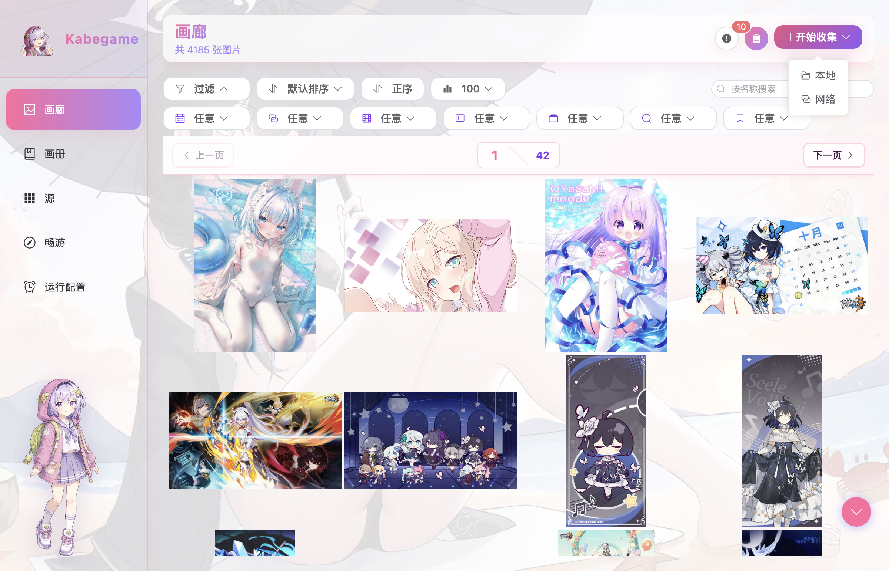

- **本地** → 打开本地导入对话框（见[导入本地文件](#导入本地文件)）。
- **网络** → 选择一个已安装的爬虫插件开始爬取，流程见[任务](/guide/tasks/)与[插件使用](/guide/plugins-usage/)。

---

## 过滤

### 「过滤」按钮

最左边的「过滤」按钮是**过滤条的折叠开关**，点一下收起下面那一整排维度下拉，再点一下展开。图片多、想让网格占满窗口时很有用。

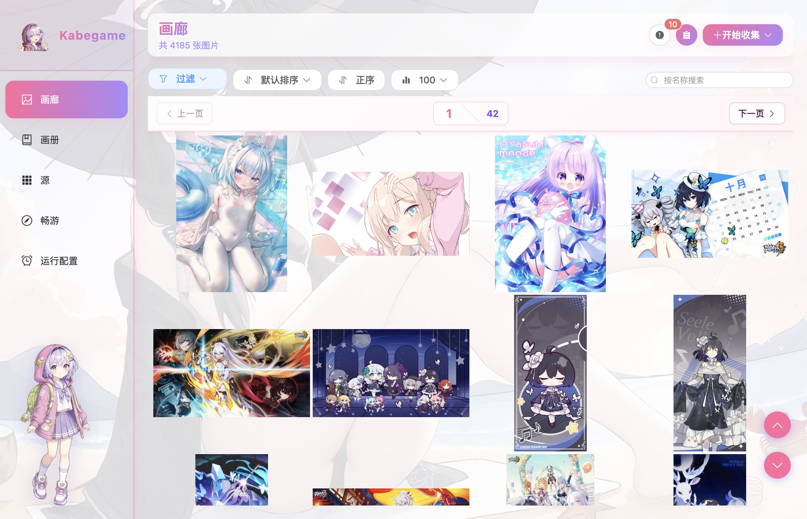

只要有任意一个维度处于生效状态，「过滤」按钮就会变成高亮的粉色，并在右上角出现一个 **×**——点它可以一次性清除所有过滤和搜索。

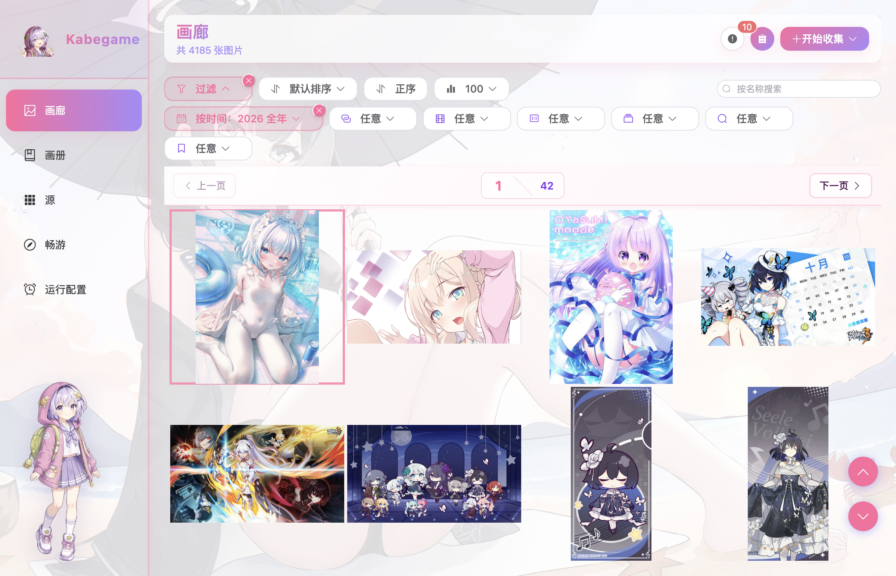

### 七个过滤维度

过滤条第二行是七个并列的维度下拉，默认都显示「任意」（即不过滤）。它们**可以叠加使用**：选了「按插件：konachan」再选「按媒体：仅视频」，得到的就是这个插件下的视频。

每个下拉都是一棵树：顶部一个「任意」用来清空该维度，下面是带计数的层级项。计数会随其它维度和搜索词联动——你看到的永远是「在当前条件下，这一项还剩几张」。

#### 按时间

年 → 月 → 日三级下钻。点行首的箭头展开下一级，点文字本身直接按该时间段过滤。没有图片的时间段不会出现。

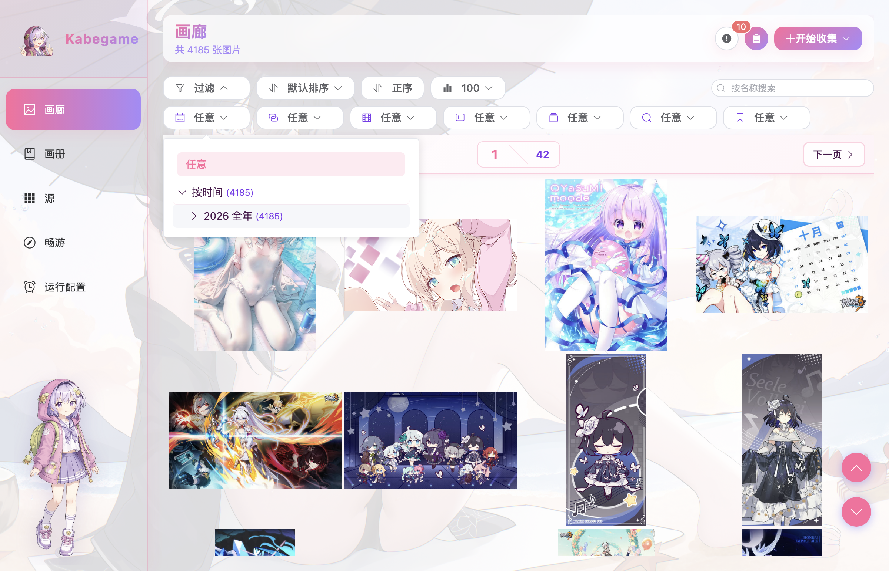

#### 按插件

列出所有仍有图片的插件（含内置的「本地导入」），各带计数。

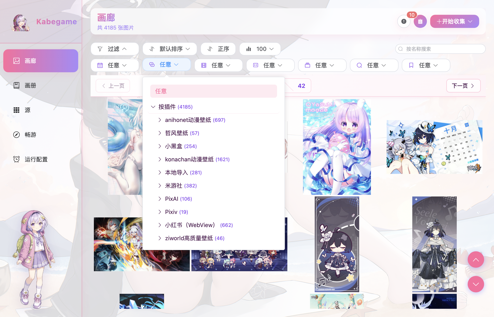

插件还可以贡献自己的子维度。例如展开 konachan 后会出现 `general` / `character` / `copyright` / `artist` / `style`——这些是该插件在抓取时写入的标签分类，不同插件各不相同。

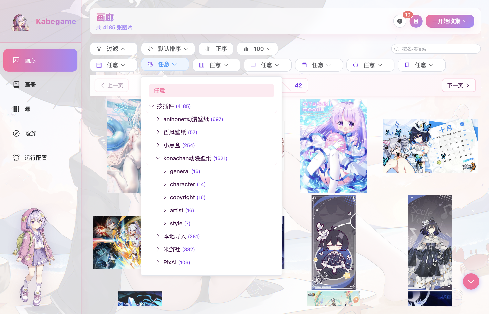

#### 按媒体

仅图片 / 仅视频。

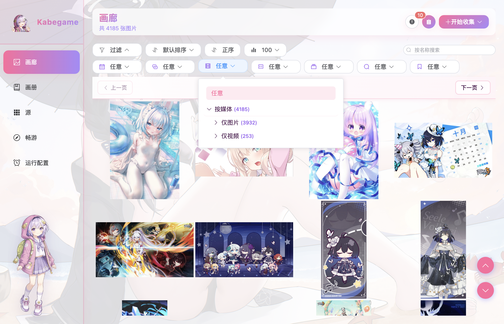

#### 按尺寸

按宽高比分档：横屏 (4:3–16:9) / 宽屏 (16:9–21:9) / 方正 (3:4–4:3) / 竖屏 (9:16–3:4) / 其他（太宽、太窄或尺寸读取失败）。挑桌面壁纸时用「宽屏」，挑手机壁纸时用「竖屏」。

#### 按大小

按文件体积分档：未知 / < 512 KB / 512 KB–1 MB / 1–2 MB / 2–5 MB / 5–10 MB / 10–50 MB / ≥ 50 MB。找占空间的大文件时很直接。

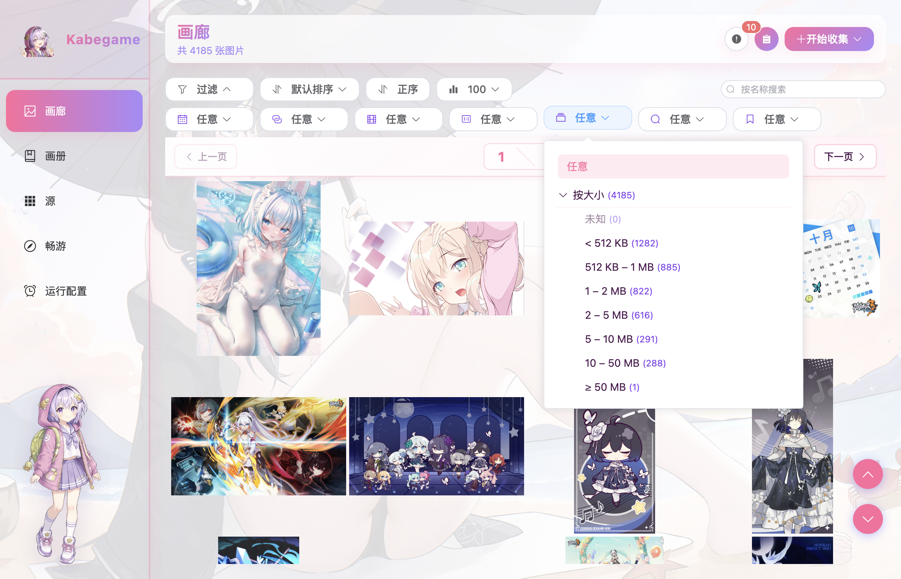

#### 按名称

按文件名的语言分类：English / 中文 / 日本語 / 한국어 / Other。注意这是**按名称的文字种类**分组，不是按图片内容。

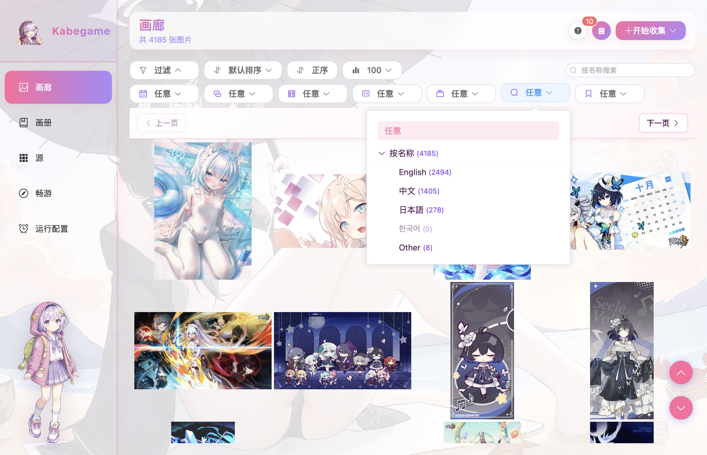

#### 设置过壁纸的

只看曾经设为桌面壁纸的图片。选中它之后，排序下拉里会多出「设置时间」这一项，可以按设置成壁纸的先后排序。

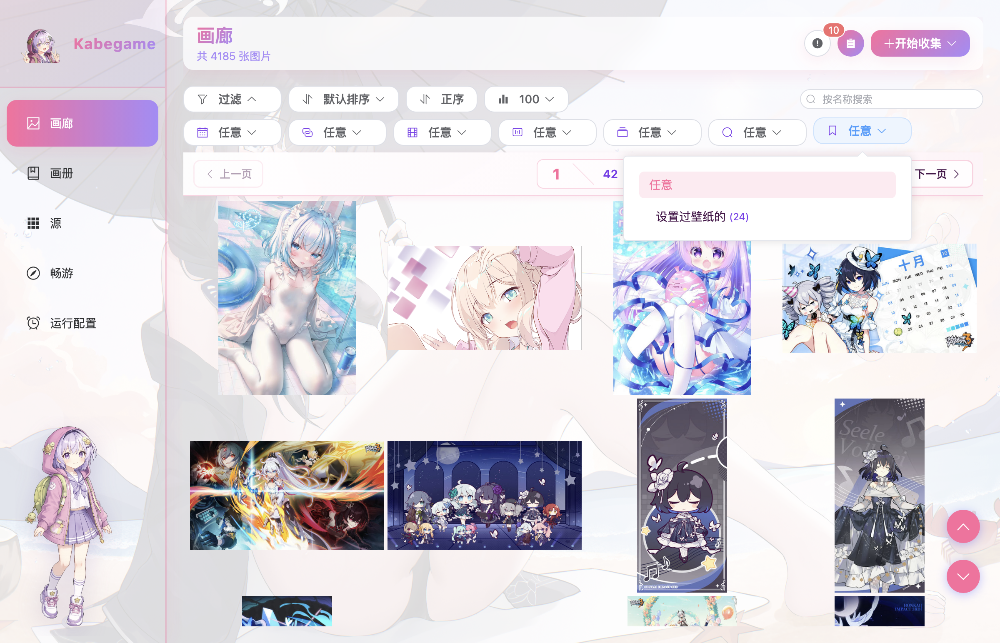

:::note
维度激活后，按钮本身会变成「按插件：小黑盒」这样的粉色标签，右上角同样带一个 **×** 可单独清除该维度，不影响其它条件。
:::

### 名称搜索

过滤条最右边是搜索框，按图片**名称**做模糊匹配。搜索与七个维度叠加生效，并会同步影响各维度的计数。

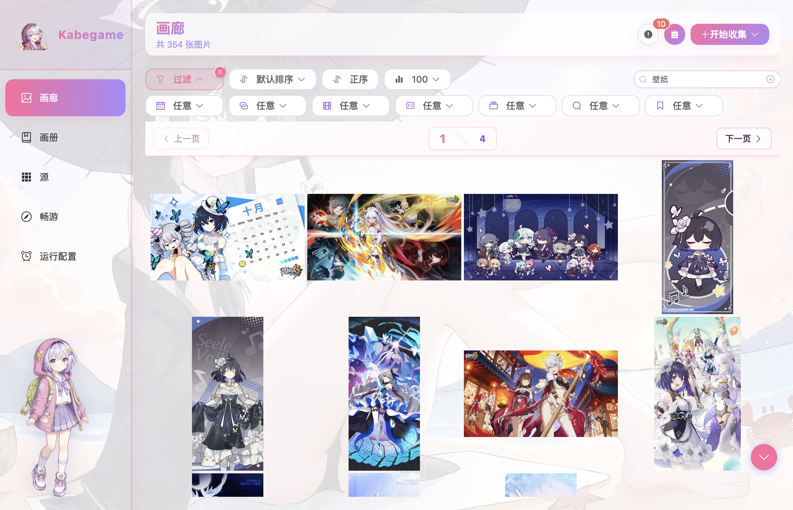

搜索词不会持久化，重进画廊会清空。

---

## 排序与翻页

### 排序

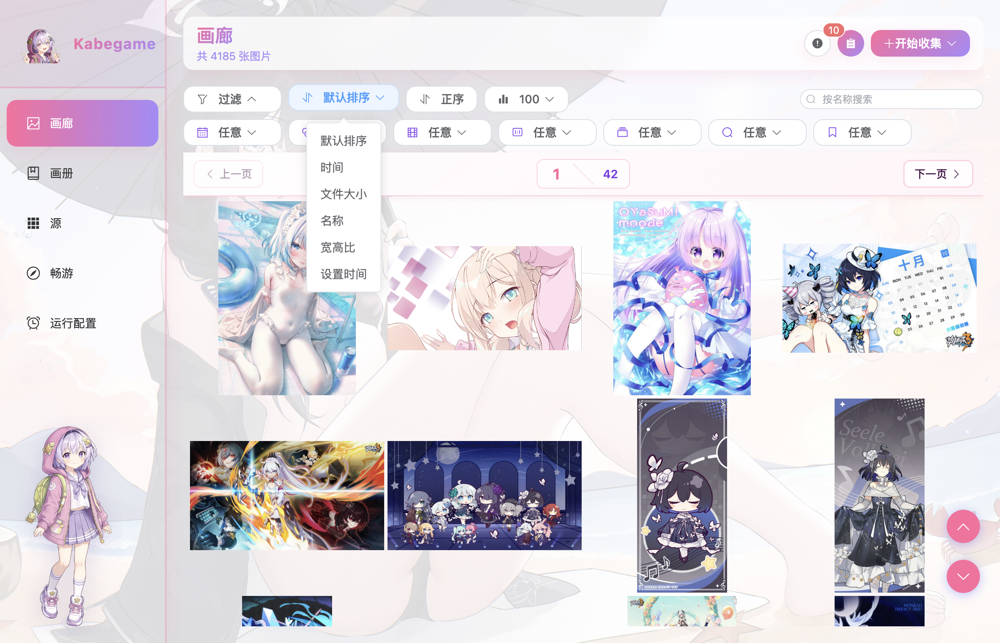

| 排序键 | 说明 |
|---|---|
| 默认排序 | 按内部 ID，近似入库顺序 |
| 时间 | 按收藏（入库）时间 |
| 文件大小 | 按文件体积 |
| 名称 | 按文件名 |
| 宽高比 | 按图片宽高比 |
| 设置时间 | 按设为壁纸的时间；配合「设置过壁纸的」过滤使用 |

排序键右边是**正序 / 倒序**切换按钮——它不是下拉，点一下就翻转当前方向。

### 每页数量与分页器

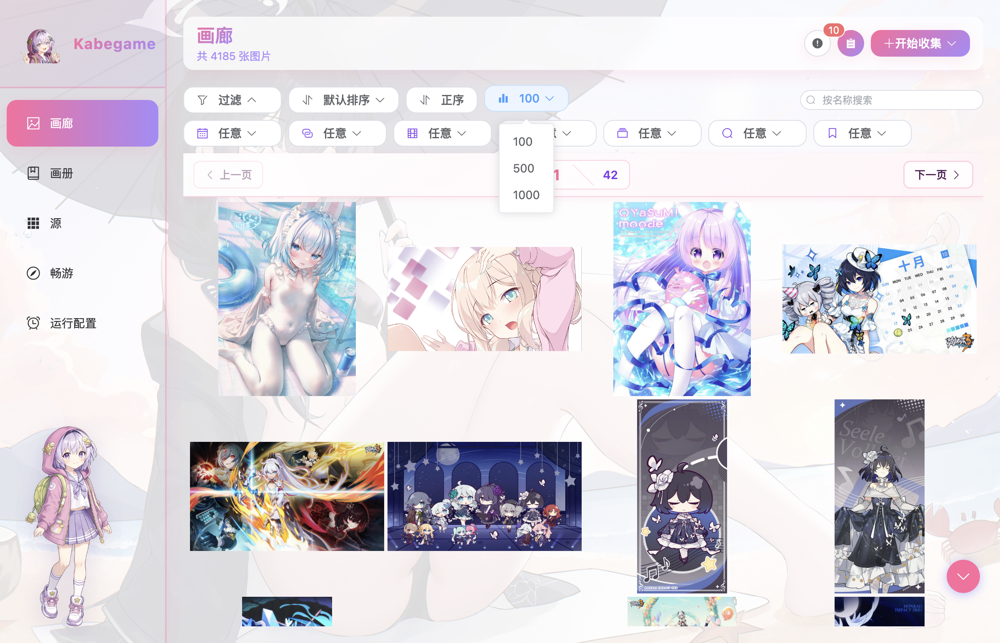

每页可选 **100 / 500 / 1000**，默认 100。切换后立即从第 1 页重新加载，新值会持久化，下次启动保持。也可以在[设置](/guide/settings/)里改（「每页显示数量」）。

图片总数超过每页数量时，网格上方出现分页器：上一页 / 当前页 / 总页数 / 下一页。当前页码可以直接点开输入跳转。

### 滚动行为

向下滚动时，顶栏和过滤条会自动收起，只保留分页器吸顶，把空间让给图片。窗口右下角常驻两个圆形按钮：**回到顶部**与**跳到底部**。

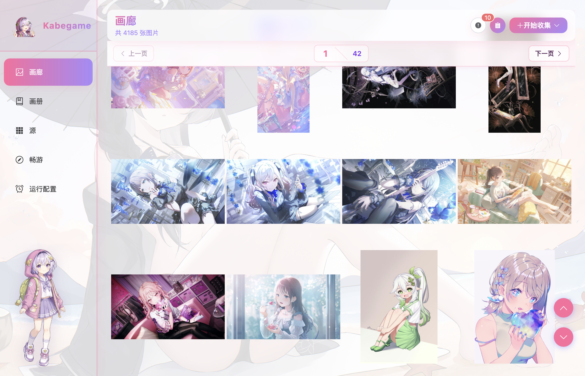

:::note
滚得太快时亀ちゃん会跳出俏皮提示（「慢慢滑嘛，人家要追不上啦」之类）。这是缩略图加载的节流提示，不是错误，稍等即可继续。
:::

### 视频的显示

视频缩略图右上角有一个播放角标，鼠标悬停时会自动播放预览片段（悬停在哪一格，哪一格的角标变成暂停）。

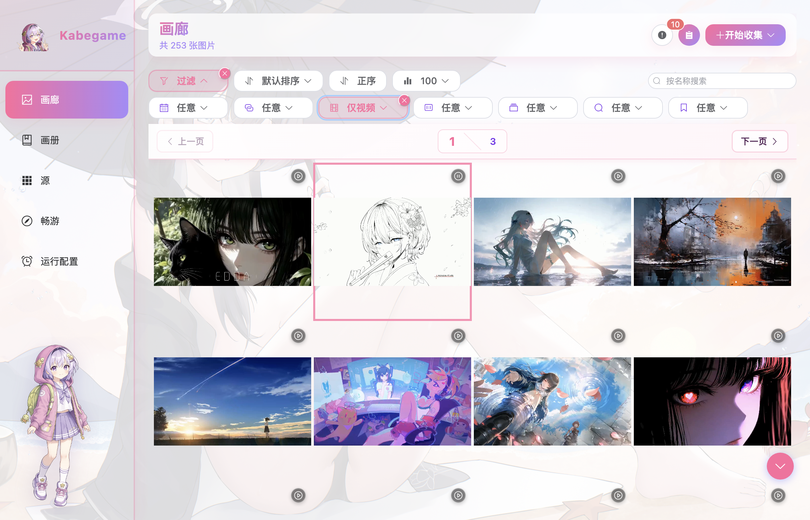

---

## 选择与批量操作

| 操作 | 效果 |
|---|---|
| 单击 | 仅选中该图；若当前已多选且点的是已选中项，保持原选中集 |
| `⌘` / `Ctrl` + 单击 | 切换该图的选中状态（多选） |
| `Shift` + 单击 | 以上次点击为锚做范围选择 |
| `⌘` / `Ctrl` + `A` | 全选当前页 |
| `⌘` / `Ctrl` + `C` | 复制图片（仅单选时有效） |
| `Delete` / `Backspace` | 对选中项触发删除确认 |
| 右键 | 若右键对象不在当前选中集，先单选它再弹菜单 |

被选中的格子会带上粗粉色边框：

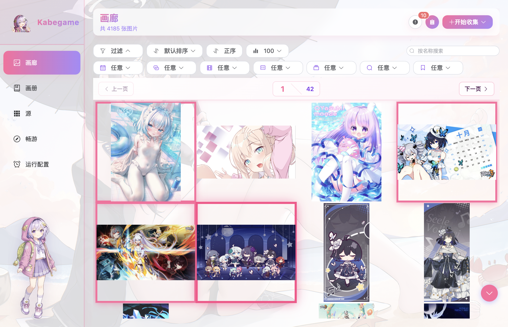

:::note
键盘快捷键只在图片网格获得焦点时生效——先在网格里点一下再按键。
:::

### 调整列数

- `⌘` / `Ctrl` + 鼠标滚轮
- `⌘` / `Ctrl` + `+` / `-`

这两种方式在**动态列数**下即时生效。如果在设置里开启了固定列数，快捷键会被禁用，需要直接改设置里的列数值。画廊布局（网格 / 画廊）、滚动方向（垂直 / 水平）等也在[设置](/guide/settings/)里。

---

## 右键菜单

### 单选

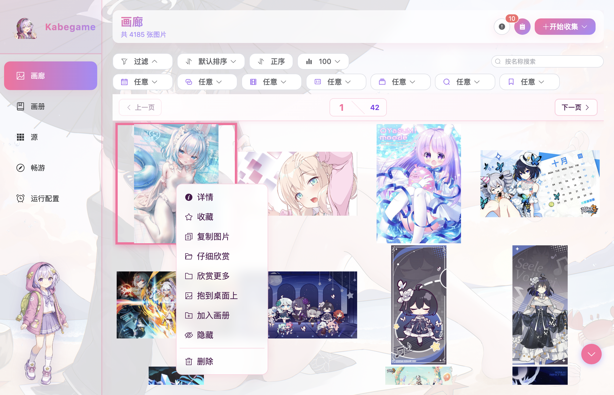

| 菜单项 | 作用 |
|---|---|
| 详情 | 打开应用内预览并展开详情面板 |
| 收藏 / 取消收藏 | 切换收藏标记 |
| 复制图片 | 把图片复制到系统剪贴板 |
| 仔细欣赏 | 用系统默认看图程序打开原文件 |
| 欣赏更多 | 在文件管理器中打开图片所在文件夹 |
| 抱到桌面上 | 把这张图设为桌面壁纸，详见[壁纸](/guide/wallpaper/) |
| 加入画册 | 加入已有画册或新建画册，详见[画册](/guide/albums/) |
| 隐藏 / 取消隐藏 | 加入「隐藏」画册；文件保留，默认不在画廊显示 |
| 删除 | 从画廊移除并把本地文件移入系统回收站 |

### 多选

多选状态下右键，菜单会收敛成能批量执行的动作，并在每项后面标出影响的张数：

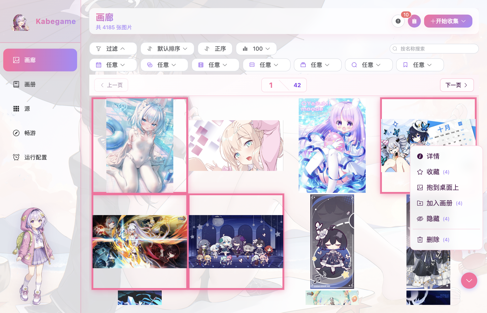

「复制图片」「仔细欣赏」「欣赏更多」只在单选时出现——它们对一批图片没有意义。

### 关于删除

删除会把本地文件**移入系统回收站（可恢复）**，同时从画廊和所有画册中移除记录。位于符号链接、网络盘或虚拟盘上的文件只移出图库，不动磁盘文件。

:::caution
如果只是想让图片不在画廊里露面、但保留它在库中的记录和文件，请用「隐藏」而不是「删除」。隐藏的图片可以通过工具箱的「显示隐藏图片」开关随时找回。攒够了想一次清空，见[清理隐藏图片](#清理隐藏图片)。
:::

---

## 应用内预览

桌面上**双击**图片打开应用内预览（紧凑布局下单击即可）。是否走应用内预览由[设置](/guide/settings/)的「图片点击行为」决定，改成「系统默认打开」的话点击会交给系统看图程序。

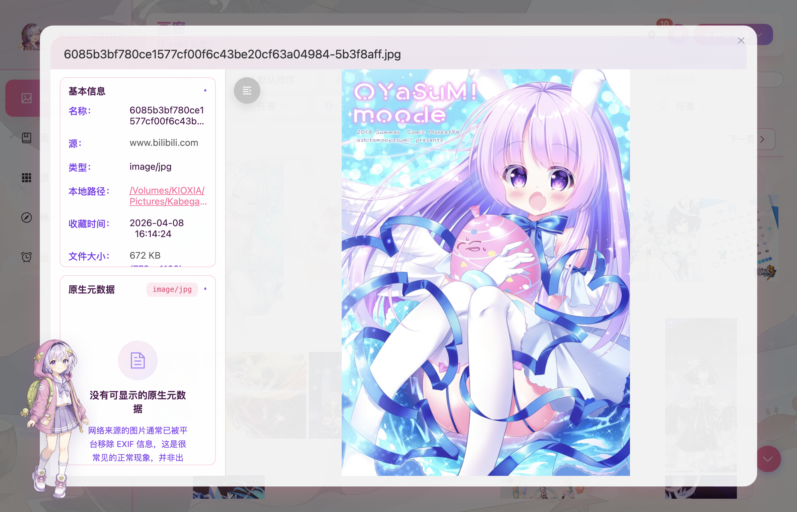

| 操作 | 方法 |
|---|---|
| 关闭 | 点遮罩区域或按 `Esc` |
| 切换上/下一张 | `←` `→` |
| 缩放 | 鼠标滚轮或触摸板双指捏合 |
| 拖拽 | 放大后按住左键拖动 |
| 右键菜单 | 与网格右键菜单一致 |

左侧详情面板分两块：

- **基本信息**：名称、源站、类型、本地路径、收藏时间、文件大小与像素尺寸。本地路径可以点击直接定位文件。
- **原生元数据**：从文件里读出的内嵌信息，支持 JPEG、PNG、WebP、GIF 四种格式——JPEG / WebP 读 EXIF，PNG 读 tEXt / iTXt 等信息块，WebP / GIF 还会给出动画的帧数、时长与循环次数。网络来源的图片常常已被平台移除 EXIF，此时会显示「没有可显示的原生元数据」——这是正常现象。

:::note
详情面板刚打开时描述和元数据区可能短暂留白，这些数据是按需加载的，读完会自动填入。
:::

---

## 导入本地文件

本地导入能力已内置，不需要额外安装插件。

### 拖入网格区（仅桌面）

把图片、视频或文件夹拖到画廊的**图片网格区域**上，区域周围会浮现一圈虚线并提示将要做什么，松手就直接开始导入——不需要再确认。可以一次拖多个文件、多个文件夹或两者混合。

| 拖入内容 | 结果 |
|---|---|
| 图片 / 视频 | 创建一个本地导入任务，图片进入画廊 |
| 文件夹 | 每个文件夹创建一个**本地文件夹同步画册**，子目录会递归建成子画册 |
| `.kgpg` 插件包 | 不接受，请拖到[源页面](/guide/plugins-usage/#方法二拖到源页面仅桌面) |

:::caution[文件夹拖入建的是同步画册]
拖文件夹**不是**把里面的图片复制进画廊，而是建一个跟磁盘目录保持同步的画册：目录里的文件被删掉，画册里对应的图片也会消失。想把图片真正导进来，用下面的「开始收集 → 本地」，或者直接拖文件而不是拖文件夹。
:::

拖到画廊以外的区域会有不同的行为，见[画册](/guide/albums/#拖入导入仅桌面)与[插件使用](/guide/plugins-usage/#导入本地-kgpg)。任务详情页和畅游详情页不接受拖入。

### 「开始收集」→ 本地

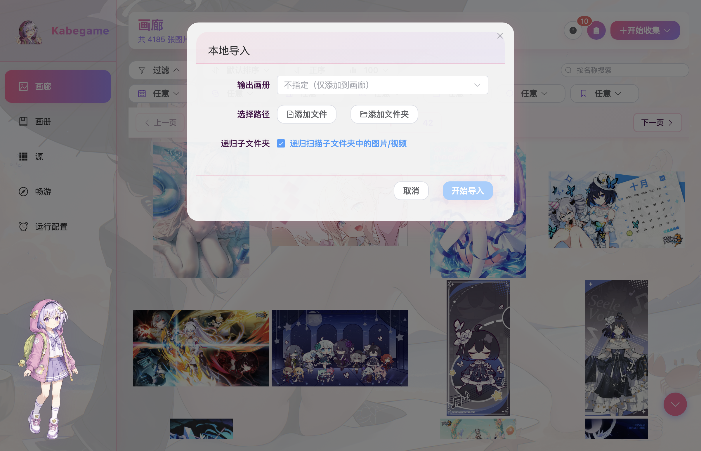

| 字段 | 说明 |
|---|---|
| 输出画册 | 选择导入到哪个画册；默认「不指定（仅添加到画廊）」 |
| 选择路径 | 「添加文件」逐个挑文件，「添加文件夹」整个目录导入 |
| 递归子文件夹 | 勾选后递归扫描子目录中的图片和视频，默认开启 |

点「开始导入」后会创建一个导入任务，进度可以在任务抽屉里看。

:::note[macOS 权限]
「图片」「桌面」「文稿」「下载」是 macOS 的受保护目录，直接拖拽可能提示权限不足。改用「添加文件夹」在系统选择器里选中该目录通常就能通过；仍然不行的话，到「系统设置 → 隐私与安全性 → 文件与文件夹」为 Kabegame 打开对应目录的权限。
:::

---

## 工具箱：整理、清理、刷新、显示开关

点击侧栏下方的亀ちゃん立绘会弹出全局工具箱。立绘被隐藏时，入口会回落到侧栏底部的工具行。

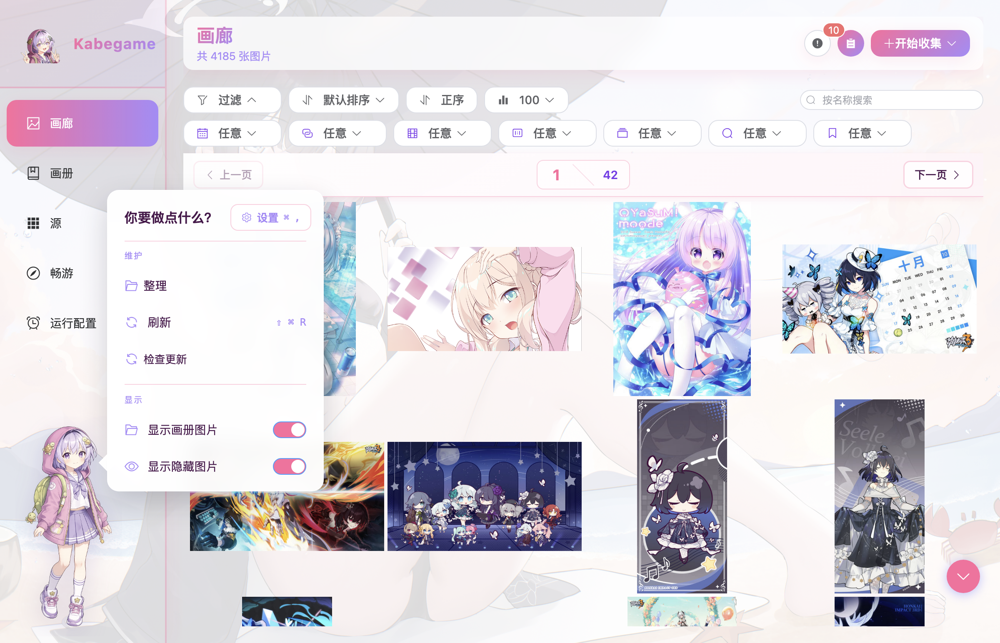

**维护**

- **整理**：对整个图库做一次性清理，见下文。
- **清理隐藏图片**：一次性清空「隐藏」画册，见下文。右侧数字是当前隐藏图片数，为 0 时该项不可点。
- **刷新**（`⇧⌘R` / `Ctrl+Shift+R`）：重新加载当前列表。
- **检查更新**：检查应用新版本。

**显示**

- **显示画册图片**：关掉后，画廊里不再显示已经加入画册的图片，只留还没归类的。
- **显示隐藏图片**：临时把「隐藏」画册里的图片显示回来。

### 整理画廊

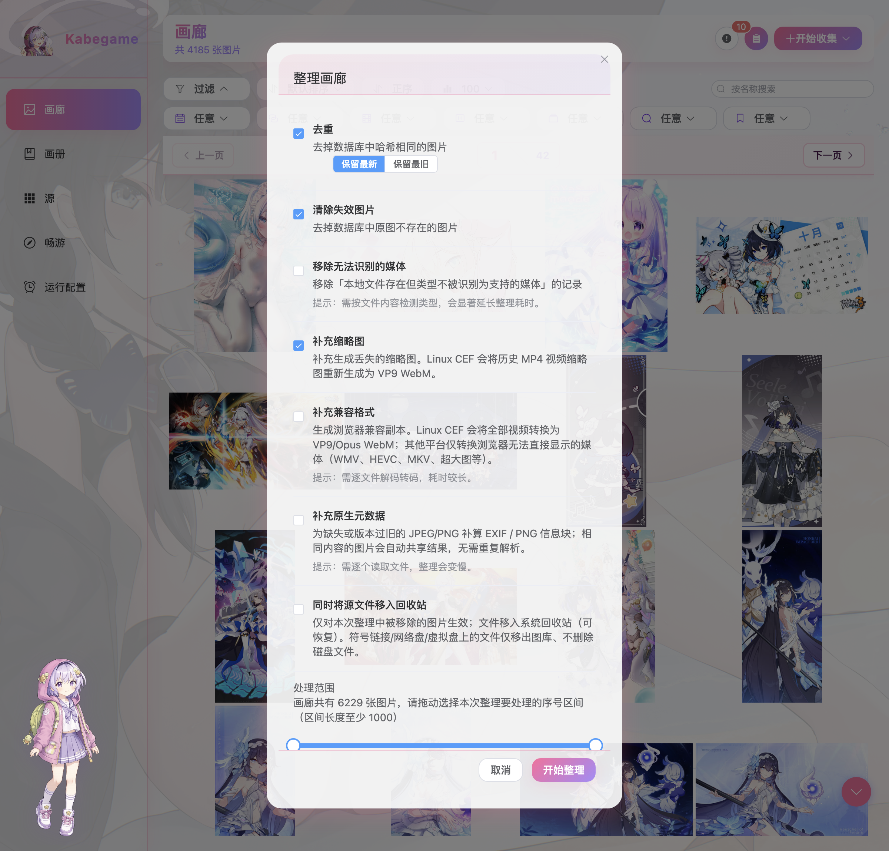

| 选项 | 说明 |
|---|---|
| 去重 | 去掉数据库中哈希相同的图片，可选「保留最新」或「保留最旧」 |
| 清除失效图片 | 去掉数据库中原图已不存在的记录 |
| 移除无法识别的媒体 | 文件还在但类型不被识别为支持的图片/视频时移除记录。需按文件内容检测类型，会显著延长耗时 |
| 补充缩略图 | 为缺失缩略图的图片重新生成 |
| 补充兼容格式 | 生成浏览器兼容副本（WMV、HEVC、MKV、超大图等）。需逐文件解码转码，耗时较长 |
| 补充原生元数据 | 为缺失或版本过旧的 JPEG / PNG / WebP / GIF 补算内嵌元数据；相同内容的图片自动共享结果 |
| 同时将源文件移入回收站 | 仅对本次整理中被移除的记录生效，文件进系统回收站（可恢复） |
| 处理范围 | 图库超过 4000 张时出现，用滑块选定本次处理的序号区间（区间长度至少 1000） |

开始整理后工具箱里的「整理」项会变成进行中状态，点开可以看实时进度、已移除 / 已补充计数和本次启用的参数，随时可以取消。完成或取消都会有 Toast 提示。

:::note
整理针对**整个图库**，不受当前过滤条件影响；「处理范围」滑块显示的总数也是全库数量，可能大于顶栏那个受过滤影响的数字。
:::

### 清理隐藏图片

「隐藏」只是把图片挪进隐藏画册、不在画廊显示，记录和文件都还在。攒多了想一次性清干净，就用工具箱里的
**清理隐藏图片**。点击后会弹出确认框（写明这次要清掉多少张），确认后转为后台任务，进度、已清理计数和取消按钮都在工具箱的忙碌卡片里，和整理一样。

它做的事是：把隐藏画册里的图片从图库中永久移除，并删除对应的源文件。

| 平台 | 源文件的去向 |
|---|---|
| 桌面（Windows / macOS / Linux） | 移入系统回收站，可恢复。位于软链接、网络盘或虚拟盘上的文件出于安全考虑只移出图库、**保留在原处** |
| Android | 由本应用写入相册的图片直接删除；从系统相册导入的外来图片会弹**一次**系统删除确认，覆盖本批全部文件 |

完成后如果有源文件没能删掉（护栏拦下、Android 上拒绝了授权等），Toast 会如实告诉你有多少张仍留在原处，不会当成全部成功。

:::caution
这是不可撤销的操作（桌面端可从回收站恢复，Android 端不能）。清理前建议先用「显示隐藏图片」开关过一遍，确认里面没有想留的东西。
:::

---

## 失败图片

顶栏感叹号按钮打开失败图片对话框，列出下载失败的条目。

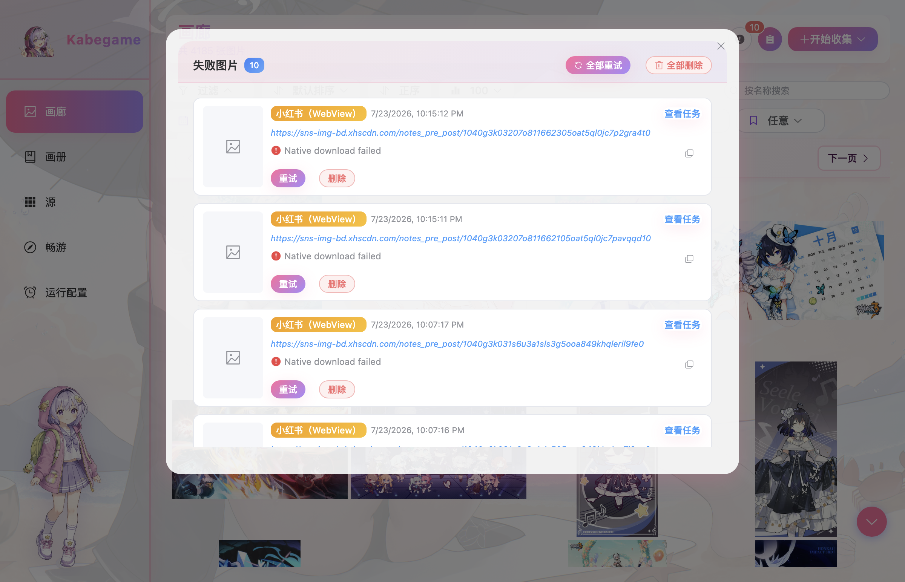

每条记录包含来源插件、失败时间、原始 URL 和错误信息，可以单条「重试」「删除」，也可以复制 URL 或跳到对应的「查看任务」。右上角的「全部重试」「全部删除」对列表里所有条目生效。

常见失败原因（站点限流、需要 Cookie、DRM 保护等）与处理办法见[故障排查](/guide/troubleshooting/)。

---

## 空状态

图库为空，或者当前过滤 / 搜索没有命中任何图片时，画廊会显示亀ちゃん的空状态插画和「开始收集」按钮。

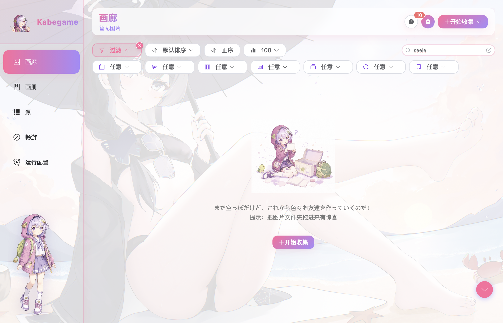

如果你确信库里有图，先看看「过滤」按钮是不是粉色的——点它右上角的 **×** 清除所有过滤和搜索即可。

---

## Android 上的差异

Android 使用紧凑布局，画廊的交互相应调整：

- 过滤、排序、每页数量收进 Header 下拉条。
- **单击**图片直接打开全屏预览，**长按**进入选择模式。
- 选择模式下点击其它图片切换选中；点空白不会退出，请用顶部取消按钮或系统返回键。
- 右键菜单换成底部 ActionSheet，部分动作收在「更多」子菜单里。
- 预览支持下拉关闭、上划隐藏等手势。

完整说明见 [Android 专版](/guide/android/)。

---

## 延伸阅读

- [画册](/guide/albums/)——「加入画册」的去处，以及隐藏画册的工作方式。
- [任务](/guide/tasks/)——「开始收集 → 网络」之后的完整爬取流程与任务抽屉。
- [壁纸](/guide/wallpaper/)——「抱到桌面上」与壁纸轮播。
- [插件使用](/guide/plugins-usage/)——安装插件、让「按插件」维度多出新来源。
- [设置](/guide/settings/)——每页数量、列数、布局、图片点击行为等。
- [快捷键一览](/reference/shortcuts/)——全部键盘快捷键。
