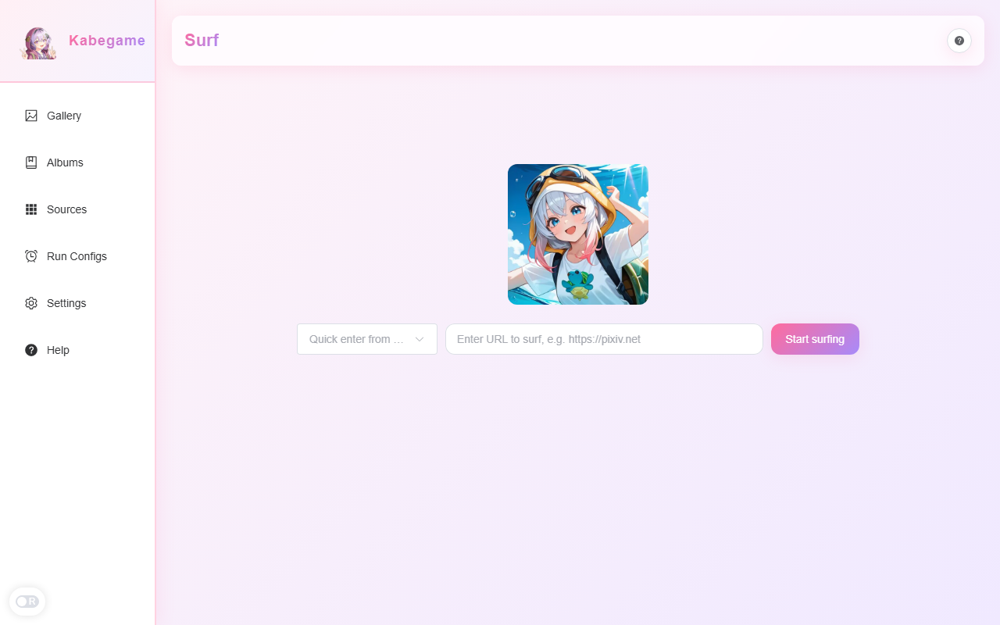

畅游（旧称「冲浪模式」）是 Kabegame 内置的「边逛边收」功能：输入一个网站地址，应用会在内部打开一个带导航栏和下载菜单的专用窗口，你在页面上对任何图片或视频右键，就能把它下载到画廊里。和按爬虫插件批量采集不同，畅游更适合临时探索、人工挑选。

## 畅游 vs 画廊

| 维度 | 畅游 | 画廊 |
|------|------|------|
| 数据来源 | 用户在应用内浏览网站时手动右键下载 | 所有已收集图片的汇总（包括畅游下载的） |
| 会话概念 | 每次输入 URL 开始一条「畅游记录」，一个站点一条记录 | 无会话，长期持有全部图片 |
| 适用场景 | 临时浏览、按需挑选 | 统一整理、翻阅、做画册 |

畅游下载成功的图片会同时出现在画廊中；删除畅游记录**不会**删除关联图片。

## 开始一次畅游

进入侧栏的「畅游」页面。在搜索行输入 URL，再点击「开始畅游」。

- 仅支持 `https://`。裸域名（如 `pixiv.net`）会自动补 `https://`；`http://` 会被拒绝并提示改用 https。
- 如果你已经安装了配置了网站地址的爬虫插件，可以直接在左侧下拉框「从插件快速进入」选择一个站点，URL 会自动填入。
- 点击后，应用会弹出一个独立的畅游窗口（1200×800，带后退 / 前进 / 刷新 / 地址栏 / 开发者工具）。

:::note
当已有一个畅游窗口打开时，主页的输入框和「开始畅游」按钮会禁用，卡片上的按钮会变为「打开已有会话」。一次只能有一个畅游会话。
:::

## 在畅游窗口中的操作

### 浏览页面

顶部导航栏提供后退、前进、刷新、地址输入（回车导航，仅接受 http/https）和开发者工具。导航栏主题会跟随系统深浅色。

外站页面里所有 `target="_blank"` 链接和 `window.open` 新窗口请求，都会在当前窗口内继续导航，而不是弹出新标签或新窗口。直接指向媒体文件（如 `.jpg`/`.mp4`/`.zip`）或带下载参数的 URL，会触发下载。

### 右键下载图片和视频

在 ``、`<video>`、`<source>` 或带背景图的元素上点击右键，会出现「下载图片 / 下载视频」菜单项。窗口顶部会用 toast 依次显示下载状态：

| Toast | 含义 |
|------|------|
| 开始下载 | 已捕获该资源，正在下载 |
| 下载成功 | 已入库，可在画廊 / 畅游图片页看到 |
| 下载失败 | 网络或写盘异常 |
| 下载失败（重复或未入库） | 哈希与画廊中已有图片相同，去重被拦下 |

右键在非媒体元素上不会拦截，仍是浏览器原生菜单。

### Cookie 同步

每次页面加载完成，应用会把当前站点相关的 Cookie（含 HttpOnly）写回畅游记录，供后续访问和插件使用。你可以在主页的记录详情对话框中查看完整 Cookie。

:::caution
Cookie 含登录态等敏感信息，请勿把详情对话框的内容分享给他人。
:::

## 结束会话

目前没有独立的「结束会话」按钮。直接关闭畅游窗口（标题栏 X）即可结束当前会话：应用会清理会话状态，主页的输入和「开始畅游」按钮会重新启用。

## 查看和管理畅游记录

每次畅游都会生成一条记录。主页下半部分以卡片列出所有记录，显示站点图标、host 或自定义名称、入口 URL、图片数、已删除数、最后访问时间等。

- 点击卡片本体：打开详情对话框。可以编辑「名称」和「入口路径」（例如改成 `/users?id=1`，下次点「开始畅游」会直接打开该路径）；也可以查看 Cookie，或「删除此畅游记录」。
- 点击卡片上的「开始畅游」：以该记录的入口再次进入（会话已存在时按钮变为「打开已有会话」）。
- 点击卡片上的「查看下载图片」：进入该站点的画廊视图（见下一节）。仅当该记录有下载过图片时显示。
- 右键卡片（或长按）：快捷菜单含「查看下载图片」「详情」「删除」。

删除畅游记录时会有确认：关联图片会**保留在画廊中**，只有记录本身被删除。

## 查看畅游下载的图片

点击记录卡片的「查看下载图片」会进入 `/surf/:host/images` 页面，列出该站点通过畅游下载的所有图片。

这个页面复用 [画廊](/guide/gallery/) 的浏览和整理能力：

- 分页、跳页、每页条数切换（见画廊的分页说明）
- 右键图片的操作菜单：详情、复制、收藏、打开所在文件夹、加入画册、隐藏、设为壁纸、分享、用系统默认打开、删除
- 顶部菜单中的「显示隐藏 / 隐藏已隐藏」切换

其中几项和主画廊略有不同：

- **删除**：会同时删除本地文件。如果你只想让图片不出现在列表里、但保留本地文件，请改用「隐藏」。
- **多图设为壁纸**：应用会自动创建一个名为「桌面画册 1/2/…」的画册，把所选图片加入，然后切换壁纸轮播到该画册。

:::note
畅游图片页不支持在 Android 上打开（整个畅游功能仅限桌面）。「设为壁纸」在桌面平台可用；「分享」功能受 `guardDesktopOnly` 限制，仅桌面有效。
:::

## 平台差异

畅游是**桌面独占**功能，Android 上不可用（相关后端命令未编译到 Android 构建中）。Linux 上仍可浏览页面和管理记录，但**无法下载**——这是 WebKit 的限制，应用会在主页输入行下方给出明确提示。

| 能力 | Windows | macOS | Linux | Android |
|------|---------|-------|-------|---------|
| 打开畅游窗口、浏览页面 | 是 | 是 | 是 | 否 |
| 右键下载图片 / 视频 | 是 | 是 | 否（WebKit 限制） | 否 |
| 查看畅游记录 / 详情 / 删除 | 是 | 是 | 是 | 否 |
| 查看畅游图片页 | 是 | 是 | 是 | 否 |
| 多图设为壁纸（桌面轮播） | 是 | 是 | 是 | 否 |

## 延伸阅读

- [画廊](/guide/gallery/) — 畅游下载的图片最终都会进入画廊；畅游图片页也复用画廊的分页与右键操作。
- [插件](/guide/plugins-usage/) — 「从插件快速进入」依赖插件配置的 https 入口地址。
- [任务](/guide/tasks/) — 任务日志里可能出现「冲浪模式」相关的去重记录，可在那里追踪具体失败原因。
