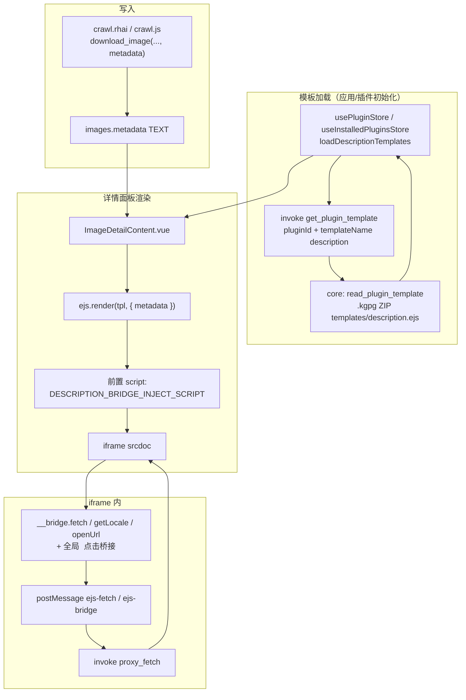

# 插件详情 EJS：模板加载、渲染与 iframe 桥接

本文描述画廊「图片详情」中 `templates/description.ejs` 的**全链路**：从爬虫写入 `metadata`、前端拉取模板字符串、EJS 渲染、注入 `__bridge` 写入 `iframe srcdoc`，到 iframe 内通过 `postMessage` 调用 `proxy_fetch`。

## 总览

---

## 一、数据：`metadata` 从哪里来

- 爬虫在 `download_image` 的 opts 里传入 **`metadata`**（任意 JSON，由插件自行约定结构）。
- 后端写入 `images.metadata` 列（`serde_json::Value`），前端 `ImageInfo.metadata` 为 `Record<string, unknown>` 等。
- 详情区 EJS **仅接收** `ejs.render(tpl, { metadata: img.metadata })` 中的 `metadata`，与 `pluginId` 配合使用。

详见 [DOWNLOADER_FLOW.md](./DOWNLOADER_FLOW.md)、[docs/RHAI_API.md](../docs/RHAI_API.md) 中 `download_image` / `metadata` 说明。

---

## 二、模板加载：何时、如何拿到 `.ejs` 字符串

1. **包内路径**：`.kgpg`（ZIP）内 **`templates/description.ejs`**（模板逻辑名 `description`）。
2. **后端**：`get_plugin_template(pluginId, templateName)` → `PluginManager::get_plugin_template_by_id` → **`read_plugin_template(zip_path, "description")`** 读 ZIP 条目。
   - 实现：[src-tauri/app-main/src/commands/plugin.rs](../src-tauri/app-main/src/commands/plugin.rs)（命令入口）、[src-tauri/core/src/plugin/mod.rs](../src-tauri/core/src/plugin/mod.rs)（ZIP 读取）。
3. **前端缓存**：
   - **`usePluginStore`**（商店/预览等场景）、**`useInstalledPluginsStore`**（已安装插件）各自维护 `descriptionTemplates` / `pluginDescriptionTemplates`。
   - **`loadDescriptionTemplates()`**：对已列出的每个插件 `invoke("get_plugin_template", { pluginId, templateName: "description" })`，结果写入 `Record<pluginId, string | null>`。
   - 与 **`loadIcons()`** 等一起在插件列表加载完成后并发执行（见 [packages/core/src/stores/plugins.ts](../packages/core/src/stores/plugins.ts)）。
4. **读取模板**：`ImageDetailContent.vue` 通过 **`pluginDescriptionTemplate(pluginId)`** 先从 `usePluginStore` 取，没有再取 `useInstalledPluginsStore`。

---

## 三、渲染：`ImageDetailContent.vue` 与 `srcdoc`

**文件**：[packages/core/src/components/common/ImageDetailContent.vue](../packages/core/src/components/common/ImageDetailContent.vue)

1. **显示条件**：`image.pluginId` 存在，且 `metadata` 经 `isRenderableMetadata` 判断非空；且能取到非空模板字符串。
2. **渲染**：
   - `body = ejs.render(tpl, { metadata: img.metadata }, { rmWhitespace: false })`
   - `descriptionSrcdoc = '' + body`
   - 注入脚本定义 **`window.__bridge.fetch`**、**`getLocale`**、**`openUrl`**，并全局监听 iframe 内 `<a>` 点击（见下节）。
3. **展示**：`iframe :srcdoc="descriptionSrcdoc"`，`sandbox` 含 `allow-scripts`、`allow-same-origin` 等。
4. **不经 DOMPurify**：信任已安装插件包内容；恶意模板风险见文末「安全说明」。
5. **无模板时**：若 `metadata` 可展示但无 `description.ejs`，走 **`showRawMetadata`**，以键值形式展示原始 `metadata`（不经过 EJS）。

**注入脚本**：正文 [descriptionBridgeInject.body.js](../packages/core/src/components/common/descriptionBridgeInject.body.js)（勿与 `descriptionBridgeInjectScript.ts` 同名 `.js`，避免 Bun 等把对 `.ts` 的解析指到无导出的 IIFE）；[descriptionBridgeInjectScript.ts](../packages/core/src/components/common/descriptionBridgeInjectScript.ts) 内 **`import … from '…/descriptionBridgeInject.body.js?raw'`** 导出 `DESCRIPTION_BRIDGE_INJECT_SCRIPT`，供 [ImageDetailContent.vue](../packages/core/src/components/common/ImageDetailContent.vue) 使用。

---

## 四、iframe 内：`__bridge` 与 `postMessage`

### 4.1 `__bridge.fetch`

1. 插件模板内调用 **`__bridge.fetch(url, options)`**，`options` 可含 **`headers`**（键值均为字符串）、**`json`**（布尔）：
   - **`json: true`**：宿主 **`invoke('proxy_fetch', …)`** 返回 `{ base64, contentType }`，注入脚本将 body **UTF-8 解码**后 **`JSON.parse`**，Promise resolve **已解析的 JSON 对象**（适用于 Pixiv/PixAI 等 JSON API）。
   - **未设 `json` 或 `json: false`**：resolve **`{ base64, contentType }`**，由插件自行 `atob` / `Blob` 等处理（例如带 `Referer: https://www.pixiv.net/` 的 `i.pximg.net/user-profile` 头像）。
2. iframe 向 **`window.parent`** 发送 `{ type: 'ejs-fetch', id, url, options }`。
3. 父窗口 **`ImageDetailContent`** 在 `window` 上监听 `message`：
   - 处理 `type === 'ejs-fetch'`；
   - **`event.source === descriptionIframeRef.contentWindow`**，避免其它来源冒充。
4. 父窗口 **`invoke('proxy_fetch', { url, headers })`**（Rust `reqwest` GET，无浏览器 CORS；IPC 上响应体为 Base64 编码，见 `proxy.rs`）。
5. 向 iframe **`postMessage({ type: 'ejs-fetch-response', id, data | error })`**，注入脚本中的 Promise 随之 resolve/reject。

**Tauri 命令**：[src-tauri/app-main/src/commands/proxy.rs](../src-tauri/app-main/src/commands/proxy.rs) → `proxy_fetch`。单响应体积上限约 **3MB**（`PROXY_FETCH_BYTES_MAX`）。

### 4.2 `__bridge.getLocale` / `__bridge.openUrl` / 全局 `<a>` 点击桥接

1. **`getLocale()`**：iframe 发送 `{ type: 'ejs-bridge', id, action: 'getLocale' }`；父窗口回 **`{ type: 'ejs-bridge-response', id, data }`**，`data` 为应用当前 i18n locale 字符串（如 `en`、`zh`、`ja`、`zhtw`）。
2. **`openUrl(url)`**：iframe 发送 `{ type: 'ejs-bridge', id, action: 'openUrl', url }`；父窗口校验 **`http:` / `https:`** 后调用 **`@tauri-apps/plugin-opener` 的 `openUrl`**，成功回 **`{ type: 'ejs-bridge-response', id }`**，失败回 **`error`** 字符串。
3. **全局 `<a>` 点击桥接**：注入脚本在 iframe 文档级监听点击事件，命中 `<a>` 后优先取 `data-url`，否则取 `href`（仅放行 `http` / `https`），再通过 `openUrl` 交给宿主打开。
4. 与 `ejs-fetch` 相同，仅当 **`event.source` 为详情 iframe** 时处理，避免其它窗口冒充。

模板内可用二者实现与主应用语言一致的文案、以及在外部浏览器/系统打开链接（例如 PixAI 标签页）。

---

## 五、插件模板编写要点

- EJS 中通过 **`metadata`**（或 `<% const m = metadata || {} %>`）访问下载时写入的 JSON。
- 模板可把 `metadata` 作为**首屏兜底**，再在 iframe 内通过 **`__bridge.fetch(..., { json: true })`** 拉取最新远端详情，仅**覆盖当前展示 DOM**；这不会回写 `images.metadata`，也不改变数据库中的原始元数据。
- Pixiv 等插件可在模板内继续请求其它 JSON（例如 `GET /ajax/user/{tags.authorId}`），再用 **`json: false`** 的 `__bridge.fetch` 拉 `i.pximg.net/user-profile` 头像字节并转 Blob URL（与评论头像一致）。
- 需要跨域 HTTP 时统一用 **`__bridge.fetch`**（`json: true` 解析 JSON；否则拿 `{ base64, contentType }`），不要假设 iframe 内直连 `fetch` 可伪造 `Referer`。
- Pixiv 部分接口带 **`lang`** 查询参数时：应先用 **`__bridge.getLocale()`** 取应用语言，再在模板内映射为 Pixiv 接受的 `ja` / `zh` / `ko` / `en`（与作品页 ajax 一致），例如 `ajax/illust/{id}`、评论根列表等。
- 需要与应用 UI 语言一致时可用 **`__bridge.getLocale()`**。
- 模板中的外链优先直接写 `<a data-url="https://...">` 或 `<a href="https://...">`，由注入脚本统一桥接打开；通常不再需要在模板里手动绑定 `click` 调 `__bridge.openUrl`。
- 可选 `templates/description.ejs`；无则详情区仅展示原始 metadata（若存在）。

示例见本文档历史版本或 [docs/PLUGIN_FORMAT.md](../docs/PLUGIN_FORMAT.md) 中「templates/description.ejs」小节。

---

## 六、涉及文件速查

| 阶段 | 路径 |
|------|------|
| 下载写入 metadata | 各插件 `crawl.rhai` / `crawl.js`，`kabegame_core` 下载链路 |
| 读 ZIP 模板 | `src-tauri/core/src/plugin/mod.rs`（`read_plugin_template`） |
| Tauri 命令 | `get_plugin_template`、`proxy_fetch` |
| 前端模板缓存与加载 | `packages/core/src/stores/plugins.ts` |
| EJS 渲染与 iframe | `ImageDetailContent.vue`、`descriptionBridgeInject.body.js`（`?raw`）/`descriptionBridgeInjectScript.ts` |

---

## 安全说明

- 仅应对已安装、可信来源的 `.kgpg` 开放该能力；模板可执行脚本且可通过 `proxy_fetch` 访问任意 URL，后续若需应增加域名白名单或策略限制。
