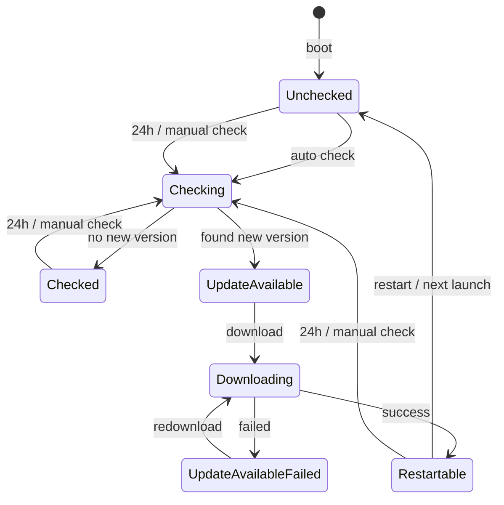

# Desktop Auto Updater FSM

桌面自动更新器的初始状态是 `Unchecked`。应用启动后可以触发自动检查，也可以由 24 小时定时任务或用户手动触发检查。

## States

| State | Description |
| --- | --- |
| `Unchecked` | 尚未检查更新。应用启动或重启后的初始状态。 |
| `Checking` | 正在请求远端版本信息并判断是否有新版本。 |
| `Checked` | 已完成检查，当前没有发现新版本。 |
| `UpdateAvailable` | 已发现新版本，等待用户下载。 |
| `UpdateAvailableFailed` | 已发现新版本，但上次下载失败，需要展示失败信息，并允许重新下载。 |
| `Downloading` | 正在下载更新包。 |
| `Restartable` | 更新包已下载完成，等待用户重启应用完成更新。 |

## Transitions

| From | Event | To |
| --- | --- | --- |
| `[*]` | `boot` | `Unchecked` |
| `Unchecked` | `auto check` | `Checking` |
| `Unchecked` | `24h / manual check` | `Checking` |
| `Checking` | `no new version` | `Checked` |
| `Checking` | `found new version` | `UpdateAvailable` |
| `Checked` | `24h / manual check` | `Checking` |
| `UpdateAvailable` | `download` | `Downloading` |
| `Downloading` | `success` | `Restartable` |
| `Downloading` | `failed` | `UpdateAvailableFailed` |
| `UpdateAvailableFailed` | `redownload` | `Downloading` |
| `Restartable` | `restart / next launch` | `Unchecked` |
| `Restartable` | `24h / manual check` | `Checking` |

## Mermaid

