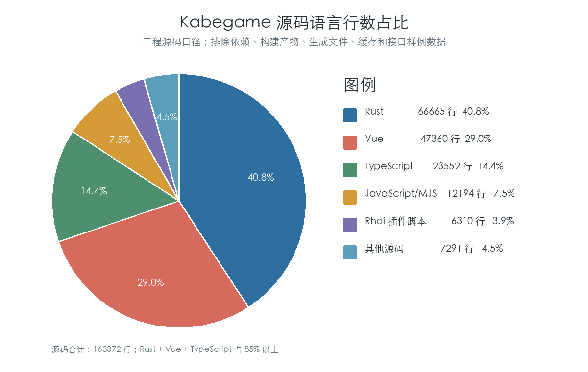
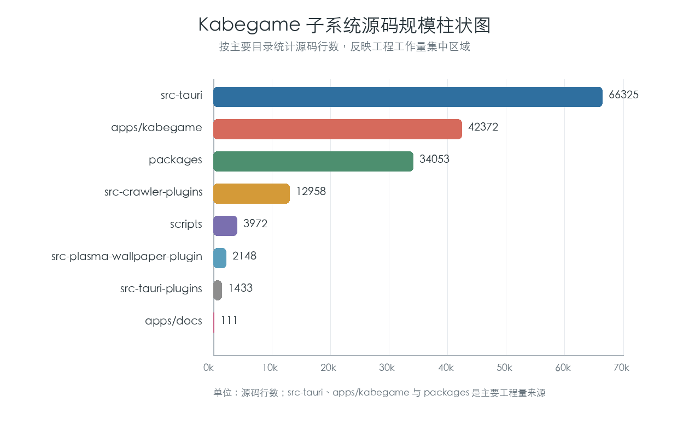
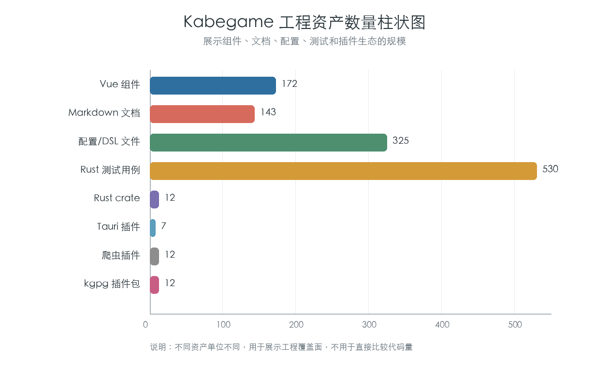

# Kabegame 项目数据分析报告

课程：工程概论  
项目名称：Kabegame  
项目地址：https://github.com/kabegame/kabegame  
分析日期：2026 年 5 月  
姓名 / 学号：按课程要求补充

## 一、数据分析目的

本报告对 Kabegame 项目进行工程数据分析。Kabegame 是一个跨平台视觉素材收集与壁纸管理应用，项目内容包括桌面端、移动端、Rust 后端核心、Vue 前端界面、插件系统、CLI、虚拟磁盘、文档站和爬虫插件生态。

本次数据分析的目的，是通过代码规模、语言组成、模块分布、文档数量、测试数量和插件数量等数据，说明项目的工程结构、主要工作量来源、质量保障情况和潜在风险。与测试报告不同，数据分析报告不重点验证某个功能是否通过，而是从数据角度观察项目整体情况。

## 二、数据来源与统计口径

本报告的数据来自本地项目仓库。统计范围包括：

1. 前端应用：`apps/kabegame`
2. 文档站：`apps/docs`
3. Rust 后端与 CLI：`src-tauri`
4. Tauri 插件：`src-tauri-plugins`
5. 爬虫插件仓库：`src-crawler-plugins`
6. 前端共享包：`packages`
7. 项目文档：`docs`、`cocs`
8. KDE Plasma 壁纸插件：`src-plasma-wallpaper-plugin`
9. 构建与维护脚本：`scripts`

## 三、项目总体数据

按上述统计口径，Kabegame 项目主要数据如下：

| 指标 | 数值 | 说明 |
|---|---:|---|
| 工程源码文件数 | 704 个 | 包含 Rust、Vue、TypeScript、Rhai、脚本等 |
| 工程源码行数 | 163372 行 | 不含依赖、构建产物、生成文件和接口样例数据 |
| 文档 / 配置文件数 | 466 个 | 包含 Markdown、JSON、JSON5、TOML、YAML 等 |
| 文档 / 配置行数 | 50354 行 | 反映项目文档和配置复杂度 |
| Vue 组件文件数 | 172 个 | 前端界面组件规模较大 |
| Rust crate 数 | 12 个 | 包含主程序、核心库、CLI 和 Tauri 插件 |
| Tauri 插件数 | 7 个 | 用于扩展压缩、分享、壁纸、通知等系统能力 |
| 爬虫插件数 | 12 个 | 覆盖多个素材来源 |
| 已打包 `.kgpg` 插件包 | 12 个 | 与爬虫插件数量一致 |
| Rust 测试用例数 | 530 个 | 以 `#[test]` 统计 |
| Rust 测试文件数 | 51 个 | 覆盖核心后端和查询模块 |

从总体数据看，Kabegame 已经具备较完整的工程规模。项目不是单一前端页面或简单脚本，而是由多端应用、Rust 核心、插件系统、文档体系和发布工具组成的复合型软件项目。

## 四、源码语言组成分析

Kabegame 的源码语言分布如下：

| 类型 | 文件数 | 行数 | 占源码比例 | 说明 |
|---|---:|---:|---:|---|
| Rust | 254 | 66665 | 40.8% | 后端核心、Tauri、CLI 和系统能力 |
| Vue | 172 | 47360 | 29.0% | 前端界面和共享组件 |
| TypeScript | 168 | 23552 | 14.4% | 前端逻辑、工具函数、构建脚本和类型 |
| JavaScript / MJS | 63 | 12194 | 7.5% | 插件脚本、构建配置和工具代码 |
| Rhai 插件脚本 | 13 | 6310 | 3.9% | 爬虫插件执行逻辑 |
| 其他源码 | 34 | 7291 | 4.5% | HTML、CSS、SCSS、Shell、C++、QML 等 |
| 合计 | 704 | 163372 | 100% | 工程源码整体 |

从语言占比可以看出：

1. Rust 占 40.8%，说明项目大量逻辑集中在后端核心、跨平台能力和系统集成上。
2. Vue 占 29.0%，说明图形界面是项目的重要组成部分，前端交互复杂度较高。
3. TypeScript 占 14.4%，主要承担前端业务逻辑、类型定义和工具代码。
4. Rhai 插件脚本占 3.9%，虽然占比不高，但它是插件化内容获取能力的关键。
5. Rust、Vue 和 TypeScript 合计超过 85%，说明项目主要由“跨平台后端 + 现代前端界面”构成。

## 五、子系统规模分析

按主要目录统计源码规模如下：

| 子系统 | 源码文件数 | 源码行数 | 说明 |
|---|---:|---:|---|
| `src-tauri` | 230 | 66325 | Rust 主程序、核心库、CLI 和移动端相关代码 |
| `apps/kabegame` | 180 | 42372 | Kabegame 主应用前端 |
| `packages` | 184 | 34053 | 前端共享组件、图片组件、i18n 和 PhotoSwipe 封装 |
| `src-crawler-plugins` | 31 | 12958 | 爬虫插件脚本和插件开发代码 |
| `scripts` | 22 | 3972 | 构建、发布和维护脚本 |
| `src-plasma-wallpaper-plugin` | 15 | 2148 | KDE Plasma 壁纸插件 |
| `src-tauri-plugins` | 39 | 1433 | Tauri 自定义插件 |
| `apps/docs` | 3 | 111 | 文档站源码入口，主要内容在 Markdown / 配置中 |

从子系统数据可以看出：

1. `src-tauri` 是最大子系统，说明项目核心复杂度主要集中在 Rust 后端和跨平台能力。
2. `apps/kabegame` 是第二大子系统，说明用户界面、画廊、画册、任务和插件管理等交互工作量较大。
3. `packages` 规模接近主前端，说明项目已经抽出了较多共享组件和基础能力。
4. `src-crawler-plugins` 规模较大，说明插件生态是 Kabegame 的重要组成部分。
5. `src-tauri-plugins` 行数不多，但承担系统能力扩展，风险不一定低于行数较大的普通模块。

## 六、文档与配置数据分析

文档和配置文件统计如下：

| 类型 | 文件数 | 行数 | 说明 |
|---|---:|---:|---|
| Markdown | 143 | 20884 | README、开发文档、插件文档、设计说明 |
| JSON | 164 | 24205 | 插件配置、应用配置、package 配置等 |
| JSON5 | 135 | 4280 | Provider DSL 和结构化配置 |
| TOML | 16 | 470 | Rust crate 配置 |
| YAML / YML | 6 | 486 | GitHub Actions 等配置 |
| Desktop 配置 | 2 | 29 | Linux 桌面集成配置 |
| 合计 | 466 | 50354 | 文档与配置整体 |

文档和配置行数达到 50354 行，说明 Kabegame 不只是代码量较大，配置和说明材料也比较多。这与项目特点一致：它既需要面向用户的安装使用文档，也需要面向插件作者的插件开发文档，还需要维护多平台构建配置和 provider DSL 配置。

从工程角度看，文档和配置的规模较大有两面影响：

1. 正面影响：有利于用户安装、开发者贡献和插件生态维护。
2. 风险影响：配置和文档需要持续同步，否则容易出现文档过期、配置不一致或发布流程出错。

## 七、插件生态数据分析

Kabegame 的插件生态数据如下：

| 指标 | 数量 | 说明 |
|---|---:|---|
| 爬虫插件目录 | 12 个 | 每个插件对应一个素材来源或导入能力 |
| Rhai 脚本文件 | 12 个 | 插件核心执行逻辑 |
| 插件用户文档 | 49 个 | 包含多语言 `doc_root` 文档 |
| 已打包 `.kgpg` 文件 | 12 个 | 可被应用安装或分发的插件包 |

从插件数据可以看出，Kabegame 已经不是硬编码单一来源的下载工具，而是通过插件机制支持多个内容来源。插件数量和打包数量一致，说明当前插件基本具备可分发形态。

但插件生态也带来工程风险：

1. 插件来源越多，越容易受到第三方网站结构变化影响。
2. 插件脚本需要维护文档、配置和版本兼容性。
3. 插件运行涉及网络访问和本地写入，需要安全边界和用户提示。
4. 多语言插件文档增加了维护成本。

## 八、测试与质量数据分析

项目 Rust 测试数据如下：

| 指标 | 数值 | 说明 |
|---|---:|---|
| Rust 测试用例数 | 530 个 | 以 `#[test]` 统计 |
| Rust 测试文件数 | 51 个 | 包含单元测试和集成测试 |
| Rust 集成测试文件数 | 12 个 | 位于 `tests` 目录的测试文件 |
| 前端测试文件数 | 0 个 | 当前未发现 `*.spec.*` 或 `*.test.*` 文件 |

测试数据说明，项目后端 Rust 部分有较多自动化测试，底层查询模块的专项测试已经在 `develop_report_02.md` 中单独说明。

同时，前端测试文件数量为 0，说明前端界面目前更依赖人工测试或运行时验证。考虑到 Kabegame 前端有 172 个 Vue 组件、4 万多行 Vue 代码，后续可以增加前端组件测试或端到端测试，以降低 UI 回归风险。

## 九、风险数据分析

根据以上数据，可以归纳出项目的主要风险集中区域：

| 风险区域 | 数据依据 | 风险说明 |
|---|---|---|
| Rust 后端复杂度 | `src-tauri` 66325 行，Rust 占 40.8% | 核心逻辑、系统能力和跨平台适配集中在后端 |
| 前端界面复杂度 | Vue 47360 行，Vue 组件 172 个 | 画廊、画册、任务、插件管理等 UI 容易产生交互回归 |
| 插件维护风险 | 12 个爬虫插件，49 个插件文档 | 第三方来源变化会导致插件失效 |
| 配置维护风险 | JSON / JSON5 合计 299 个文件 | 配置数量多，容易出现版本不一致 |
| 文档同步风险 | Markdown 143 个文件 | 功能变化后需要同步更新用户和开发者文档 |
| 前端测试不足 | 前端测试文件数为 0 | UI 回归和交互问题可能较难提前发现 |
| 跨平台发布风险 | Rust crate 12 个，Tauri 插件 7 个 | Windows、macOS、Linux、Android 和 KDE 插件发布链路较复杂 |

这些风险与前面开发报告和测试报告中的风险判断基本一致：Kabegame 的主要挑战不是单个功能是否能实现，而是多平台、多模块、多插件长期维护的复杂度。

## 十、结论与改进建议

从数据上看，Kabegame 是一个工程规模较大的跨平台应用项目。项目源码约 16.3 万行，Rust、Vue 和 TypeScript 是主要技术组成；`src-tauri`、`apps/kabegame` 和 `packages` 是主要工作量来源；插件、文档和配置体系也已经形成一定规模。

项目的优势包括：

1. 后端核心和跨平台能力较完整，Rust 代码占比高，适合处理本地文件、任务、插件和系统集成。
2. 前端界面规模较大，说明项目已经具备较丰富的用户功能。
3. 插件生态初步形成，12 个插件均有对应打包产物。
4. 文档和配置数量较多，有利于安装、使用、插件开发和项目维护。
5. Rust 测试用例数量较多，底层模块具备一定自动化质量保障。

项目的改进方向包括：

1. 增加前端测试，优先覆盖画廊、画册、插件管理和任务管理等核心界面。
2. 建立跨平台发布检查清单，降低 Standard、Light、CLI、Android 和 KDE 插件发布风险。
3. 对插件增加兼容性检查和安全提示，减少第三方来源变化带来的维护压力。
4. 持续清理生成文件、接口样例和缓存数据，避免仓库规模和统计结果被非源码内容放大。
5. 对文档建立更新机制，确保 README、插件文档、安装文档和开发文档与实际功能一致。
6. 继续保持后端核心测试，特别是媒体库、任务系统、插件运行和查询路由等基础模块。

总体而言，Kabegame 具备较完整的软件工程结构，已经从单一应用发展为包含前端、后端、插件、文档、CLI 和发布工具的综合项目。后续重点应放在前端测试补强、插件治理、跨平台发布稳定性和文档持续维护上。
