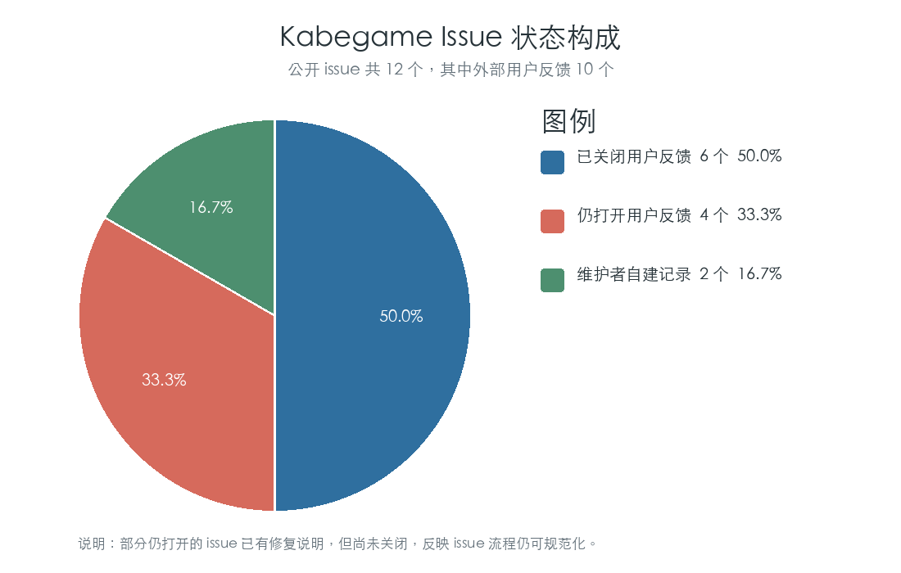
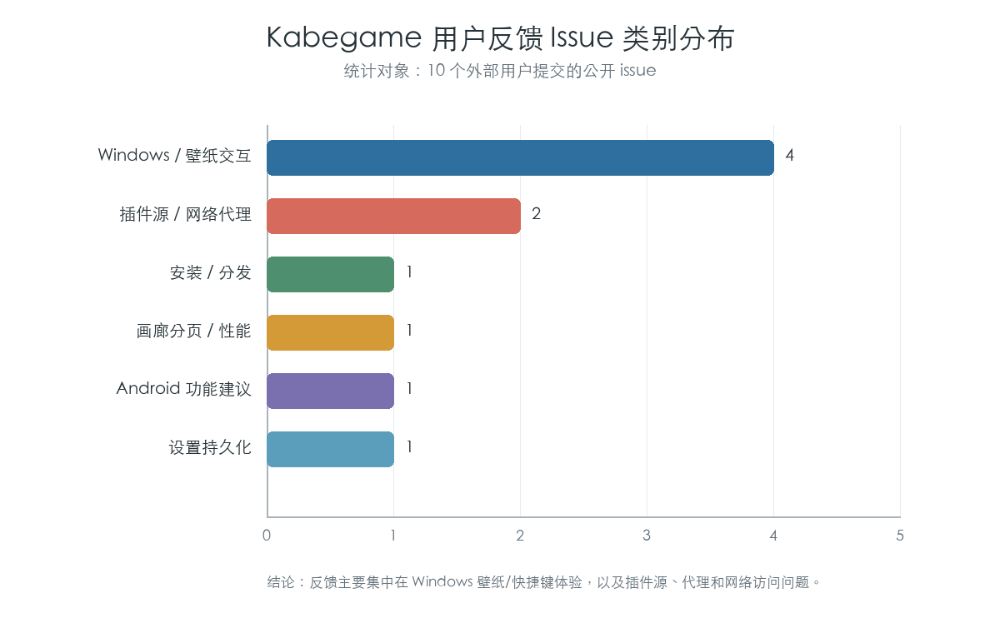

# Kabegame 用户反馈与 Issue 调研报告

课程：工程概论  
项目名称：Kabegame  
调研对象：GitHub Issues  
仓库地址：https://github.com/kabegame/kabegame  
调研日期：2026 年 5 月  
姓名 / 学号：按课程要求补充

## 一、调研目的

本报告对 Kabegame 项目的 GitHub Issues 进行调研，用于分析用户反馈内容、问题集中区域、开发者响应情况和后续改进方向。Issue 是开源项目中最直接的用户反馈渠道，能够反映用户在安装、使用、功能理解、插件运行和跨平台体验中遇到的问题。

本次调研重点关注外部用户提交的 issue。维护者自己创建的学习记录或内部任务也会计入总量，但不作为用户反馈的主要分析对象。

## 二、数据来源

数据来源为 GitHub 仓库 `kabegame/kabegame` 的公开 Issues。调研时共检索到公开 issue 12 个，其中：

| 类型 | 数量 | 说明 |
|---|---:|---|
| 公开 issue 总数 | 12 | GitHub Issues 中可检索的全部 issue |
| 外部用户反馈 | 10 | 由非维护者用户提交 |
| 维护者自建记录 | 2 | 主要是内部记录或开发者自用任务 |
| 已关闭用户反馈 | 6 | 已修复、已解释或已完成处理 |
| 仍打开用户反馈 | 4 | 已响应但仍未关闭 |

## 三、Issue 明细整理

| Issue | 状态 | 提交者 | 类型 | 主要内容 | 处理情况 |
|---|---|---|---|---|---|
| [#1](https://github.com/kabegame/kabegame/issues/1) | 已关闭 | Rainsan86 | Bug | 设置保存高概率丢失 | 维护者确认问题并在后续版本修复 |
| [#2](https://github.com/kabegame/kabegame/issues/2) | 已关闭 | Weidows | 安装 / 分发 | Scoop 安装链接指向异常 | 维护者修复发布流水线 |
| [#5](https://github.com/kabegame/kabegame/issues/5) | 已关闭 | Rainsan86 | 功能建议 | 希望 Windows 支持静默启动 | 记录为 todo，后续版本修复 |
| [#8](https://github.com/kabegame/kabegame/issues/8) | 已关闭 | Rainsan86 | Bug | Windows F11 快捷键占用和全屏行为问题 | v3.0.5 / v3.1.0 逐步修复，用户确认体验改善 |
| [#9](https://github.com/kabegame/kabegame/issues/9) | 已关闭 | Rainsan86 | 使用体验 / Bug | Windows 壁纸切换模式与多显示器表现不清晰 | 维护者解释原生模式与窗口模式，并承认多显示器适配不足 |
| [#10](https://github.com/kabegame/kabegame/issues/10) | 打开 | fall-time | 功能建议 | Android 端希望支持横屏图片选取片段作为壁纸 | 维护者认可建议并计入 todo |
| [#11](https://github.com/kabegame/kabegame/issues/11) | 打开 | jiuyuanzzz | 功能建议 / 性能 | 希望调整页数或每页显示数量 | v3.3.0 添加每页大小设置，但 issue 尚未关闭 |
| [#12](https://github.com/kabegame/kabegame/issues/12) | 打开 | Fang00Mu | 插件源 / 文档 / 网络 | GitHub Releases source 无法使用，文档与视频/应用不一致，插件 403 | 维护者提供手动导入方案，并指出文档过时与 Windows 代理问题 |
| [#13](https://github.com/kabegame/kabegame/issues/13) | 打开 | FrandreJoestar | 插件 / 网络代理 | Pixiv 无法获取画廊，系统代理不生效 | 用户确认 TUN / 虚拟网卡可解决，v3.3.0 修复 Windows 代理检测 |
| [#20](https://github.com/kabegame/kabegame/issues/20) | 已关闭 | Rainsan86 | Bug | 导入本地壁纸轮播失败 | 维护者尝试转入 QQ 沟通，issue 后续关闭 |

维护者自建或非典型用户反馈 issue：

| Issue | 状态 | 内容 | 说明 |
|---|---|---|---|
| [#4](https://github.com/kabegame/kabegame/issues/4) | 打开 | 安卓入门学习中 | 更像开发者学习和开发记录，不作为用户反馈统计主体 |
| [#6](https://github.com/kabegame/kabegame/issues/6) | 打开 | macOS 文件夹访问权限 | 维护者自建问题记录，可作为平台风险参考 |

## 四、反馈类型统计

外部用户反馈共 10 个，按问题类型分类如下：

| 反馈类型 | Issue 数量 | 相关 Issue | 说明 |
|---|---:|---|---|
| Windows / 壁纸交互 | 4 | #5、#8、#9、#20 | 集中在静默启动、快捷键、壁纸模式、本地导入轮播 |
| 插件源 / 网络代理 | 2 | #12、#13 | 集中在插件源访问、Pixiv、GitHub Releases、代理检测 |
| 安装 / 分发 | 1 | #2 | Scoop 安装和发布链接问题 |
| 画廊分页 / 性能 | 1 | #11 | 用户希望更灵活地调整分页显示数量 |
| Android 功能建议 | 1 | #10 | 移动端壁纸显示方式优化 |
| 设置持久化 | 1 | #1 | 设置保存丢失，属于数据可靠性问题 |

从分类结果可以看出，用户反馈主要集中在两个方面：

1. Windows 桌面体验：包括壁纸模式、快捷键、静默启动和本地导入轮播。
2. 插件与网络访问：包括 GitHub Releases 插件源、Pixiv 插件、代理检测和 403 错误。

这与 Kabegame 的产品特点一致。项目既依赖本地桌面能力，又依赖插件获取网络素材，因此系统集成和网络环境是最容易产生用户反馈的区域。

## 五、响应情况分析

外部用户 issue 的响应数据如下：

| 指标 | 数值 |
|---|---:|
| 外部用户 issue 数 | 10 |
| 已关闭外部用户 issue | 6 |
| 仍打开外部用户 issue | 4 |
| 平均首次响应时间 | 约 3.2 小时 |
| 中位首次响应时间 | 约 1.3 小时 |
| 已关闭 issue 平均关闭时间 | 约 159.8 小时 |
| 已关闭 issue 中位关闭时间 | 约 87.5 小时 |

从响应时间看，维护者对用户反馈的响应较快，多数 issue 在数小时内得到回复。部分 issue 会经过多轮沟通，例如 #8 Windows 快捷键问题、#12 插件源和文档问题、#13 Pixiv 代理问题。

从关闭情况看，10 个外部用户反馈中有 6 个已经关闭，关闭率为 60%。仍打开的 4 个 issue 中，#11 和 #13 已有版本修复说明但未关闭，说明 issue 管理流程还可以更规范，例如修复后及时标记、等待用户确认后关闭或补充标签。

## 六、典型用户反馈分析

### 6.1 Windows 快捷键与壁纸体验

代表 issue：#8、#9、#20。

用户反馈显示，Windows 桌面端是当前反馈较集中的平台。问题包括 F11 快捷键占用、全屏逻辑不明确、窗口模式与原生壁纸模式差异、本地导入壁纸轮播失败等。这类问题与系统级桌面能力相关，通常不只是普通 UI bug，还涉及操作系统权限、窗口行为、多显示器和壁纸 API。

改进建议：

1. 在设置页中更清楚地区分“原生壁纸模式”和“窗口模式”。
2. 对快捷键占用增加开关或作用域限制。
3. 增加 Windows 多显示器场景测试。
4. 对本地导入后参与轮播的流程增加测试用例。

### 6.2 插件源、Pixiv 与代理问题

代表 issue：#12、#13。

用户反馈显示，插件源访问和网络代理是影响素材获取体验的重要因素。#12 中用户提到 GitHub Releases source 无法使用，并进一步反馈帮助文档、视频教程和实际应用命名不一致。#13 中用户反馈 Pixiv 插件无法获取画廊，后续确认使用 TUN / 虚拟网卡后可以解决，说明 Windows 系统代理检测存在问题。

改进建议：

1. 增加插件源连通性检测和更明确的错误提示。
2. 在设置中提供手动代理配置或代理检测结果展示。
3. 对 Pixiv、Konachan 等需要代理的插件，在插件说明中明确网络要求。
4. 统一文档、视频教程和应用内命名，减少用户理解成本。

### 6.3 文档一致性与社区协作

代表 issue：#12。

用户明确指出应用内帮助文档、视频教程和实际界面命名不一致，例如“源管理”“收集源”“源”等表达混用。这类反馈说明项目功能更新较快，但文档同步没有完全跟上。

改进建议：

1. 建立文档更新清单，发布新版本时同步检查帮助文档。
2. 增加“如何贡献”的文档，引导用户参与文档和插件维护。
3. 使用统一术语，例如固定使用“插件源”或“收集源”，避免不同位置说法不一致。
4. 对教程视频中的旧界面说明增加版本提示。

### 6.4 画廊分页与性能需求

代表 issue：#11。

用户希望调整页数或显示数量，维护者回复中提到瀑布流在上万张图片时会卡顿，因此选择增加每页大小设置，而不是直接恢复瀑布流。这说明用户希望更高效浏览大量图片，但项目也必须考虑性能边界。

改进建议：

1. 保留分页机制，避免大图库一次性渲染过多图片。
2. 提供每页数量设置，满足高级用户需求。
3. 后续可加入虚拟列表或更高效的图片懒加载策略。
4. 在设置中说明大页数可能带来的性能影响。

### 6.5 Android 端功能建议

代表 issue：#10。

用户希望 Android 端支持横屏图片选取某个片段作为壁纸展示。这属于移动端体验优化建议，说明 Kabegame 的 Android 端已经开始获得用户关注。

改进建议：

1. 增加 Android 壁纸裁剪和预览功能。
2. 支持横屏图片在竖屏设备上的显示区域选择。
3. 在移动端优先实现轻量、明确的核心操作，避免复制桌面端复杂功能。

## 七、用户反馈反映的问题

根据 issue 调研，可以归纳出以下项目问题：

1. 跨平台桌面能力复杂，Windows 壁纸、快捷键、多显示器等场景需要更多测试。
2. 插件运行依赖网络环境，代理、403、GitHub Releases 访问等问题会影响用户第一体验。
3. 文档更新滞后会放大用户困惑，尤其是应用界面命名发生变化后。
4. 用户对高效浏览大量图片有需求，分页、性能和交互效率需要继续优化。
5. Issue 标签和状态管理不够规范，部分已经修复或已有解决方案的 issue 仍保持打开。

## 八、改进建议

针对用户反馈，建议后续从以下方向改进：

1. 增加 issue 标签体系，例如 `bug`、`feature`、`documentation`、`network`、`windows`、`android`、`plugin`。
2. 对已经修复的 issue 及时关闭，或标记为 `waiting for confirmation`。
3. 为插件源和网络代理增加诊断页面，帮助用户判断是网络问题、插件问题还是源配置问题。
4. 增加 Windows 桌面端回归测试，覆盖快捷键、壁纸模式、本地导入和多显示器。
5. 发布版本时同步检查应用内帮助文档、README 和教程说明。
6. 建立贡献指南，鼓励用户帮助补充文档、提交插件和反馈复现信息。
7. 对用户反馈较多的功能，在更新日志中明确说明修复版本和操作方式。

## 九、结论

通过对 Kabegame GitHub Issues 的调研可以看出，项目已经获得了一定真实用户反馈。用户反馈主要集中在 Windows 桌面体验、插件源与网络代理、文档一致性、画廊分页性能和 Android 端功能建议等方面。

维护者对 issue 的响应速度较快，外部用户反馈的中位首次响应时间约为 1.3 小时，说明项目维护积极。但 issue 管理流程仍有改进空间，尤其是标签分类、修复后关闭、文档同步和问题复现模板。

总体来看，用户反馈说明 Kabegame 的核心功能已经被真实用户使用，但项目后续需要加强跨平台测试、网络诊断、文档维护和社区协作机制，才能进一步提升稳定性和用户信任。
