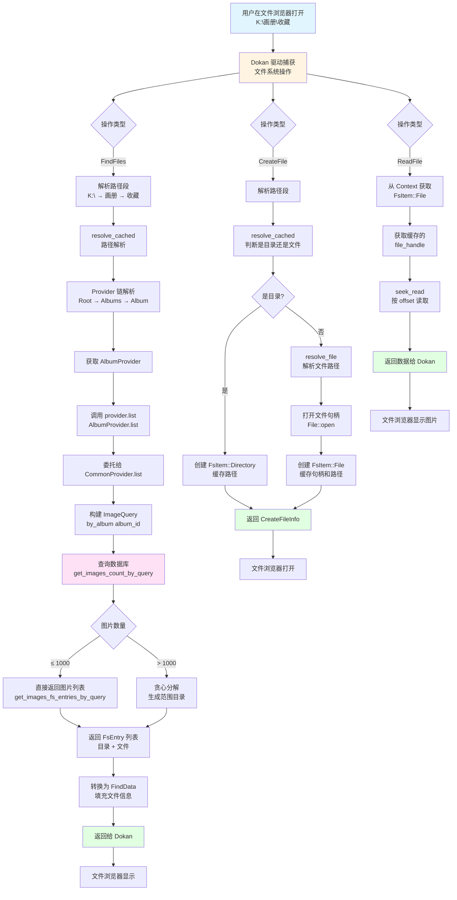

# 虚拟盘访问画册流程图

## 完整流程



## 详细步骤说明

### 1. 路径解析阶段（resolve_cached）

```
K:\画册\收藏
  ↓ parse_components
["画册", "收藏"]
  ↓ resolve_provider (递归)
RootProvider
  ↓ get_child("画册")
AlbumsProvider
  ↓ get_child("收藏")
AlbumProvider
  ↓ (内部使用)
CommonProvider (with ImageQuery::by_album)
```

### 2. Provider 链

```
RootProvider (根目录)
  ├─ list() → ["按任务", "画册", "全部", ...]
  └─ get_child("画册") → AlbumsProvider

AlbumsProvider (画册列表)
  ├─ list() → 查询所有画册名称
  └─ get_child("收藏") → AlbumProvider

AlbumProvider (单个画册)
  ├─ list() → 委托给 CommonProvider
  ├─ get_child() → 委托给 CommonProvider (处理范围目录)
  └─ resolve_file() → 委托给 CommonProvider

CommonProvider (通用图片列表)
  ├─ list() → 查询图片列表（支持贪心分解）
  ├─ get_child() → 处理范围目录（如 "1-1000"）
  └─ resolve_file() → 解析单个文件路径
```

### 3. 数据库查询

```sql
-- ImageQuery::by_album 生成的查询
SELECT images.* 
FROM images
INNER JOIN album_images ai ON images.id = ai.image_id
WHERE ai.album_id = ?
ORDER BY images.id DESC
LIMIT ? OFFSET ?
```

### 4. 贪心分解策略

当图片数量 > 1000 时，使用贪心分解：

```
总图片数: 112400

分解结果:
├─ 1-100000/        (10万级目录)
├─ 100001-110000/   (1万级目录)
├─ 110001-111000/   (1千级目录)
├─ 111001-112000/   (1千级目录)
└─ 112001-112400    (剩余 400 个文件直接显示)
```

### 5. 文件读取优化

- **文件句柄缓存**：在 `create_file` 时打开并缓存 `File` 句柄
- **无锁读取**：使用 `FileExt::seek_read(offset)` 直接按偏移量读取
- **支持并发**：不移动文件游标，天然支持碎片读取（Explorer/图片查看器常见）

## 关键代码位置

- **路径解析**: `windows.rs::resolve_cached()` (445-491行)
- **Provider 解析**: `windows.rs::resolve_provider()` (494-510行)
- **画册列表**: `albums.rs::AlbumsProvider` (34-36行)
- **画册内容**: `albums.rs::AlbumProvider` (114-116行)
- **图片查询**: `common.rs::CommonProvider::list()` (61-78行)
- **贪心分解**: `common.rs::list_greedy_subdirs_with_remainder()` (346-379行)
- **文件读取**: `windows.rs::read_file()` (907-927行)
